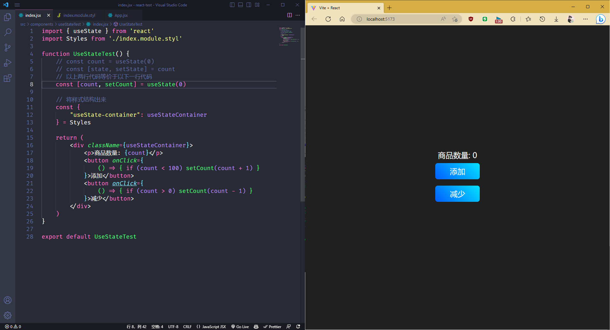

# Ract Project

## 1. 创建方法

### A. React Cli

​    <b>这里可以使用官方给出的 Cli 去进行项目的搭建工作, 使用此方法需要提前使用 npm 进行全局安装, 使用: `npm install --global create-react-app` 进行安装. 完成后使用下方命令进行配置 React 工程</b> 

```js
npm create-react-app project-name
yarn create react-app project-name

npm create-react-app project-name --template typescript
yarn create react-app project-name --template typescript
// 输入完成敲击回车会自动配置项目所需的组件, 上方是 React JavaScript (js, jsx)版本, 下方则是 React Typescript (.ts, .tsx)版本
```

### B. Vite

```js
// npm 使用
npm create vite@latest
// yarn 使用
yarn create vite // 加载完成后输入项目名后需要自行选择创建的脚手架类型, 这里可以直接选择 React
```


​    <b>除了以上方法外, 还可以直接使用 Vite 官方提供的脚手架 API 创建项目, 且免安装! 比 Webpack 更快!</b> 

## 2. 插件安装


## 3. React 基础


## 5. React Router

### Router @


## 6. React Hooks

### A. useState

​    <b>useState 是一个可以在函数组件中保存状态的 Hooks 函数, 使用时需要在内部填写它的初始值, 然后它会返回一个数组: [<span style="text-decoration: underline;color: #409eff;">当前值</span>, <span style="text-decoration: underline;color: #409eff;">修改当前值的方法</span>], 具体使用方法如下:</b> 

```jsx
import { useState } from 'react'
import Styles from './index.module.styl'

function UseStateTest() {
    // const count = useState(0)
    // const [state, setState] = count
    // 以上两行代码等价于以下一行代码
    const [count, setCount] = useState(0)

    // 将样式结构出来
    const {
        "useState-container": useStateContainer
    } = Styles

    return (
        <div className={useStateContainer}>
            <p>商品数量: {count}</p>
            <button onClick={
                () => { if (count < 100) setCount(count + 1) }
            }>添加</button>
            <button onClick={
                () => { if (count > 0) setCount(count - 1) }
            }>减少</button>
        </div>
    )
}

export default UseStateTest
```

<b>附带样式文件(.styl)</b> 

```stylus
.useState-container
    display flex
    flex-direction column
    justify-content center
    align-items center
    width 100%
    height 100vh
    color #fff
    background-color #202020
    overflow hidden

    // ele: p 商品数量
    p
        font-size 24px
    
    // ele: button 按钮( 添加, 减少 )
    button
        min-width 140px
        font-size: 24px
        color #fff
        background-image linear-gradient(45deg,
            hsl(218, 100, 50),
            hsl(187, 100, 51)
        )
        border none
        outline none
        border-radius 8px
        padding 10px 16px
        margin 10px 0
        cursor pointer
```



​    <b>该组件定义时可以为:</b> 

​		<b> Number 数字 (如: `useState(0)`</b> 

​		<b> String 字符串 (如: `useState("Hello World")`</b> 

​		<b> Array 数组 (如: `useState("[1, 2, 3]")`</b> 

​		<b> Object 对象 (如: `useState({key: 0, name: "Tom", age: 18})`</b> 

​		<b> Array 与 Object 的混合 (如: `useState([{id: 0, name: "王五"}, {id: 1, name: "赵六"}])`</b> 

​    <b>针对以上内容依旧可以在 react 文件中的函数中进行使用, 具体操作如下:</b> 

```jsx
import { useState } from 'react'
import Styles from './index.module.styl'

function UseStateTest() {
    // 将样式结构出来
    const {
        "useState-container": useStateContainer
    } = Styles

    // todo: 开始书写各种格式的useState
    // * 1. Number
    const [num, setNum] = useState(0)

    // * 2. String
    const [str, setStr] = useState('Hello World!')

    // * 3. Array
    const [arr, setArr] = useState([1, 2, 3])

    // * 4. Object
    const [objData, setObjData] = useState({
        name: "张三",
        age: 18
    })

    // * 5. mix arr and obj
    const [mix, setMix] = useState([
        {
            id: 0,
            name: "王五"
        },
        {
            id: 1,
            name: "赵六"
        }
    ])
    return (
        <div className={useStateContainer}>
            <h1>UseStateTest</h1>
            <p>当前 Number 类型的值为: {num}</p>
            <p>当前 String 类型的值为: {str}</p>
            <p>当前 Array 类型的值为: {arr}</p>
            <p>当前 Array 类型的下标为 0 且个数为 1 的值是: {arr[0]}</p>
            <p>当前 Object 类型下 key 为 name 的值: {objData.name}</p>
            <p>当前 mix 混合模式中第一组数据中的 name 值为: {mix[0].name}</p>
        </div>
    )
}
```

<b>如果相对上方内容进行改变时, 就可以直接调用 setxxx 方法. 实际操作如下:</b> 

```jsx
import { useState } from 'react'
import Styles from './index.module.styl'

function UseStateTest() {
    // 将样式结构出来
    const {
        "useState-container": useStateContainer,
        "btn-container": btnContainer
    } = Styles

    // todo: 开始书写各种格式的useState
    // * 1. Number
    const [num, setNum] = useState(0)

    // * 2. String
    const [str, setStr] = useState('Hello World!')

    // * 3. Array
    const [arr, setArr] = useState([1, 2, 3])
    function addArr() {
        // 获取数组最后一个元素
        const thatArr = arr[arr.length - 1] + 1
        setArr([...arr, thatArr])
    }

    // * 4. Object
    const [objData, setObjData] = useState({
        name: "张三",
        age: 18
    })

    // * 5. mix arr and obj
    const [mix, setMix] = useState([
        {
            id: 0,
            name: "王五"
        },
        {
            id: 1,
            name: "赵六"
        }
    ])
    return (
        <div className={useStateContainer}>
            <h1>UseStateTest</h1>
            <p>当前 Number 类型的值为: {num}</p>
            <p>当前 String 类型的值为: {str}</p>
            <p>当前 Array 类型的值为: {arr}</p>
            <p>当前 Array 类型的下标为 0 且个数为 1 的值是: {arr[0]}</p>
            <p>当前 Object 类型下 key 为 name 的值: {objData.name}</p>
            <p>当前 mix 混合模式中第一组数据中的 name 值为: {mix[0].name}</p>
            <div className={btnContainer}>
                <button onClick={
                    () => setNum(num + 1)
                }>addNum</button>

                <button onClick={
                    () => setStr('Hello React!')
                }>React</button>

                <button onClick={addArr}>addArr</button>
                <button>replaceObj</button>
            </div>
        </div>
    )
}

export default UseStateTest
```

<b>样式文件(.styl)</b> 

```stylus
.useState-container
    display flex
    flex-direction column
    justify-content center
    align-items center
    width 100%
    height 100vh
    color #fff
    background-color #202020
    overflow hidden

    // ele: p 商品数量
    p
        font-size 24px
    
    // ele: button 按钮( 添加, 减少 )
    button
        min-width 140px
        font-size: 24px
        color #fff
        background-image linear-gradient(45deg,
            hsl(218, 100, 50),
            hsl(187, 100, 51)
        )
        border none
        outline none
        border-radius 8px
        padding 10px 16px
        margin 10px 0
        cursor pointer

    .btn-container
        display flex
        justify-content center
        align-items center

        button
            margin 0 10px
```

