# Ract Project

## 1. 创建方法

### A. React Cli

​    <b>这里可以使用官方给出的 Cli 去进行项目的搭建工作, 使用此方法需要提前使用 npm 进行全局安装, 使用: `npm install --global create-react-app` 进行安装. 完成后使用下方命令进行配置 React 工程</b> 

```js
npm create-react-app project-name
yarn create react-app project-name

npm create-react-app project-name --template typescript
yarn create react-app project-name --template typescript
// 输入完成敲击回车会自动配置项目所需的组件, 上方是 React JavaScript (js, jsx)版本, 下方则是 React Typescript (.ts, .tsx)版本
```

### B. Vite

```js
// npm 使用
npm create vite@latest
// yarn 使用
yarn create vite // 加载完成后输入项目名后需要自行选择创建的脚手架类型, 这里可以直接选择 React
```


​    <b>除了以上方法外, 还可以直接使用 Vite 官方提供的脚手架 API 创建项目, 且免安装! 比 Webpack 更快!</b> 

## 2. 插件安装


## 3. React 基础


## 5. React Router

### Router @


## 6. React Hooks

### A. useState

​    <b>useState 是一个可以在函数组件中保存状态的 Hooks 函数, 使用时需要在内部填写它的初始值, 然后它会返回一个数组: [<span style="text-decoration: underline;color: #409eff;">当前值</span>, <span style="text-decoration: underline;color: #409eff;">修改当前值的方法</span>], 具体使用方法如下:</b> 

```jsx
import { useState } from 'react'
import Styles from './index.module.styl'

function UseStateTest() {
    // const count = useState(0)
    // const [state, setState] = count
    // 以上两行代码等价于以下一行代码
    const [count, setCount] = useState(0)

    // 将样式结构出来
    const {
        "useState-container": useStateContainer
    } = Styles

    return (
        <div className={useStateContainer}>
            <p>商品数量: {count}</p>
            <button onClick={
                () => { if (count < 100) setCount(count + 1) }
            }>添加</button>
            <button onClick={
                () => { if (count > 0) setCount(count - 1) }
            }>减少</button>
        </div>
    )
}

export default UseStateTest
```

<b>附带样式文件(.styl)</b> 

```stylus
.useState-container
    display flex
    flex-direction column
    justify-content center
    align-items center
    width 100%
    height 100vh
    color #fff
    background-color #202020
    overflow hidden

    // ele: p 商品数量
    p
        font-size 24px
    
    // ele: button 按钮( 添加, 减少 )
    button
        min-width 140px
        font-size: 24px
        color #fff
        background-image linear-gradient(45deg,
            hsl(218, 100, 50),
            hsl(187, 100, 51)
        )
        border none
        outline none
        border-radius 8px
        padding 10px 16px
        margin 10px 0
        cursor pointer
```


​    <b>该组件定义时可以为:</b> 

​		<b> Number 数字 (如: `useState(0)`</b> 

​		<b> String 字符串 (如: `useState("Hello World")`</b> 

​		<b> Array 数组 (如: `useState("[1, 2, 3]")`</b> 

​		<b> Object 对象 (如: `useState({key: 0, name: "Tom", age: 18})`</b> 

​		<b> Array 与 Object 的混合 (如: `useState([{id: 0, name: "王五"}, {id: 1, name: "赵六"}])`</b> 

​    <b>针对以上内容依旧可以在 react 文件中的函数中进行使用, 具体操作如下:</b> 

```jsx
import { useState } from 'react'
import Styles from './index.module.styl'

function UseStateTest() {
    // 将样式结构出来
    const {
        "useState-container": useStateContainer
    } = Styles

    // todo: 开始书写各种格式的useState
    // * 1. Number
    const [num, setNum] = useState(0)

    // * 2. String
    const [str, setStr] = useState('Hello World!')

    // * 3. Array
    const [arr, setArr] = useState([1, 2, 3])

    // * 4. Object
    const [objData, setObjData] = useState({
        name: "张三",
        age: 18
    })

    // * 5. mix arr and obj
    const [mix, setMix] = useState([
        {
            id: 0,
            name: "王五"
        },
        {
            id: 1,
            name: "赵六"
        }
    ])
    return (
        <div className={useStateContainer}>
            <h1>UseStateTest</h1>
            <p>当前 Number 类型的值为: {num}</p>
            <p>当前 String 类型的值为: {str}</p>
            <p>当前 Array 类型的值为: {arr}</p>
            <p>当前 Array 类型的下标为 0 且个数为 1 的值是: {arr[0]}</p>
            <p>当前 Object 类型下 key 为 name 的值: {objData.name}</p>
            <p>当前 mix 混合模式中第一组数据中的 name 值为: {mix[0].name}</p>
        </div>
    )
}
```

<b>如果相对上方内容进行改变时, 就可以直接调用 setxxx 方法. 实际操作如下:</b> 

```jsx
import { useState } from 'react'
import Styles from './index.module.styl'

function UseStateTest() {
    // 将样式结构出来
    const {
        "useState-container": useStateContainer,
        "btn-container": btnContainer
    } = Styles

    // todo: 开始书写各种格式的useState
    // * 1. Number
    const [num, setNum] = useState(0)

    // * 2. String
    const [str, setStr] = useState('Hello World!')

    // * 3. Array
    const [arr, setArr] = useState([1, 2, 3])
    function addArr() {
        // 获取数组最后一个元素
        const thatArr = arr[arr.length - 1] + 1
        setArr([...arr, thatArr])
    }

    // * 4. Object
    const [objData, setObjData] = useState({
        name: "张三",
        age: 18
    })

    function replaceObj() {
      setObjData({...objData, name: "李四"})
    }

    // * 5. mix arr and obj
    const [mix, setMix] = useState([
        {
            id: 0,
            name: "王五"
        },
        {
            id: 1,
            name: "赵六"
        }
    ])

    function replaceMix() {
      const thatMix = [...mix]
      thatMix[0].name = "杨七"
      setMix([...thatMix])
    }
    return (
        <div className={useStateContainer}>
            <h1>UseStateTest</h1>
            <p>当前 Number 类型的值为: <span>{num}</span></p>
            <p>当前 String 类型的值为: <span>{str}</span></p>
            <p>当前 Array 类型的值为: <span>{arr}</span></p>
            <p>当前 Array 类型的下标为 0 且个数为 1 的值是: <span>{arr[0]}</span></p>
            <p>当前 Object 类型下 key 为 name 的值: <span>{objData.name}</span></p>
            <p>当前 mix 混合模式中第一组数据中的 name 值为: <span>{mix[0].name}</span></p>
            <div className={btnContainer}>
                <button onClick={
                    () => setNum(num + 1)
                }>addNum</button>

                <button onClick={
                    () => setStr('Hello React!')
                }>React</button>

                <button onClick={addArr}>addArr</button>
                <button onClick={replaceObj}>replaceObj</button>
                <button onClick={replaceMix}>replaceMix</button>
            </div>
        </div>
    )
}

export default UseStateTest
```

<b>样式文件(.styl)</b> 

```stylus
.useState-container
    display flex
    flex-direction column
    justify-content center
    align-items center
    width 100%
    height 100vh
    color #fff
    background-color #202020
    overflow hidden

    // ele: p 商品数量
    p
        width: 600px
        font-size 24px
        margin: 5px 0

        span
            padding 0 10px
            background-color: hotpink
            font-weight:  600
    
    // ele: button 按钮( 添加, 减少 )
    button
        min-width 140px
        font-size: 24px
        color #fff
        background-image linear-gradient(45deg,
            hsl(218, 100, 50),
            hsl(187, 100, 51)
        )
        border none
        outline none
        border-radius 8px
        padding 10px 16px
        margin 10px 0
        cursor pointer

    .btn-container
        display flex
        justify-content center
        align-items center

        button
            margin 0 10px
```

<b>展示效果:</b> 

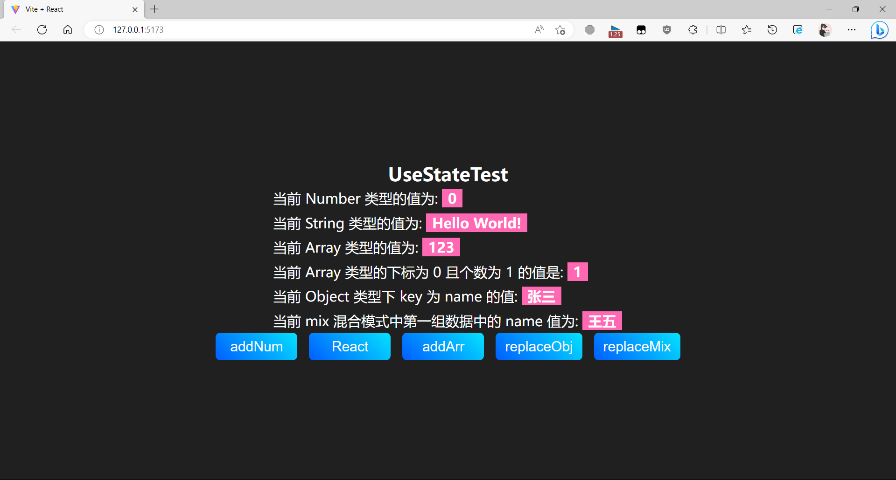

<b>点击后效果:</b> 

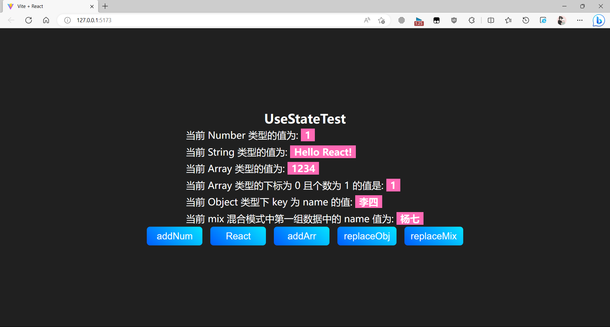

​    <b>但还有一点, 该函数 ( useState ) 是异步函数所以在一些赋值操作上会出现问题, 如: 下方代码进行多次累加时, 由于函数是异步的就会出现累加错误, 代码如下:</b> 

```jsx
import { useState } from "react";
import Styles from "./index.module.styl";

function UseStateTest() {
    // 将样式结构出来
    const {
        "useState-container": useStateContainer,
        "btn-container": btnContainer,
    } = Styles;

    // todo: 开始书写各种格式的useState
    // * 1. Number
    const [num, setNum] = useState(0);

    function addNum() {
      // ! warn: 异步操作将会造成以下代码累加错误
      setNum(num + 10)
      setNum(num + 10)
      setNum(num + 10)
    }

    return (
        <div className={useStateContainer}>
            <h1>UseStateTest</h1>
            <p>
                当前 Number 类型的值为: <span>{num}</span>
            </p>

            <button onClick={addNum}>addNum</button>
        </div>
    );
}

export default UseStateTest;

```

<b>运行后就可以看到初始值为: 0. 如图所示:</b> 

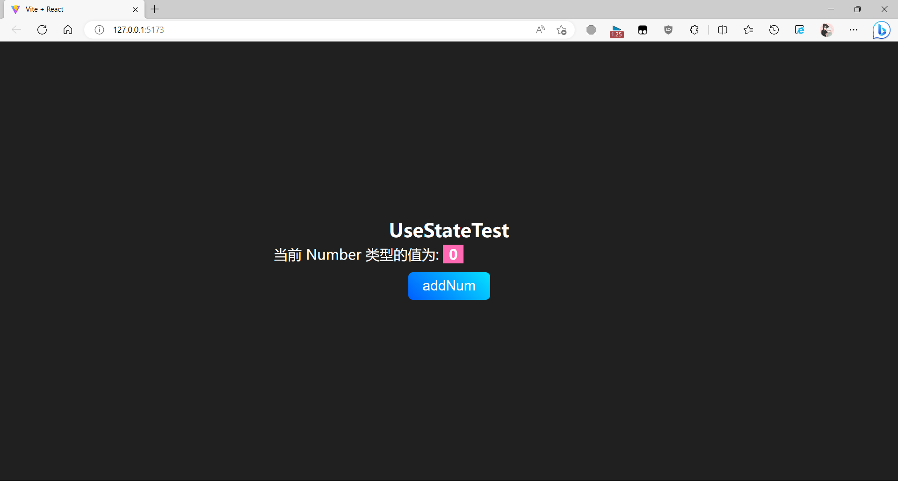

<b>此时我们对累加按钮进行点击, 就会发现由于该函数为异步函数所以最终即使连着写了 3 次也只有最后一次被累加成功了, 如图所示:</b> 


<b>如果要处理以上问题需要使用一个回调函数进行保存操作, 将每次的结果保存后累加就不会出现写 3 次加 1 的现象了, 接下来对上面的代码进行修改, 实际操作如下:</b> 

```jsx
import { useState } from "react";
import Styles from "./index.module.styl";

function UseStateTest() {
    // 将样式结构出来
    const {
        "useState-container": useStateContainer,
        "btn-container": btnContainer,
    } = Styles;

    // todo: 开始书写各种格式的useState
    // * 1. Number
    const [num, setNum] = useState(0);

    function addNum() {
      // ! warn: 异步操作将会造成以下代码累加错误
      // setNum(num + 10)
      // setNum(num + 10)
      // setNum(num + 10)
      // * success: 以下代码将会正确累加
      setNum(num => num + 10);
      setNum(num => num + 10);
      setNum(num => num + 10);
      // Q: 为什么此时可以正常累加?
      // A: 因为在每次调用 setNum 时, 都会将上一次的值传递给回调函数, 从而保证了累加的正确性.
    }

    return (
        <div className={useStateContainer}>
            <h1>UseStateTest</h1>
            <p>
                当前 Number 类型的值为: <span>{num}</span>
            </p>

            <button onClick={addNum}>addNum</button>
        </div>
    );
}

export default UseStateTest;

```

<b>修改完成后, 再次尝试: ( 此处省略初始值为 0 的图... )</b> 

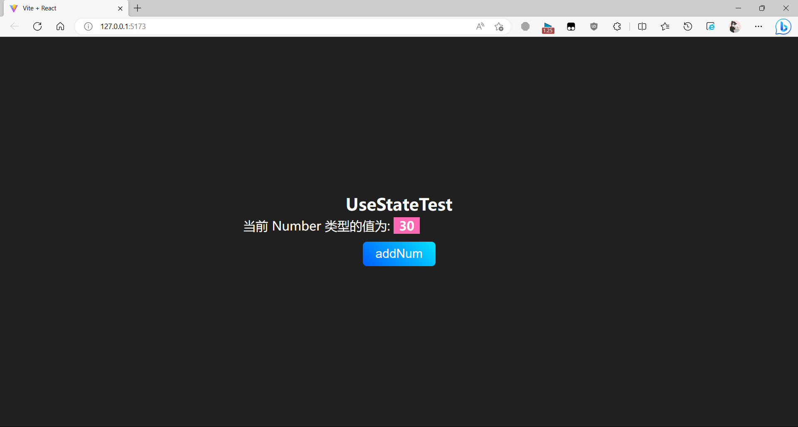

​    <b>此时在每次调用 setNum 时, 都会将上一次的值传递给回调函数, 从而保证了累加的正确性.</b> 

### B. useEffect

​    <b>useEffect 是一个会在: 挂载、更新 的情况下执行的一个函数. 接下来使用一个 jsx 文件以及它的子组件进行测试, 先书写父级元素:</b>  

```jsx
import { useState } from 'react'
import Children from './children'
import Styles from './index.module.styl'

function UseEffectTest() {

  // 解构样式
  const {
    "useEffect-container": UseEffectContainer
  } = Styles

  const [isShow, setIsShow] = useState(true)

  return (
    <div className={UseEffectContainer}>
      {isShow && <Children />}
      <button onClick={()=> setIsShow(!isShow)}>{isShow ? '隐藏' : '显示'}</button>
    </div>
  )
}

export default UseEffectTest

```

<b>父级元素的样式: </b> 

```stylus
.useEffect-container
    display flex
    flex-direction column
    justify-content center
    align-items center
    width 100%
    height 100vh
    color #fff
    background-color #202020
    overflow hidden

    button
        min-width 140px
        font-size: 24px
        color #fff
        background-image linear-gradient(45deg,
            hsl(218, 100, 50),
            hsl(187, 100, 51)
        )
        border none
        outline none
        border-radius 8px
        padding 10px 16px
        margin 10px 0
        cursor pointer

```

<b>接下来是子组件:</b> 

```jsx
import { useState, useEffect } from 'react'
import Styles from './index.module.styl'

function useEffectChildren() {
  const { log } = console;
  const {
    "Effect-children": EffectChildren
  } = Styles;

  const [rep, setRep] = useState('World!')

  useEffect(() => {
    // 第 1 次调用: useEffectChildren 组件挂载时会被调用
    /**
     * 第 2 ~ N 次调用: useEffectChildren 组件更新时, 如下方的 setRep() 调用, 会被调用, 因为在 useEffectChildren 组件中定义的 rep 发生了变化导致 DOM 被重新渲染. 符合 useEffect 的第二个参数的条件 (在组件 挂载 或 更新 时被调用, 此处为更新)
     */
    log('挂载 或 更新')
  })

  return (
    <div className={EffectChildren}>
      <h1>我是 UseEffectChildren</h1>
      <div>
        <p>Hello { rep }</p>
        <button onClick={() => rep == "World!" ? setRep('React!') : setRep('World!')}>React</button>
      </div>
    </div>
  )
}

export default useEffectChildren

```

<b>子组件的样式:</b> 

```stylus
.Effect-children
    display: flex
    align-items: center
    justify-content: center
    flex-direction: column
    width: 100%
    border-top: 1px solid #fff
    border-bottom: 1px solid #fff

    h1
        font-size: 36px
    
    div
        display: flex
        flex-direction: column
        justify-content: center
        align-items: center
        width: 600px

        p
            font-size: 24px

        button
            align-self end
```

<b>如图所示: ( 第一次挂载显示组件 )</b> 


<b>接下来点击 <span style="color: #F56C6C;">隐藏</span> 按钮后将会对上方挂载元素进行卸载, 此时想到了在上方所说的只有在 挂载 和 更新 时才会执行, 那卸载的时候呢? 其实在使用 useEffect 函数的返回值将会在卸载的时候去执行, 接下来将代码稍作修改, 为其函数内返回值新增函数, 如下所示:</b> 

```jsx
import { useState, useEffect } from 'react'
import Styles from './index.module.styl'

function useEffectChildren() {
  const { log } = console;
  const {
    "Effect-children": EffectChildren
  } = Styles;

  const [rep, setRep] = useState('World!')

  useEffect(() => {
    log('挂载 或 更新')

    // 卸载调用函数
    return () => {
      console.log('我被卸载了')
    }
  })

  return (
    <div className={EffectChildren}>
      <h1>我是 UseEffectChildren</h1>
      <div>
        <p>Hello { rep }</p>
        <button onClick={() => rep == "World!" ? setRep('React!') : setRep('World!')}>React</button>
      </div>
    </div>
  )
}

export default useEffectChildren

```

<b>此时对按钮进行点击我们就会看到 "我被卸载了" 的字符串, 如图中所示:</b> 

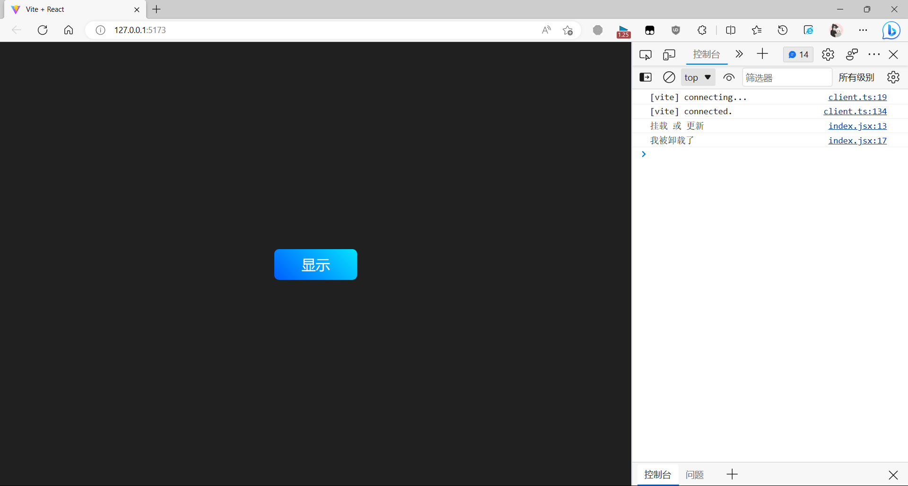

<b>当我们点击 "显示" 的时候, 此时又会被挂载所以会再次显示 “挂载 或 更新”字样.</b> 


<b>接下来我们继续点击内部的按钮, 对上方的 Hello Wrold 中的 World 进行修改, 如果是 World , 则会修改成 React, 反之同理会再次修改会 Wrold. </b> 

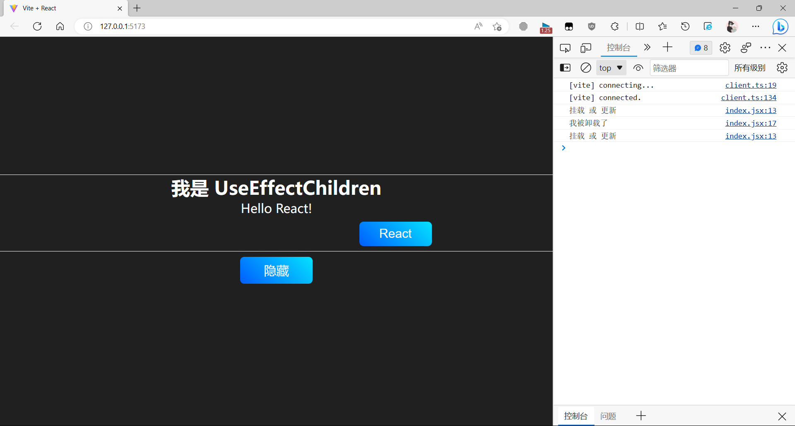

​    <b>此时发现虽然成功了...但是为什么会被卸载了? 原因是在 DOM 被修改的时候会先将原有元素组件卸载之后重新再进行渲染挂载. 所以就会看到显示 "我被卸载了" 然后又显示 "挂载 或 更新" 的字样.</b> 

#### 定向监听

​    <b>除了以上的监听方式, 它 ( useEffect ) 还能对指定的元素去进行监听, 如: 这里只想让它在点击 React 或 World 的按钮上去进行监听, 要怎么实现呢? 这时候就可以使用它的第二个参数了, 它的类型为数组, 内部用来存放需要监听的组件, 接下来我们开始实操, 来看以下代码:</b> 

​    <b>子组件代码 ( 准备 ), 先新增一个 num 数字便于后期再进行定向监听, 此时并未给 useEffect 设置第二个参数所以点击 rep 以及新增的 num 都会触发 "挂在 或 更新" 和 "卸载" 监听函数.</b> 

```jsx
import { useState, useEffect } from 'react'
import Styles from './index.module.styl'

function useEffectChildren() {
    const { log } = console;
    const {
        "Effect-children": EffectChildren
    } = Styles;

    const [rep, setRep] = useState('World!')
    const [num, setNum] = useState(0)

    useEffect(() => {
        log('挂载 或 更新')

        // 卸载调用函数
        return () => {
            console.log('卸载')
        }
    })

    return (
        <div className={EffectChildren}>
            <h1>我是 UseEffectChildren</h1>
            <div>
                <p>Hello {rep}</p>
                <button onClick={() => rep == "World!" ? setRep('React!') : setRep('World!')}>React</button>
                <p>当前数据为: {num}</p>
                <button onClick={() => setNum(num + 1)}>Add</button>
            </div>
        </div>
    )
}

export default useEffectChildren

```

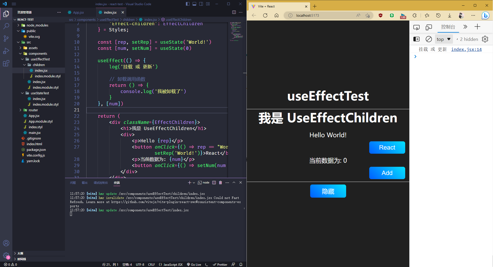

<b>此时点击两个按钮都会触发1. 卸载; 2. 更新 useEffect 函数. 接下来我们为其添加第二个参数后再次尝试 ( 这里我将新增 Add 按钮控制的参数 ( num ) 放入第二个参数的数组中 ):</b> 

```jsx
import { useState, useEffect } from 'react'
import Styles from './index.module.styl'

function useEffectChildren() {
    const { log } = console;
    const {
        "Effect-children": EffectChildren
    } = Styles;

    const [rep, setRep] = useState('World!')
    const [num, setNum] = useState(0)

    useEffect(() => {
        log('挂载 或 更新')

        // 卸载调用函数
        return () => {
            console.log('我被卸载了')
        }
    }, [num])

    return (
        <div className={EffectChildren}>
            <h1>我是 UseEffectChildren</h1>
            <div>
                <p>Hello {rep}</p>
                <button onClick={() => rep == "World!" ? setRep('React!') : setRep('World!')}>React</button>
                <p>当前数据为: {num}</p>
                <button onClick={() => setNum(num + 1)}>Add</button>
            </div>
        </div>
    )
}

export default useEffectChildren

```

<b>此时我们再点击:</b> 


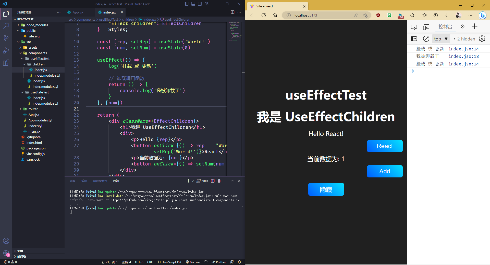

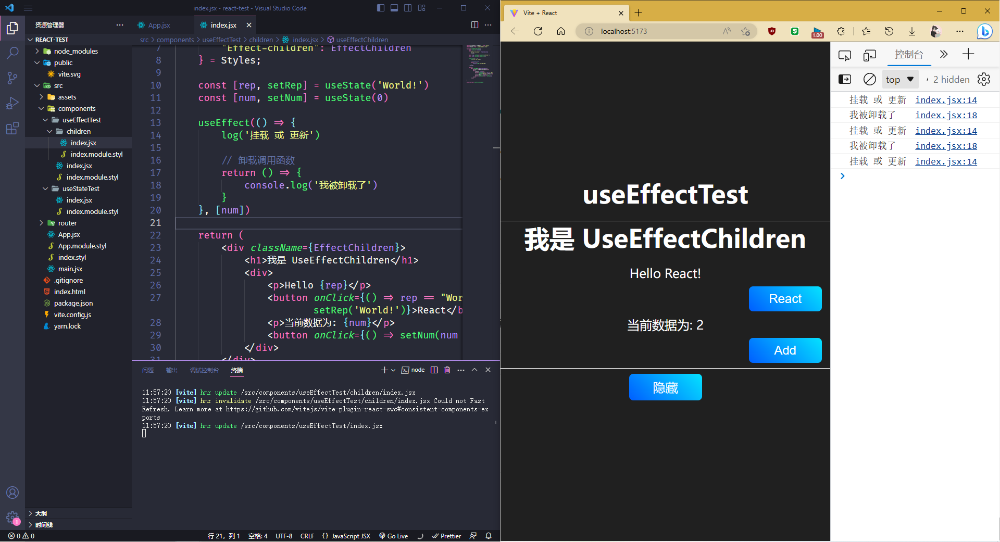

<b>经过上方操作以后就会发现: 它也可以对指定的内容进行监听, 如上方的 num. 只有它引起的挂载、卸载、更新才会触发该事件.</b> 

### C. useContext

​    <b>React 中 useContext 函数是一个可以传递参数的函数组件, 它内部可以有 Provider ( 用于传递上下文内容 ) 和 Consumer ( 用于消费上下文内容), 使用时需要进行引用, 此时引用的是 `createContext` 函数来创建一个新的上下文, 并对其进行解构.</b> 

<b>父组件 ( .jsx )</b> 

```jsx
import { createContext } from 'react'
import Styles from './index.module.styl'
import UseContextChildren from './children'

function UseContextTest() {
    // 结构样式
    const {
        ContextContainer
    } = Styles

    return (
        <div className={ContextContainer}>
            <h1>useContextTest</h1>
            <UseContextChildren />
        </div>
    )
}

export default UseContextTest
```

<b>父组件样式 ( .styl )</b> 

```stylus
.ContextContainer
    display flex
    flex-direction column
    justify-content center
    align-items center
    width 100%
    height 100vh

    &>h1
        font-size 3.2rem
        font-weight 700
        margin-bottom 1rem

```

<b>子组件 ( .jsx )</b> 

```jsx
import { createContext } from 'react'
import Styles from './index.module.styl'

function UseContextChildren() {
    const { } = Styles

    return (
        <div>UseContextChildren</div>
    )
}

export default UseContextChildren
```

#### 1. 使用方式

​    <b>接下来开始使用 useContext 组件进行上下文的传递任务</b> 

<b>父组件 (. jsx ):</b> 

​    <b>为其添加并导出一个上下文函数 ( useContent ), 在函数外部定义一个 testContext 函数作为上下文的载体, 然后从 testContext 中将 Provider 结构出来并将参数通过该组件传递给子组件, 最后别忘记到处载体变量 ( `export { testContext }` )</b>

```jsx
import { createContext } from 'react'
import Styles from './index.module.styl'
import UseContextChildren from './children'

// todo: 因为 const 是块级作用域, 所以需要在函数外部定义
// 使用 createContext 创建上下文
const testContext = createContext({})

// 使用 Provider 提供上下文
const { Provider } = testContext

function UseContextTest() {
    // 结构样式
    const {
        ContextContainer
    } = Styles

    return (
        <div className={ContextContainer}>
            <h1>useContextTest</h1>
            <Provider value={{
                name: 'test',
                age: 18
            }}>
                <UseContextChildren />
            </Provider>
        </div>
    )
}

// 到处默认组件
export default UseContextTest

// 由于子组件需要使用上下文，所以需要将上下文导出
export { testContext }
```

<b>子组件 ( .jsx ):</b> 

​    <b>此处子组件需要接收父组件传递过来的参数, 使用: `import { testContext } from '../index'` 进行导入, 并从中解构出需要的 Consumer 接收父组件 Provider 传递过来的参数.</b> 

```jsx
import { createContext } from 'react'
import Styles from './index.module.styl'
import { testContext } from '../index'

function UseContextChildren() {
    const { } = Styles

    // 使用 Consumer 消费上下文
    const { Consumer } = testContext

    return (
        <Consumer>
            {
                // 此处使用 ES6 解构语法, 从 value 中将参数取出
                // 分别是: value.name 和 value.age
                ({ name, age }) => {
                    return (
                        <>
                            <h1>UseContextChildren</h1>
                            <section>
                                <p>name: {name}</p>
                                <p>age: {age}</p>
                            </section>
                        </>
                    )
                }
            }
        </Consumer>
    )
}

export default UseContextChildren
```

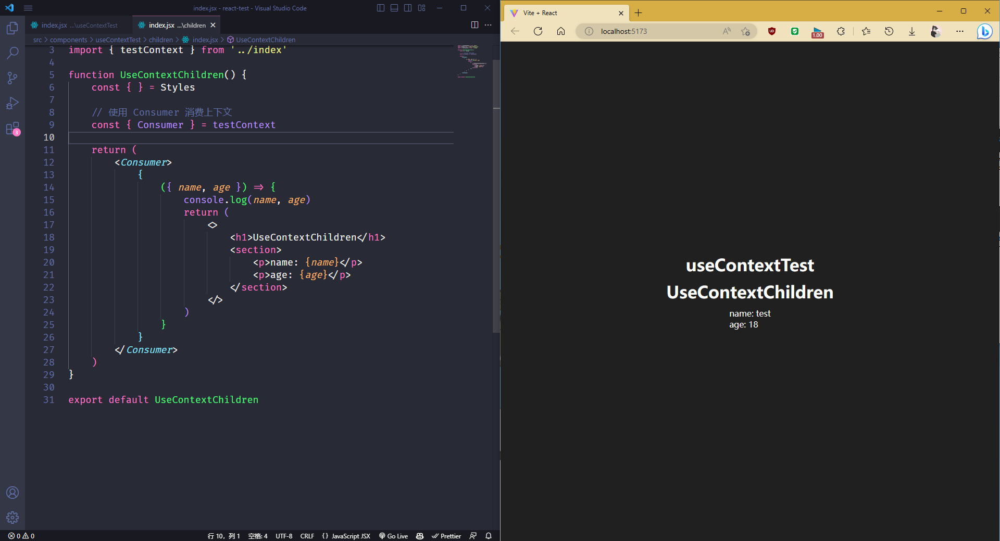

#### 2. 简化书写

​    <b>以上内容虽然可以成功传递参数, 但是组件一旦多了的话还是会很麻烦... 接下来会使用更加简洁的方式去完成以上的内容.</b> 

<b>父级元素 ( .jsx ): </b> 

```jsx
import { createContext } from 'react'
import Styles from './index.module.styl'
import UseContextChildren from './children'

// todo: 因为 const 是块级作用域, 所以需要在函数外部定义
// 使用 createContext 创建上下文
const TestContext = createContext({})
const TestuseContext = createContext({})

// 使用 Provider 提供上下文
const { Provider: ProviderOne } = TestContext


function UseContextTest() {
    // 结构样式
    const {
        ContextContainer
    } = Styles

    return (
        <div className={ContextContainer}>
            <h1>useContextTest</h1>
            {/* 第一种写法: Es6 中的结构及重名写法 */}
            <ProviderOne value={{ name: 'test', age: 18 }}>
                {/* 第二种写法: 使用对象形式的 变量名.提供器 = {{ 提供参数 }} 的形式 */}
                <TestuseContext.Provider value={{ school: "xxx计算机学院" }}>
                    <UseContextChildren />
                </TestuseContext.Provider>
            </ProviderOne>
        </div>
    )
}

// 到处默认组件
export default UseContextTest

// 由于子组件需要使用上下文，所以需要将上下文导出
export { TestContext, TestuseContext }
```

<b>复杂的子组件 ( .jsx )</b> 

```jsx
import { createContext } from 'react'
import Styles from './index.module.styl'
import { TestContext, TestuseContext } from '../index'

function UseContextChildren() {
    const { } = Styles

    // 使用 Consumer 消费上下文
    const { Consumer: ConsumerOne } = TestContext

    return (
        <ConsumerOne>
            {
                ({ name, age }) => {
                    return (
                        <TestuseContext.Consumer>
                            {
                                ({ school }) => {
                                    return (
                                        <>
                                            <h1>UseContextChildren</h1>
                                            <section>
                                                <p>name: {name}</p>
                                                <p>age: {age}</p>
                                                <p>school: {school}</p>
                                            </section>
                                        </>
                                    )
                                }
                            }
                        </TestuseContext.Consumer>
                    )
                }
            }
        </ConsumerOne>
    )
}

export default UseContextChildren
```

<b>简化后的子组件 ( .jsx ):</b> 

```jsx
import { useContext } from 'react'
import Styles from './index.module.styl'
import { TestContext, TestuseContext } from '../index'

function UseContextChildren() {
    const { } = Styles

    // 使用 useContext 获取上下文
    // ES6 解构到处 TestContext 中的 name 以及 age
    // 分别: TestContext.name 和 TestContext.age
    const { name, age } = useContext(TestContext)

    // 直接赋予变量名, 内部为对象 ( 对象是父级元素 createContext 中创建的. )
    const SchoolInfo = useContext(TestuseContext)

    return (
        <>
            <h1>UseContextChildren</h1>
            <section>
                {/* 使用 ES6 结构语法将内容导出 */}
                <p>name: {name}</p>
                <p>age: {age}</p>
                {/* 第二种方式: 使用原始对象调用的方法 */}
                <p>school: {SchoolInfo.school}</p>
            </section>
        </>
    )
}

export default UseContextChildren
```

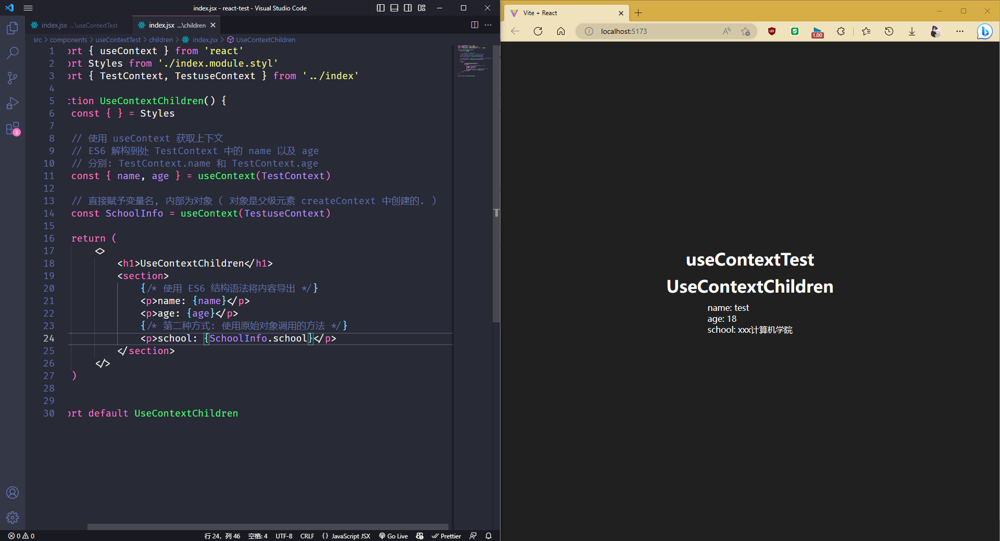

​    <b>可以看到父级元素的值是可以正常的传递到子组建的. 而且使用上方简化的写法更利于后期 维护 或 更改.</b> 

### D. useReducer

​    <b>useReducer 是 React 中 useState 的优化, 它可以更快的完成重复性任务, 只需要传入公共的函数, 其次在传入初始值即可.</b> 

<b>父组件 ( .jsx )</b>

```jsx
import { useReducer } from "react";
import Styles from "./index.module.styl";
import Home from "./components/Home";
import About from "./components/About";

// reducer 函数, 用于更新 state
// 第一个参数是 state 可复用函数, 第二个参数是 action
// 返回值是新的 state
function reducer(state, action) {
    switch (action) {
        case "add":
            return state + 1;
        case "sub":
            return state - 1;
        default:
            return state;
    }
}

function UseReducerTest() {
    // 解构样式
    const {
        ReducerContainer,
        BtnContainer,
    } = Styles;

    // useReducer 是 React 的一个 Hook
    // 第一个参数是 reducer 函数, 如: (state, action) => newState
    // 第二个参数是初始值, 如: 0
    // 返回值是一个数组, 第一个值是 state, 第二个值是 dispatch 函数
    const [count, dispatch] = useReducer( reducer, 0 );
    return (
        <div className={ReducerContainer}>
            <h1>UseReducerTest</h1>
            <h2>Index 组件: {count}</h2>
            <section className={BtnContainer}>
                <button
                    onClick={() => {
                        if (count < 100) dispatch("add");
                    }}
                >
                    add
                </button>
                <button
                    onClick={() => {
                        if (count > 0) dispatch("sub");
                    }}
                >
                    sub
                </button>
            </section>
            <Home />
            <About />
        </div>
    );
}

export default UseReducerTest;

// 导出 reducer 函数, 用于子组件复用
export { reducer };

```

<b>父级样式文件 ( .styl )</b> 

```stylus
.ReducerContainer
    display flex
    flex-direction column
    justify-content center
    align-items center
    width 100%
    height 100vh

    .BtnContainer, section
        
        button
            min-width 140px
            font-size: 24px
            color #fff
            background-image linear-gradient(45deg,
                hsl(218, 100, 50),
                hsl(187, 100, 51)
            )
            border none
            outline none
            border-radius 8px
            padding 10px 16px
            margin 10px
            cursor pointer

    div
        display flex
        flex-direction column
        justify-content center
        align-items center
```

<b>子组件 Home ( .jsx )</b> 

```jsx
import { useReducer } from "react";
import { reducer } from "..";

function Home() {
    const [count, dispatch] = useReducer(reducer, 50);
    return (
        <div>
            <h2>Home 组件: {count}</h2>
            <section>
                <button
                    onClick={() => {
                        if (count < 100) dispatch("add");
                    }}
                >
                    add
                </button>
                <button
                    onClick={() => {
                        if (count > 0) dispatch("sub");
                    }}
                >
                    sub
                </button>
            </section>
        </div>
    );
}

export default Home;

```

<b>子组件 About ( .jsx )</b> 

```jsx
import { useReducer } from 'react'
import { reducer } from '..'

function About() {
    const [count, dispatch] = useReducer(reducer, 100);
  return (
    <div>
            <h2>About 组件: {count}</h2>
            <section>
                <button
                    onClick={() => {
                        if (count < 100) dispatch("add");
                    }}
                >
                    add
                </button>
                <button
                    onClick={() => {
                        if (count > 0) dispatch("sub");
                    }}
                >
                    sub
                </button>
            </section>
        </div>
  )
}

export default About

```

<b>通过以上书写后, 将操作类型一致的函数进行复用, 可大幅减少重复的代码量, 否则的话以上使用 useState 会造成很多的重复且不可复用的代码:</b> 

```jsx
import { useState } from 'react'
import Styles from './index.module.styl'
function add( setContainer, Value) {
    if(Value < 100) setContainer(Value + 1)
}
function sub( setContainer, Value) {
    if(Value > 0) setContainer(Value - 1)
}

function Home() {
    const [homeCount, setHomeCount] = useState(50);

    return (
        <div>
            <h2>Home 组件: {homeCount}</h2>
            <section>
                <button
                    onClick={() => add(setHomeCount, homeCount)}
                >
                    add
                </button>
                <button
                    onClick={() => sub(setHomeCount, homeCount)}
                >
                    sub
                </button>
            </section>
        </div>
    )
}

function About() {
    const [aboutCount, setAboutCount] = useState(100);

    return (
        <div>
            <h2>About 组件: {aboutCount}</h2>
            <section>
                <button
                    onClick={() => add(setAboutCount, aboutCount)}
                >
                    add
                </button>
                <button
                    onClick={() => sub(setAboutCount, aboutCount)}
                >
                    sub
                </button>
            </section>
        </div>
    )
}


function index() {
    const { ReducerContainer, BtnContainer } = Styles;
    const [count, setCount] = useState(0);
  return (
    <div className={ReducerContainer}>
            <h1>UseReducerTest</h1>
            <h2>Index 组件: {count}</h2>
            <section className={BtnContainer}>
                <button
                    onClick={() => add(setCount, count)}
                >
                    add
                </button>
                <button
                    onClick={() => sub(setCount, count)}
                >
                    sub
                </button>
            </section>
            <Home />
            <About />
        </div>
  )
}

export default index

```

<b>虽然以上两种方式都可以完成它, 但是明显使用 useReducer 的组件更加省时省力, 且便于后期维护. 最终展示效果:</b> 

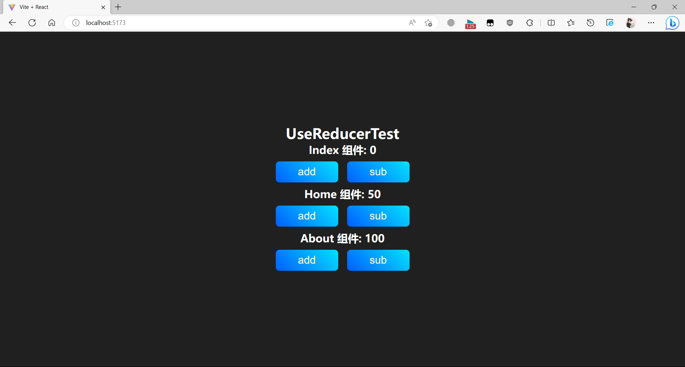

### E. useCallback


## 7. React Class Life Cycle

