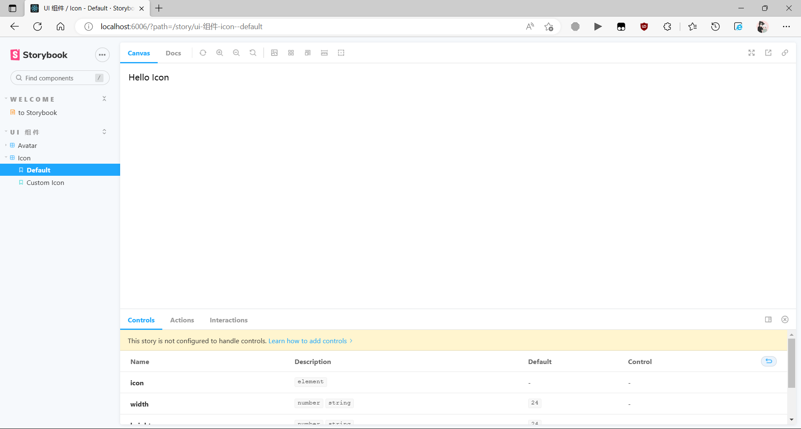

# ReactProject

## 前言

​    <b>本文档为个人笔记, 仅起到辅助作用! 文档作者: 常青前端. 该文档基于 [峰华前端](https://space.bilibili.com/302954484/?spm_id_from=333.999.0.0) 《React即时通讯》课程完成的. 现在分享一下教程的视频连接, 请将本文档与视频配套使用!效果更佳!如果条件允许的情况下请支持一下原视频的作者: <u>张旭乾</u>:</b>  

<b>视频讲解详细, 思路清晰易懂. 想要学习的话可以购买教学视频, 此文档仅为个人笔记, 不涉及商用!如需购买学习请点击链接进行跳转:</b> [点击跳转](https://study.163.com/course/courseMain.htm?share=1&shareId=1533295018&courseId=1210022809&tracecpk2)

## 1. 插件说明

<b>1. ESLint 是一款 JavaScript 的语法检查工具</b> 

<b>2. Prettier - Code formatter 是一款非常好用的代码格式化工具</b>

<b>3. ES7 React/Redux/GraphQL/React-Native snippets  是一款便捷的 React 基础框架生成工具</b> 

<b>4. JavaScript Es6 code snippets 是一款专注于 JavaScript 代码片段的生成工具</b> 

<b>5. Material Theme 推荐的 VS Code 主题 ( 可选项 )</b> 

<b>6. Material Icon Theme 推荐的 VS Code 文件图标 ( 可选项 )</b> 

<b>7. FiraCode 推荐的 VS Code 代码字体 ( 可选项; 下载地址: `github.com/tonsky/FiraCode` )</b> 

<b style="color: #F56C6C">※ 注意: 以上安装的均为 VS Code ( Visual Studio Code ) 插件, 项目所需插件将会在后期使用时安装, 并展示.</b> 

---

## 2. React 说明

<b>1. 下载 React 脚手架; 使用:</b> 

```javascript
// npm 下载
npm install create-react-app --global

// npm 简写
npm i create-react-app --global

// yarn 下载
yarn add create-react-app --g
```

<b style="color: #F56C6C">※ 注意: 以上的 "-g" 或是 "--global" 都指的全局安装</b> 

<b>2. 安装完成后, 在创建 React 项目时可以使用: </b> 

```js
// npm 的创建方式
npx create-react-app react-project

// yarn 的创建方式
yarn create react-app react-project

// 拓展提升: 创建 reactTypesApp 的方法
npx create-react-app react-project --template typescript
yarn create react-app react-project --template typescript
```

<b>3. 工程目录说明: </b> 

```javascript
/**
 * 1. node_modules: 是 Node Js 下载的模块目录，里面存放着项目中所需的各种功能模块
 * 2. public: 是静态资源目录，里面存放着项目中的静态资源，如：图片、css、js 等...
 * 3. src: 是源代码目录，里面存放着项目生产过程中的源代码，如：js、css、html 等...
 *   3.0. App.css: 是 React 样式文件，里面存放着项目最外层 App 的样式信息，如：样式名称、样式内容、样式作用范围等...
 *   3.1. App.js: 是 React 组件，里面存放着项目的组件信息，如：组件名称、组件内容、组件样式等...
 *   3.2. App.test.js: 是 React 测试文件，里面存放着项目的测试信息，如：测试名称、测试内容、测试结果等...( 可删除 )
 *   3.3. index.css: 是 React 样式文件，里面存放着项目的全局样式信息，如：样式名称、样式内容、样式作用范围等...
 *   3.4. index.js: 是 React 入口文件，里面存放着项目的入口信息，如：项目名称、版本、作者、依赖模块、自定义脚本等...
 *   3.5. logo.svg: 是 React 图片文件，里面存放着项目的图片信息，如：图片名称、图片内容、图片作用范围等...
 *   3.6. reportWebVitals.js: 是 React 性能测试文件，里面存放着项目的性能测试信息，如：测试名称、测试内容、测试结果等...
 *   3.7. setupTests.js: 是 React 测试文件，里面存放着项目的测试信息，如：测试名称、测试内容、测试结果等...( 可删除 )
 * 4. .gitignore: 是 Git 版本控制忽略文件，里面存放着不需要版本控制的文件
 * 5. package.json: 是项目配置文件，里面存放着项目的配置信息，如：项目名称、版本、作者、依赖模块、自定义脚本等...
 * 6. package-lock.json: 是项目配置文件，里面存放着项目的配置信息，如：项目名称、版本、作者、依赖模块、自定义脚本等...
 * 7. README.md: 是项目说明文件，里面存放着项目的说明信息，如：项目名称、版本、作者、依赖模块、自定义脚本等...
 */
```

<b>4. React 基础 - 创建组件</b> 

​    <b>创建一个测试组件例如: button 按钮组件, 这里需要注意组件名称需要首字母大写. ( 本次创建于: ./src/widgets/Button.{ js, jsx } )</b>

``` jsx
import React from 'react'

function Button() {
    // 事件处理函数
    const handleClick = () => {
        console.log('点击了一下')
    }

  // 返回组件并且绑定事件
  return <button onClick={handleClick}>点击一下</button>
}

export default Button
```

​    <b>本次将使用 ./src/pages/Index.{ js, jsx } 为主目录, ./src/App.{ js, jsx } 为根目录, 所以后面的所有次组件均加载到 ./src/pages/Index.{ js, jsx } 组件中, 再由该组件传递至根目录 ( ./scr/App.{ js, jsx } ) 文件中, 在此创建 Index.{ js, jsx } 主目录</b> 

```jsx
import React from 'react'
import Button from '../widgets/Button'

function Index() {
  return (
    <div>
        {/* 导入 Button 组件 */}
        <Button />
    </div>
  )
}

export default Index

```

​    <b>在此处创建 Button 组件</b>

```jsx
import React from 'react'

function Button() {
    // 事件处理函数
    const handleClick = () => {
        console.log('点击了一下')
    }

    // 返回组件并且绑定事件
  return <button onClick={handleClick}>点击一下</button> 
}

export default Button
```

​    <b>其次我们将最终整理好的组件, 直接交给 App.{ js, jsx } 去处理</b>

```jsx
import React from 'react';
import './App.css';
import Index from './pages/Index';

function App() {
  return <Index />
}

export default App;
```

​    <b>操作完成后, 启动服务器 ( 友情提示: 在命令行中使用 npm start 或 yarn start )后可以看到一下画面:</b> 


​    <b style="color: #F56C6C;">※ 左侧为: 启动后浏览器所示, 右侧则是: 点击浏览器中按钮后打印出的测试字符 ( 此时按钮应该没有任何样式: 居左, 上图因展示原因略有不同 )</b> 

<b>5. React 与 HTML 的区别</b>

```js
/**
 * html => jsx 的区别
 * onclick => onClick
 * class => className
 * style => style={{}}
 * style="background-color: 'red'" => style={{backgroundColor: 'red'}}"
 */
```

<b>6. React 基础 - Props 属性</b> 

​    <b>在 React 中可以使用 Props 属性对组件中的值进行传递, 例如以下传递 Button 按钮组件的文本字符,  在 Button 组件中如下定义:</b> 

```jsx
import React from 'react'

function Button(props) {
    // 事件处理函数
    const handleClick = () => {
        console.log('点击了一下')
    }

    // 返回组件并且绑定事件
  return <button onClick={handleClick}>
     {props.content}
  </button> 
}

export default Button

```

​    <b>当然也可以进行一定程度上的偷懒, 但本次偷懒将基于 ES6 中解构属性的方式进行实现, 如下所示:</b> 

```jsx
import React from 'react'

// 使用 ES6 的解构赋值语法获取 props 中的 content 属性
function Button({content}) {
    // 事件处理函数
    const handleClick = () => {
        console.log('点击了一下')
    }

    // 返回组件并且绑定事件
  return <button onClick={handleClick}>
     {content}
  </button> 
}

export default Button
```

   <b>紧接着在 Index 主目录中的组件使用时, 将子组件接收的 "content" 属性赋予内容, 如下所示:</b> 

```jsx
import React from 'react'
import Button from '../widgets/Button'

function Index() {
  return (
    <div>
        {/* 导入 Button 组件, 并在组件上使用 content 属性, 并对其赋值 */}
        <Button content="按钮1" />
    </div>
  )
}

export default Index

```

​    <b>书写完成后再次打开 浏览器 或 刷新 后可以看到, 按钮的文本跟刚刚的文本有了一些区别, 在 content 属性中的字符串成功的显示在了按钮组件的内容区域, 如图所示:</b> 


​    <b style="color: #F56C6C;">※ 左侧为: 刷新浏览器后的样式, 这里可以清晰的看见按钮文本从 "点击一下" 变成了 "按钮1", 右侧因为并未对按钮进行点击所以并未做出响应</b> 

<b>7. React 基础 - 组件复用</b> 

​    <b>在 React 中所有定义的组件都可以被当作一个自创的标签去使用, 当然既然是当成一个标签, 那么它理所当然的也可以被多次使用, 这里简称为: "复用组件", 复用组件的方法也很简单, 如下所示:</b> 

```jsx
import React from 'react'
import Button from '../widgets/Button'

function Index() {
  return (
    <div>
        {/* 导入 Button 组件, 并在组件上使用 content 属性, 并对其赋值 */}
        <Button content="按钮1" />
        
        {/* 对 Btn 组件进行复用 */}
        <Button content="按钮2" />
    </div>
  )
}

export default Index
```

​    <b>经过以上操作, 此时我们可以看到组件被重复使用成功, 如图所示:</b> 


​    <b>虽然实现了复用, 但是点击时就会发现出现了一个小问题, 按钮与按钮之间触发的函数是同一个, 如下图所示:</b> 


​    <b>那如果想要每个按钮显示的文本不同就可以使用传参的方式去实现, 将 onClick 方法从父级中传入子组件来实现, 具体方法方法如下：</b> 

```jsx
import React from 'react'

// 使用 ES6 的解构赋值语法获取 props 中的 content 属性
// 此时将点击事件也作为一个参数接收, 以便在组件中使用
function Button({onClick, content}) {
    // 返回组件并且绑定事件
  return <button onClick={ onClick }>
     {content}
  </button> 
}

export default Button

```

​    <b>在 Button 组件中设置完毕后, 就可以去调用组建的地方进行设置了, 这里选择的是 Index 主目录</b>

```jsx
import React from 'react'
import Button from '../widgets/Button'

function Index() {
    // 定义按钮1的点击事件
    const handleBtn1Click = () => {
        console.log('按钮1被点击了')
    }

    // 定义按钮2的点击事件
    const handleBtn2Click = () => {
        console.log('按钮2被点击了')
    }

  return (
    <div>
        {/* 导入 Button 组件, 并在组件上使用 content 属性, 并对其赋值 */}
        {/* 将点击事件 1 传入组件中 */}
        <Button content="按钮1" onClick={ handleBtn1Click } />

        {/* 对 Btn 组件进行复用 */}
        {/* 将点击事件 2 传入组件中 */}
        <Button content="按钮2" onClick={ handleBtn2Click } />
    </div>
  )
}

export default Index

```

​    <b>经过以上操作后, 就可以看到每一个按钮都有自己的点击事件了, 如下所示:</b> 


<b>8. React 基础 - children 属性</b> 

​    <b>在 React 组件中可以使用 children 属性进行获取组件中所包含的内容, 例如:</b> 

```jsx
import React from 'react'

// 使用 ES6 的解构赋值语法获取 props 中的 content 属性
// 此时将点击事件也作为一个参数接收, 以便在组件中使用
function Button({onClick, content, children = ""}) {
    // 返回组件并且绑定事件
  return (
    <div>
        <button onClick={ onClick }>
            {content}
        </button>
        {/* 将子组件的内容渲染到页面中 */}
        {children}
    </div>
  ) 
}

export default Button

```

   <b>设置完 Btn 组建后, 在修改 Index 主目录</b>

```jsx
import React from 'react'
import Button from '../widgets/Button'

function Index() {
    // 定义按钮1的点击事件
    const handleBtn1Click = () => {
        console.log('按钮1被点击了')
    }

    // 定义按钮2的点击事件
    const handleBtn2Click = () => {
        console.log('按钮2被点击了')
    }

  return (
    <div>
        {/* 导入 Button 组件, 并在组件上使用 content 属性, 并对其赋值 */}
        {/* 将点击事件 1 传入组件中 */}
        {/* 此时将组建 1 改为双标签, 并让子组件获取内部传递的 children 值 */}
        <Button content="按钮1" onClick={ handleBtn1Click }>
            <span>请点击按钮</span>
        </Button>

        {/* 对 Btn 组件进行复用 */}
        {/* 将点击事件 2 传入组件中 */}
        <Button content="按钮2" onClick={ handleBtn2Click } />
    </div>
  )
}

export default Index

```

​    <b>经过以上操作后, 就可以清晰的看到组件的内部标签也被成功读取并显示出来, 如下图:</b> 


<b>9. React 基础 - state 状态</b> 

​    <b>在 React 中如果想要组件可以根据条件进行变化, 则需要使用 state 去进行设置, 具体实现方法如下:</b> 

```jsx
import React, { useState } from 'react'
import Button from '../widgets/Button'

function Index() {

    // 设置一个 state 用于修改文本背景样式 #409EFF => #67C23A
    const [oBgc, setoBgc] = useState("#67C23A")

  return (
    <div>
        <p style={{backgroundColor: oBgc}}>
            这是一个文本, 点击按钮修改背景颜色, 
            你可以看到文本背景颜色已经被修改了, 
            但是这个修改是不会被保存的, 
            因为这个修改是在内存中进行的, 一旦页面刷新, 
            这个修改就会丢失
        </p>
        <Button onClick={() => setoBgc("#409EFF")} content="点击修改"></Button>
    </div>
  )
}

export default Index

```

​    <b>经过以上操作后, 再次点击按钮就可以看到 p 标签的颜色发生了变化, 如下所示:</b> 


​    <b style="color: #F56C6C;">※ 首先可以看到修改完成后可以正常运行了, 接下来我们尝试点击按钮:</b>


​    <b style="color: #F56C6C;">※ 通过点击按钮时, 右侧控制台中 p 标签的 style 属性发生变化, 最终将左侧文本的背景颜色从 绿色 转变成了 蓝色</b>

<b>10. React 基础 - Hooks</b> 

​    <b>在 React 中可以将可复用的方法或函数也作为一个单独的模块去使用, 例如本次案例中的修改颜色事件, 接下来书写一个 Hooks, 在 ./src 目录下创建一个模块文件夹用于存放一些公共的方法, 再在 ./src/modules 目录下创建一个 useReplacColor.js 文件, 用于修改背景颜色的公共方法</b>

```jsx
import { useState } from 'react'

function useReplacColor() {
    // 设置一个 state 用于修改文本背景样式 #409EFF => #67C23A
    const [oBgc, setoBgc] = useState("#67C23A")

    const handleClickReplacColor = () => {
        // 修改背景颜色
        setoBgc("#409EFF")
    }

    // 返回一个数组, 数组中包含了修改背景颜色的方法
    return [oBgc, handleClickReplacColor]
}

export default useReplacColor

```

​    <b>接下来再将 Hooks 引入 Index 主目录文件中, 如下所示:</b> 

```jsx
import React from 'react'
import Button from '../widgets/Button'
// 引入 Hooks => useReplacColor
import useReplacColor from '../modules/useReplacColor'

function Index() {
    // 使用 useReplacColor Hooks 对文本背景颜色进行修改
    const [oBgc, handleClickReplacColor] = useReplacColor()

  return (
    <div>
        <p style={{backgroundColor: oBgc}}>
            这是一个文本, 点击按钮修改背景颜色, 
            你可以看到文本背景颜色已经被修改了, 
            但是这个修改是不会被保存的, 
            因为这个修改是在内存中进行的, 一旦页面刷新, 
            这个修改就会丢失 ( 修改后 )
        </p>
        <Button onClick={ handleClickReplacColor } content="点击修改"></Button>
    </div>
  )
}

export default Index

```

​    <b>经过以上方式修改后的 React 代码显得更加简洁通俗易懂, 且功能能够在不变的前提下得到一定程度上的保证. 接下来将 Hooks 作为公共组件, 在现有的基础上进行修改, 如下:</b> 

```jsx
import { useState } from 'react'

// 在此处定义一个 Hooks, 并设置传参. 在参数处设置默认值
function useReplacColor(fromColor = "#409EFF", toColor = "#67C23A") {
    
    // 设置一个 state 用于修改文本背景样式 #409EFF => #67C23A
    const [oBgc, setoBgc] = useState(fromColor)

    const handleClickReplacColor = () => {
        // 修改背景颜色
        setoBgc(toColor)
    }

    // 返回一个数组, 数组中包含了修改背景颜色的方法
    return [oBgc, handleClickReplacColor]
}

export default useReplacColor

```

​    <b>并在 Index 中添加第 02 组文本及按钮, 并将其背景颜色设置为: 橘黄 => 粉红</b> 

```jsx
import React from 'react'
import Button from '../widgets/Button'
// 引入 Hooks => useReplacColor
import useReplacColor from '../modules/useReplacColor'

function Index() {
    // 使用 useReplacColor Hooks 对文本背景颜色进行修改
    const [oBgc, handleClick] = useReplacColor()

    // 02. 在此设置第 02 组样式
    const [oBgc2, handleClick2] = useReplacColor("#E6A23C", "#F56C6C")

  return (
    <div>
        <p style={{backgroundColor: oBgc}}>
            这是一个文本, 点击按钮修改背景颜色, 
            你可以看到文本背景颜色已经被修改了, 
            但是这个修改是不会被保存的, 
            因为这个修改是在内存中进行的, 一旦页面刷新, 
            这个修改就会丢失
        </p>
        <Button onClick={ handleClick } content="点击修改"></Button>

        {/* 01. 添加第二组 */}
        <p style={{backgroundColor: oBgc2}}>
            这是一个文本, 点击按钮修改背景颜色, 
            你可以看到文本背景颜色已经被修改了, 
            但是这个修改是不会被保存的, 
            因为这个修改是在内存中进行的, 一旦页面刷新, 
            这个修改就会丢失 ( 添加 02 组 )
        </p>
        <Button onClick={ handleClick2 } content="点击修改"></Button>

    </div>
  )
}

export default Index

```

​    <b>接下来看效果:</b> 


​    <b>以上为添加第二组后的样式, 接下来挨个进行点击测试:</b> 


​    <b>由上图可见, 以上组件实现了复用并相互并会产生冲突</b> 

---

## 3. Styled 插件

​    <b>Styled-component 是一款 React 的样式生成器, 它会针对每一个组建的每一个元素生成对应且唯一的类名, 不必担心重复类名导致与后面的组件重名的情况</b> 

<b>1. 下载安装, 可以使用 `npm` 或 `yarn` 命令进行安装, 具体方法如下:</b> 

```js
// 在终端使用 npm 命令下载
npm install styled-component --dev

// 简写为:
npm i styled-component --D

// 使用 YARN
yarn add styled-component --dev
```

<b>2. 配置方法</b>

​    <b>在 ./src 根目录中新建 theme.js 文件, 并将其引入到 ./src/index.js 文件中</b>

```js
export default {
    primaryColor: "#409EFF", // 设置默认主题颜色
};
```

​    <b>紧接着将配置好的 theme.js 引入到 ./src/index/js 中</b> 

```js
import React from 'react';
import ReactDOM from 'react-dom/client';
import './index.css';
import App from './App';
import reportWebVitals from './reportWebVitals';
import { ThemeProvider } from "styled-components";
import theme from "./theme";

const root = ReactDOM.createRoot(document.getElementById('root'));
root.render(
  <React.StrictMode>
    <ThemeProvider theme={theme}>
      <App />
    </ThemeProvider>
  </React.StrictMode>
);

reportWebVitals();

```

​    <b>在需要配置默认主题样式时, 可以在 ./src/theme.js 文件进行配置, 在后期使用时可以直接对值进行调用. 使用方法如下:</b> 

```js
export default {
    color: {
        primary: '#409EFF',
        primaryHover: '#A0CFFF',
        primaryChecked: '#337ECC',
        success: '#67C23A',
        successHover: '#B3E19D',
        successChecked: '#529B2E',
        warning: '#E6A23C',
        warningHover: '#F3D19E',
        warningChecked: ' #B88230',
        danger: '#F56C6C',
        dangerHover: '#FAB6B6',
        dangerChecked: '#C45656',
        info: '#909399',
        infoHover: ' #C8C9CC',
        infoChecked: '#73767A',
    }
};
```

<b>Theme.js 附录</b> 

```jsx
import styled from "styled-components"

const StyledDiv = styled.div`
    width: 120px;
    backround-color: ${({ theme }) => theme.color.primary} // No.01
`
```

​    <b style="color: #F56C6C;">以上展示为使用方法, 如上方 No.01 处书写的是: 将 theme 解构出来, 然后访问其下的 color 属性, 在访问 color 属性下的 primary 属性 ( color 与它下面的 primary 属性均为配置主题样式时, 书写的 ./src/theme.js 中的自定义颜色等内容相符 ) . 与正常访问对象方法无异.</b> 

<b>3. 使用方式</b>

​    <b>在使用时可以将其引入单个组件中, 在对某个元素进行设置, 如下例子展示:</b> 

```jsx
import React from 'react'
// 引入 styled-components
import styled from 'styled-components'

// 定义一个常量 styledDiv, 此处使用 Tagged Template Literals 语法
const StyledDiv = styled.div`
  width: 120px;
  height: 40px;
  background-color: #409EFF;
`

// 使用 ES6 的解构赋值语法获取 props 中的 content 属性
// 此时将点击事件也作为一个参数接收, 以便在组件中使用
function Button({onClick, content, children = ""}) {
    // 返回组件并且绑定事件
  return (
    <StyledDiv>
        <button onClick={ onClick }>
            {content}
        </button>
        {/* 将子组件的内容渲染到页面中 */}
        {children}
    </StyledDiv>
  ) 
}

export default Button

```

​    <b style="color: #F56C6C;">※ 注意: 在常量 StyledDiv 中使用的是 Tagged Template Literals 语法, 当然以上设置的是固定的值, 如图下所示. 当然也可设置变量值.</b> 


​    <b>接下来将为上方的 Button 组件设置宽度 220px,我们先给 Button 组件中的 StyledDiv 标签添加上一个 width 属性, 属性值采取 React 赋值的方式传递给它, 接下来使用 ES6 的解构语法与模板字符串中的 ${} 语法以及 ES6 箭头函数 进行 width 参数的传递, 来实现.具体操作如下:</b> 

```jsx
import React from 'react'
// 引入 styled-components
import styled from 'styled-components'

// 定义一个常量 styledDiv, 此处使用 Tagged Template Literals 语法
const StyledDiv = styled.div`
  width: ${({ width }) => width || "120px"};
  height: 40px;
  background-color: #409EFF;
`

// 使用 ES6 的解构赋值语法获取 props 中的 content 属性
// 此时将点击事件也作为一个参数接收, 以便在组件中使用
function Button({width, onClick, content, children = ""}) {

  console.log(width);
    // 返回组件并且绑定事件
  return (
    <StyledDiv width={width}>
        <button onClick={ onClick }>
            {content}
        </button>
        {/* 将子组件的内容渲染到页面中 */}
        {children}
    </StyledDiv>
  ) 
}

export default Button

```

​    <b>书写完成后再在 Index 主目录中的 Button 标签上设置 width 属性: `width="220px"`, 具体实操如下:</b> 

```jsx
import React from 'react'
import Button from '../widgets/Button'
// 引入 Hooks => useReplacColor
import useReplacColor from '../modules/useReplacColor'

function Index() {
    // 使用 useReplacColor Hooks 对文本背景颜色进行修改
    const [oBgc, handleClick] = useReplacColor()

    // 设置第 02 组样式
    const [oBgc2, handleClick2] = useReplacColor("#E6A23C", "#F56C6C")

  return (
    <div>
        <p style={{backgroundColor: oBgc}}>
            这是一个文本, 点击按钮修改背景颜色, 
            你可以看到文本背景颜色已经被修改了, 
            但是这个修改是不会被保存的, 
            因为这个修改是在内存中进行的, 一旦页面刷新, 
            这个修改就会丢失
        </p>
        <Button onClick={ handleClick } content="点击修改" width="220px"></Button>

        {/* 第二组 */}
        <p style={{backgroundColor: oBgc2}}>
            这是一个文本, 点击按钮修改背景颜色, 
            你可以看到文本背景颜色已经被修改了, 
            但是这个修改是不会被保存的, 
            因为这个修改是在内存中进行的, 一旦页面刷新, 
            这个修改就会丢失 ( 第 02 组 )
        </p>
        <Button onClick={ handleClick2 } content="点击修改"></Button>

    </div>
  )
}

export default Index

```

​    <b>完成以上步骤后就可以看到两个按钮的外层 DIV 标签长度不一, 如图:</b> 


---

## 4. StoryBook 插件

​    <b>StoryBook 是 UI 开发的工具。它通过隔离组件使开发更快、更容易。这允许您一次处理一个组件。您可以开发整个 UI，而无需启动复杂的开发堆栈、强制某些数据进入数据库或浏览应用程序</b> 

<b>1. 下载 StoryBook 插件:</b> 

```js
// 使用 npm 进行下载
npx -p @storybook/cli sb init
```

<b>2. 运行 StiryBook 插件:</b> 

```js
// 启动插件
yarn run storybook
```

<b>3. 配置文件, 在配置时可以删除 `src/stories` 目录下的除`Introduction.stories.mdx` 外的其余文件, 并将 `Introduction.stories.mdx` 文件重名为 `hello.stories.mdx` 并将内部的 `<Meta title="" />` 改为: `<Meta title="Welcome/to Storybook" />`</b> 

<b>A. 设置主题样式: ( 因为需要将 theme 中的主题样带入进来, 所以需要设置 ./.storybook 文件夹中的 preview.js )</b> 

```js
// 导入 React 组件
import React from "react";
// 导入 addDecorator 方法, 用于添加装饰器
import { addDecorator } from "@storybook/react";
// 导入 ThemeProvider 组件, 用于提供主题
import { ThemeProvider } from "styled-components";
// 导入主题 
import theme from "../src/theme";

// 添加装饰器: 此处导入 storyFn, 用于渲染组件
addDecorator( storyFn => {
    // 返回 ThemeProvider 组件, 用于提供主题: 此处传入主题和 storyFn, 并在内部挂载 storyFn 本身
  <ThemeProvider theme={theme}>{ storyFn() }</ThemeProvider>
})
```

<b style="color: #F56C6C;">※ 注意: 上方为老版本 @5.x, 最新版本的 @6.x 需要配置:</b>

```js
import React from 'react';
import { addDecorator } from '@storybook/react';
import { ThemeProvider } from 'styled-components';
import theme from './../src/theme.jsx'

/**
 * old method has the risk of not working with Storybook 6.0
 */
// addDecorator( storyFn => (
//     <ThemeProvider theme={theme}>
//       { storyFn() }
//     </ThemeProvider>
//   )
// )

/**
 *  new in Storybook 6.0
 */
export const decorators = [ Story => (
  <ThemeProvider theme={theme}>
    <Story />
  </ThemeProvider>
) ]


export const parameters = {
  actions: { argTypesRegex: "^on[A-Z].*" },
  controls: {
    matchers: {
      color: /(background|color)$/i,
      date: /Date$/,
    },
  },
  options: {
    showRoots: true,
  }
}
```

​    <b>B. 升级方式: 使用 `yarn upgrade-interactive --latest` 配置需要升级的插件, 这里配置项有:</b> 

```js
@storybook/react // storybook主程序 @5.3.19 => @6.5.10
@storybook/preset-create-react-app // @3.0.0 => @4.1.2
@storybook/addons // @5.3.19 => @6.5.10
@storybook/addon-links // @5.3.19 => @6.5.10
@storybook/addon-actions // @5.3.19 => @6.5.10
```

​    <b>升级完成后, 新版本还需要安装一些新的插件来支持:</b> 

```
yarn add @storybook/builder-webpack5 @storybook/manager-webpack5
```

​    <b>配置 `main.js` 文件, 新增:</b>

```js
module.exports = {
  stories: [
    "../src/**/*.stories.mdx",
    "../src/**/*.stories.@(js|jsx|ts|tsx)",
  ],
  addons: [
    "@storybook/addon-links",
    "@storybook/addon-essentials",
    "@storybook/addon-interactions",
    "@storybook/preset-create-react-app"
  ],
  framework: "@storybook/react",
  core: {
    "builder": "@storybook/builder-webpack5"
  }
}
```

​    <b>接下来设置 `preview.js`, 并将内部新版本中过时的 API: `addDecorator` 和 `addParameters` 删除. 并设置新的解构样式</b>

```js
import React from 'react';
import { addDecorator } from '@storybook/react';
import { ThemeProvider } from 'styled-components';
import theme from './../src/theme.jsx'

/**
 *  new in Storybook 6.0
 */
export const decorators = [ Story => (
  <ThemeProvider theme={theme}>
    <Story />
  </ThemeProvider>
)]


export const parameters = {
  actions: { argTypesRegex: "^on[A-Z].*" },
  controls: {
    matchers: {
      color: /(background|color)$/i,
      date: /Date$/,
    },
  },
  options: {
    showRoots: true,
  }
}
```


# ProjectStrat

## 前言

​    <b>本程序为 react 即时通讯项目</b>

## 1. 配置项目

​    <b>使用 React 创造指令创建一个 `react-chat` 项目, 创建完成后将该项目重新导入 VS Code ( Visual Studio Code ) 中, 重新导入是为了打开终端 ( Ctrl + \` ) 时直接就在项目目录下了, 不需要再使用 :`cd react-chat` 进入项目目录了</b> n

​    <b>完成以上步骤后, 开始配置插件, 下载上方讲解的插件:</b>

```js
// npm
npm i styled-component -D
npm i sass sass-loader -D
npx -p @stpeiorybook/cli sb init

// yarn
yarn add styled-component -D
yarn add -D sass sass-loader
npx -p @storybook/cli sb init
```

​    <b>配置完成后, 启动 storybook 插件, 使用: `yarn storybook` 或是 `npm run storybook`</b> 


​    <b>完成以上基础配置后, 需要按照上方配置重新设置 storybook 的配置:</b>


### A. 配置样式

​    <b>在 `./src/theme.jsx` 中书写样式文件</b>

```jsx
const theme = {
    colors: {
        primary: "#409EFF",
        brand: {
            darkest: "#337ecc",
            base: "#409EFF",
            darker: "#79bbff",
            dark: "#a0cfff",
            light: "#c6e2ff",
            lighter: "#d9ecff",
            lightest: "#ecf5ff",
        },
        success: {
            darkest: "#529b2e",
            base: "#67C23A",
            darker: "#95d475",
            dark: "#b3e19d",
            light: "#d1edc4",
            lighter: "#e1f3d8",
            lightest: "#f0f9eb"
        },
        warning: {
            darkest: "#b88230",
            base: "#E6A23C",
            darker: "#eebe77",
            dark: "#f3d19e",
            light: "#f8e3c5",
            lighter: "#faecd8",
            lightest: "#fdf6ec"
        },
        danger: {
            darkest: "#c45656",
            base: "#F56C6C",
            darker: "#f89898",
            dark: "#fab6b6",
            light: "#fcd3d3",
            lighter: "#fde2e2",
            lightest: "#fef0f0"
        },
        info: {
            darkest: "#73767a",
            base: "#909399",
            darker: "#c8c9cc",
            dark: "#c8c9cc",
            light: "#dedfe0",
            lighter: "#e9e9eb",
            lightest: "#f4f4f5"
        }
    }
}


export default theme
```

### B. 默认仓库

​    <b>默认将所有的图片、视频、音频文件存放于 `./src/asstes` 文件夹中的对应文件中, 分别为:</b>

​        <b>1. `./src/asstes/audios` 中存放音频文件</b> 

​        <b>2. `./src/asstes/images` 中存放图像文件</b> 

​        <b>3. `./src/asstes/videos` 中存放视频文件</b> 

### C. 配置 StoryBook

​    <b>与上方同理, 此处省略, 代码如下:</b> 

```js
import React from 'react';
import { addDecorator } from '@storybook/react';
import { ThemeProvider } from 'styled-components';
import theme from './../src/theme.jsx'


addDecorator( storyFn => (
    <ThemeProvider theme={theme}>
      { storyFn() }
    </ThemeProvider>
  )
)

export const parameters = {
  actions: { argTypesRegex: "^on[A-Z].*" },
  controls: {
    matchers: {
      color: /(background|color)$/i,
      date: /Date$/,
    },
  },
}
```

## 2. Avatar 组件

​    <b>在 `./src` 目录下创建 `./src/components` 组件文件夹, 再在内部创建 `./src/components/Avatar` 文件. 内部分别创建:</b>

​        <b>1. 项目组件: `./src/components/Avatar/index.jsx`</b> 

​        <b>2. 组件样式: `./src/components/Avatar/styles/jsx`</b> 

​        <b>3. 组件文档: `./src/components/Avatar/avatar.stories.jsx`</b> 

### A. 主页构建

​    <b>1. 可以使用快捷方式构建一个 React 组件: `rfcp` 然后点击 Tab 就可以完成了 ( 以上操作基于插件: `ES7 React/Redux/GraphQL/React-Native snippets` )</b> 

```jsx
// 创建完成:
import React from 'react'
import PropTypes from 'prop-types'

function Avatar(props) {
  return (
    <div>
          
    </div>
  )
}

Avatar.propTypes = {

}

export default Avatar


```

​    <b>2. 构建基础结构:</b> 

```jsx
import React from 'react'
import PropTypes from 'prop-types'
//导入 Avatar 头像图片
import AvatarPortrait from './../../assets/images/web@1x.png'

function Avatar(props) {
  return (
    // 最外层容器
    <div>
        
        {/* 在线状态 */}
        <div></div>

        {/* 头像外层容器 */}
        <div>

            {/* 头像容器 */}
            

        </div>

    </div>
  )
}

Avatar.propTypes = {

}

export default Avatar

```

### B. 配置文档

​    <b>在 `./src/components/Avatar` 目录下创建 `avatar.stories.jsx` 文件, 作为 StoryBook 的文档文件，在文件中添加配置项:</b> 

```jsx
// 导入 React 组件
import React from 'react'
// 导入 Avatar 头像组件
import Avatar from '.'

// 导出默认的组件
export default {
    // 组件的标题
    title: 'Avatar',
    // 组件的描述
    component: Avatar,
}

// 导出 Avatar 组件的默认样式: Default, 在内部使用 <Avatar /> 组件进行渲染
export const Default = () => <Avatar />

```

### C. 构建样式

​    <b>在 `./src/components/Avatar/styles.jsx` 中配置 Index.jsx 的样式:</b> 

```jsx
import styled from "styled-components";

// 最外层 Avatar 组件容器
const StyledAvatar = styled.div``;

// Avatar 组件的在线状态容器
const StatusIcon = styled.div``;

// Avatar 组件的头像外层容器 ( 作用: 裁剪头像 )
const AvatarClip = styled.div``;

// Avatar 组件的头像容器
const AvatarImg = styled.img``;

// 默认导出最外层容器
export default StyledAvatar;

// 导出其余子组件
export { StatusIcon, AvatarClip, AvatarImg };

```

### D. 导入样式

​    <b>将配置好的样式文件导入 Index.jsx 页面中:</b> 

```jsx
import React from 'react'
import PropTypes from 'prop-types'
//导入 Avatar 头像图片
import AvatarPortrait from './../../assets/images/web@1x.png'
// 导入配置好的样式组件
import StyledAvatar, { StatusIcon, AvatarClip, AvatarImg } from './styles'

function Avatar(props) {
  return (
    // 最外层容器
    <StyledAvatar>
        
        {/* 在线状态 */}
        <StatusIcon></StatusIcon>

        {/* 头像外层容器 */}
        <AvatarClip>

            {/* 头像容器 */}
            <AvatarImg src={AvatarPortrait} alt="avatar" />

        </AvatarClip>

    </StyledAvatar>
  )
}

Avatar.propTypes = {

}

export default Avatar

```

### E. 设置样式

​    <b>配置头像组件的基本样式:</b> 

```jsx
import styled from "styled-components";

// 最外层 Avatar 组件容器
const StyledAvatar = styled.div`
    position: relative;
`;

// Avatar 组件的在线状态容器
const StatusIcon = styled.div`
    position: absolute;
    left: 2px;
    top: 4px;

    &::before {
        content: "";
        position: absolute;
        display: block;
        width: 8px;
        height: 8px;
        border-radius: 50%;
        background-color: white;
        transform: scale(2);
    }

    &::after {
        content: "";
        position: absolute;
        display: block;
        width: 8px;
        height: 8px;
        border-radius: 50%;
        background-color: ${({ theme })  => theme.colors.success.base};
    }
`;

// Avatar 组件的头像外层容器 ( 作用: 裁剪头像 )
const AvatarClip = styled.div`
    width: 48px;
    height: 48px;
    border-radius: 50%;
    overflow: hidden;
`;

// Avatar 组件的头像容器
const AvatarImg = styled.img`
    width: 100%;
    height: 100%;
    object-fit: cover;
    object-position: center;
`;

// 默认导出最外层容器
export default StyledAvatar;

// 导出其余子组件
export { StatusIcon, AvatarClip, AvatarImg };

```

### F. 优化样式

​    <b>在 styled-components 组件中对于那些重复的代码可以进行配置后, 复用代码. 从而达到优化代码量的效果, 且减轻工作量, 并为后期维护提供便捷, 优化如下:</b> 

```jsx
import styled, { css } from "styled-components";

// 定义样式复用的变量, 将通用的样式抽离出来, 以便复用
// ! danger: 注意要导入 styled-components 的 css 方法, 否则无法使用 css`` 语法
const StatusIconFunc = color => css`
    content: "";
    position: absolute;
    display: block;
    width: 8px;
    height: 8px;
    border-radius: 50%;
    background-color: ${color};
`;

// 最外层 Avatar 组件容器
const StyledAvatar = styled.div`
    position: relative;
`;

// Avatar 组件的在线状态容器
const StatusIcon = styled.div`
    position: absolute;
    left: 2px;
    top: 4px;

    &::before {
        // last: 此处相对于下方先导入并解构的方式, 再此项并不需要, 之将调用 StatusIconFunc 方法, 并传入参数
        // !important: 注意此处参数类型应为: 
        // !    String<hsla | rgba | /#([0-9a-fA-F]{6}|[0-9a-fA-F]{3})$/g | Color> |
        // !    'transparent' |
        // !   
        ${ StatusIconFunc( "white" ) }
        
        transform: scale(2);
    }

    &::after {
        // first: 此处导入并解构 theme, 然后将参数传入 StatusIconFunc 方法中
        ${ ({ theme }) => StatusIconFunc( theme.colors.success.base ) }
    }
`;

// Avatar 组件的头像外层容器 ( 作用: 裁剪头像 )
const AvatarClip = styled.div`
    width: 48px;
    height: 48px;
    border-radius: 50%;
    overflow: hidden;
`;

// Avatar 组件的头像容器
const AvatarImg = styled.img`
    width: 100%;
    height: 100%;
    object-fit: cover;
    object-position: center;
`;

// 默认导出最外层容器
export default StyledAvatar;

// 导出其余子组件
export { StatusIcon, AvatarClip, AvatarImg };

```

### G. 配置 Props

​    <b>经过以上操作后虽然可以看见头像, 以及在线状态, 但支支持"在线"的状态, 并且尺寸也是固定的, 为了更好的兼容个平台尺寸以及后期样式等, 需要配置 Index.jsx 的 props 属性, 其中包含:</b>

​        <b>1. 头像链接: src</b> 

​        <b>2. 头像大小: size</b> 

​        <b>3. 在线状态: status</b> 

​        <b>4. 在线图标大小: statusIconSize</b> 

​    <b>将其配置到文件中的各个结构上: ( 此处使用解构的方式将 props 内的对象解构出来 )</b>

```jsx
import React from 'react'
import PropTypes from 'prop-types'
//导入 Avatar 头像图片
import AvatarPortrait from './../../assets/images/web@1x.png'
// 导入配置好的样式组件
import StyledAvatar, { StatusIcon, AvatarClip, AvatarImg } from './styles'

/**
 * @Explain：
 * @Variable {src} 头像图片地址
 * @Variable {size} 头像大小; defalut { fontSize: 48, }
 * @Variable {status} 在线状态
 * @Variable {statusIconSize} 在线状态图标大小; defalut { fontSize: 8, }
 * @Variable {rest} 其他属性
 */
function Avatar({ src, size = "48px", status, statusIconSize = "8px", ...rest }) {
  return (
    // 最外层容器
    <StyledAvatar { ...rest}>
        
        {/* 在线状态 */}
        {/* 
          通过 React 短路的特性, 对 status 值进行判断
          如果 status 值不为空, 则渲染 StatusIcon 组件
          如果为空值, 则不显示该组件
         */}
        {status && (
          <StatusIcon status={status} size={statusIconSize}></StatusIcon>
        )}

        {/* 头像外层容器 */}
        <AvatarClip size={size}>

            {/* 头像容器 */}
            <AvatarImg src={AvatarPortrait} alt="avatar" />

        </AvatarClip>

    </StyledAvatar>
  )
}

Avatar.propTypes = {}

export default Avatar

```

​    <b>完成以上的基础参数传递的基础配置后, 接下来就该修改 styles 的样式配置了, 将传入的各参数带入到指定位置:</b> 

```jsx
import styled, { css } from "styled-components";

// 定义样式复用的变量, 将通用的样式抽离出来, 以便复用
// ! danger: 注意要导入 styled-components 的 css 方法, 否则无法使用 css`` 语法
const StatusIconFunc = (color, size = "8px") => css`
    content: "";
    position: absolute;
    display: block;
    width: ${size};
    height: ${size};
    border-radius: 50%;
    background-color: ${color};
`;

// 最外层 Avatar 组件容器
const StyledAvatar = styled.div`
    position: relative;
`;

// Avatar 组件的在线状态容器
const StatusIcon = styled.div`
    position: absolute;
    left: 2px;
    top: 4px;

    &::before {
        // last: 此处相对于下方先导入并解构的方式, 再此项并不需要, 之将调用 StatusIconFunc 方法, 并传入参数
        // !important: 注意此处参数类型应为: 
        // !    String<hsla | rgba | /#([0-9a-fA-F]{6}|[0-9a-fA-F]{3})$/g | Color> |
        // !    'transparent' |
        // !    'none'
        // todo: 此处的 size 参数是从 Avatar 组件中传入的, 并将其传入 StatusIconFunc 方法中
        // todo: 取自:./Index 的 statusIconSize 参数( 在线状态图标大小 ), 大圆外框 8px
        ${ ({ size }) => StatusIconFunc( "white", size ) }
        
        transform: scale(2);
    }

    &::after {
        // first: 此处导入并解构 theme, 然后将参数传入 StatusIconFunc 方法中
        ${ ({ theme, status, size }) => {
            // 判断 status 值, 并返回对应的颜色
            if( status === "online" ) return StatusIconFunc( theme.colors.success.base, size );
            if( status === "offline" ) return StatusIconFunc( theme.colors.info.base, size );
        } }
    }
`;

// Avatar 组件的头像外层容器 ( 作用: 裁剪头像 )
// todo: 取自:./Index 的 size 参数( 头像大小 ), 头像外框 48px
const AvatarClip = styled.div`
    width: ${ ({ size }) => size };
    height: ${ ({ size }) => size };
    border-radius: 50%;
    overflow: hidden;
`;

// Avatar 组件的头像容器
const AvatarImg = styled.img`
    width: 100%;
    height: 100%;
    object-fit: cover;
    object-position: center;
`;

// 默认导出最外层容器
export default StyledAvatar;

// 导出其余子组件
export { StatusIcon, AvatarClip, AvatarImg };

```

​    <b>样式配置完成后, 还需要使用 storybook 测试一下, 在 `./src/components/Avatar/avatar.stories.jsx` 中进行配置:</b> 

```jsx
// 导入 React 组件
import React from 'react'
// 导入 Avatar 头像组件
import Avatar from './Index'

// 导入头像图片
import AvatarPortraitMin from './../../assets/images/web@1x.png'
import AvatarPortraitMid from './../../assets/images/web@2x.png'
import AvatarPortraitMax from './../../assets/images/web@3x.png'
import AvatarPortraitMax2 from './../../assets/images/web@4x.png'

// 导出默认的组件
export default {
    // 组件的标题
    title: 'Avatar',
    // 组件的描述
    component: Avatar,
}

// 导出 Avatar 组件的默认样式: Default, 在内部使用 <Avatar /> 组件进行渲染
export const Default = () => <Avatar src={AvatarPortraitMin} />


// 配置头像链接地址, 及其尺寸大小
export const Sizes = () => (
    <div>
        <Avatar src={AvatarPortraitMin} size="48px" />
        <Avatar src={AvatarPortraitMid} size="56px" />
        <Avatar src={AvatarPortraitMax} size="64px" />
        <Avatar src={AvatarPortraitMax2} size="72px" />
    </div>
)

// 配置头像在线状态
export const WithStatus = () => (
    <div>
        <Avatar src={AvatarPortraitMin} status="online" />
        <Avatar src={AvatarPortraitMid} status="offline" />
        <Avatar src={AvatarPortraitMax2} size="72px" status="offline" statusIconSize='12px' />
        <Avatar src={AvatarPortraitMax2} size="72px" status="online" statusIconSize='12px' />
    </div>
)
```

​    <b>但是这时启动 StoryBook 就会发现虽然展示出来了, 但因为是竖向排列的所以并不美观:</b> 


​    <b>为了看起来更加的美观, 在 `./src` 根目录下创建 `story.scss` 文件, 作为 storybook 的样式配置文件, 在文件内部配置样式:</b> 

```scss
.row-elements {
    display: flex;

    & > * {
        margin: 8px;
    }
}
```

​    <b>完成以上步骤后, 就可以将刚刚创建好的样式文件引入到 `./src/components/Avatar/avatar.stories.jsx` 文档中, 并为对应的标签书写 `className` 属性:</b> 

```jsx
// 导入 React 组件
import React from 'react'
// 导入 Avatar 头像组件
import Avatar from './Index'
// 导入样式文件
// import './../../story.scss'

// 导入头像图片
import AvatarPortraitMin from './../../assets/images/web@1x.png'
import AvatarPortraitMid from './../../assets/images/web@2x.png'
import AvatarPortraitMax from './../../assets/images/web@3x.png'
import AvatarPortraitMax2 from './../../assets/images/web@4x.png'

// 导出默认的组件
export default {
    // 组件的标题
    title: 'Avatar',
    // 组件的描述
    component: Avatar,
}

// 导出 Avatar 组件的默认样式: Default, 在内部使用 <Avatar /> 组件进行渲染
export const Default = () => <Avatar src={AvatarPortraitMin} />


// 配置头像链接地址, 及其尺寸大小
export const Sizes = () => (
    <div className={"row-elements"}>
        <Avatar src={AvatarPortraitMin} size="48px" />
        <Avatar src={AvatarPortraitMid} size="56px" />
        <Avatar src={AvatarPortraitMax} size="64px" />
        <Avatar src={AvatarPortraitMax2} size="72px" />
    </div>
)

// 配置头像在线状态
export const WithStatus = () => (
    <div className={"row-elements"}>
        <Avatar src={AvatarPortraitMin} status="online" />
        <Avatar src={AvatarPortraitMid} status="offline" />
        <Avatar src={AvatarPortraitMax2} size="72px" status="online" statusIconSize='12px' />
        <Avatar src={AvatarPortraitMax2} size="72px" status="offline" statusIconSize='12px' />
    </div>
)
```

​    <b>将指定的 `div` 标签上设置 class 类名, 注意在 React 中要设置为 className, 设置完成后就可以看见所有的头像样式变成了横向排列的:</b> 


### H. propTypes

​    <b>在 `./src/components/Avatar/index.jsx` 文件中还有一个地方没有进行配置, 虽然不配置也没有任何关系, 但是在团队开发中是需要大伙合作的, 再合作的过程中如果不标明类型的话, 很容易出现类型错误, 从而导致程序加载失败的现象, 所以这里配置一下参数的类型, 如下: </b> 

```jsx
import React from 'react'
import PropTypes from 'prop-types'
//导入 Avatar 头像图片
import AvatarPortrait from './../../assets/images/web@1x.png'
// 导入配置好的样式组件
import StyledAvatar, { StatusIcon, AvatarClip, AvatarImg } from './styles'

/**
 * @Explain：
 * @Variable {src} 头像图片地址
 * @Variable {size} 头像大小; defalut { fontSize: 48, }
 * @Variable {status} 在线状态
 * @Variable {statusIconSize} 在线状态图标大小; defalut { fontSize: 8, }
 * @Variable {rest} 其他属性
 */
function Avatar({ src, size = "48px", status, statusIconSize = "8px", ...rest }) {
  return (
    // 最外层容器
    <StyledAvatar { ...rest}>
        
        {/* 在线状态 */}
        {/* 
          通过 React 短路的特性, 对 status 值进行判断
          如果 status 值不为空, 则渲染 StatusIcon 组件
          如果为空值, 则不渲染 StatusIcon 组件
         */}
        {status && (
          <StatusIcon status={status} size={statusIconSize}></StatusIcon>
        )}

        {/* 头像外层容器 */}
        <AvatarClip size={size}>

            {/* 头像容器 */}
            <AvatarImg src={AvatarPortrait} alt="avatar" />

        </AvatarClip>

    </StyledAvatar>
  )
}

Avatar.propTypes = {
  src: PropTypes.string.isRequired,
  size: PropTypes.string,
  status: PropTypes.oneOf(['online', 'offline']),
  statusIconSize: PropTypes.string,
}

export default Avatar

```

​    <b>这里的 `.isRequired` 是指这个属性时必须的! 必填项!</b> 

### I. jsconfig.json

​    <b>为了后期编译更加的便捷, 将 src 根目录配置成默认地址, 在项目根目录下创建一个 `jsconfig.json` 用于配置项目让 VS Code 将其当成一个完整的 JavaScript 工程, 使其能够提供更好的代码补全、检测等功能... 接下来配置 `jsconfig.json` 文件:</b> 

```json
{
    "compilerOptions": {
        "baseUrl": "src"
    },
    "include": [
        "src"
    ],
    "exclude": [
        "node_modules",
        "**/node_modules/*"
    ]
}
```

​    <b>上方配置项:</b> 

​        <b>1. compilerOptions: 用于配置程序编译选项</b> 

​        <b>2. baseUrl: 用于配置程序编译根目录选项</b> 

​        <b>3. include: 用于配置包含文件</b> 

​        <b>4. exclude: 用于配置排除文件</b> 

​    <b>1. 配置完成后就可以将 `./src/components/Avatar/Index.jsx` 内的所有导入替换成从 src 目录下开始的路径了, 如下:</b> 

```jsx
import React from 'react'
import PropTypes from 'prop-types'
//导入 Avatar 头像图片 例如此处; 编译时会自动从 ./src/** 开始编译,
// 所以这里直接写 'assets/images/web@1x.png' 即可
// 编译时: './src/' + 'assets/images/web@1x.png' = './src/assets/images/web@1x.png'
import AvatarPortrait from 'assets/images/web@1x.png'
// 导入配置好的样式组件
import StyledAvatar, { StatusIcon, AvatarClip, AvatarImg } from './styles'

/**
 * @Explain：
 * @Variable {src} 头像图片地址
 * @Variable {size} 头像大小; defalut { fontSize: 48, }
 * @Variable {status} 在线状态
 * @Variable {statusIconSize} 在线状态图标大小; defalut { fontSize: 8, }
 * @Variable {rest} 其他属性
 */
function Avatar({ src, size = "48px", status, statusIconSize = "8px", ...rest }) {
  return (
    // 最外层容器
    <StyledAvatar { ...rest}>
        
        {/* 在线状态 */}
        {/* 
          通过 React 短路的特性, 对 status 值进行判断
          如果 status 值不为空, 则渲染 StatusIcon 组件
          如果为空值, 则不渲染 StatusIcon 组件
         */}
        {status && (
          <StatusIcon status={status} size={statusIconSize}></StatusIcon>
        )}

        {/* 头像外层容器 */}
        <AvatarClip size={size}>

            {/* 头像容器 */}
            <AvatarImg src={AvatarPortrait} alt="avatar" />

        </AvatarClip>

    </StyledAvatar>
  )
}

Avatar.propTypes = {
  src: PropTypes.string.isRequired,
  size: PropTypes.string,
  status: PropTypes.oneOf(['online', 'offline']),
  statusIconSize: PropTypes.string,
}

export default Avatar

```

## 3. Hygen 插件

​    <b>刚刚是创建了一个头像模块, 但接下来还要创建更多其它的模块, 这样书写下去看似结果不错, 其实效率很低, 所以下面使用更高效的方式进行接下来剩余模块的开发. 此处开始下载 Hygen 插件, 这个插件需要使用全局安装, 建议使用 npm 进行安装:</b> 

```js
// 简写形式
npm i -g hygen

// 全拼输入
npm install --global hygen
```

## 4. 配置模板

​    <b>经过上方配置以后, 就可以进行模板的配置了, 使用:</b> 

```js
// 初始化项目模板
hygen init self
```

​    <b>命令, 该命令用于初始化模板文件, 如下所示:</b> 


​    <b>初始化完成后, 接下来在使用:</b> 

```js
// 创建项目模板
hygen generator new component
```

​    <b>命令, 该命令是用于创建后面将会使用到的模板, 运行完毕后就可以看到如下图所示. </b> 


### A. 编写模板

​    <b>1. 先将生成的默认文件删掉 ( `hello.ejs.t` )</b> 


​    <b>2. 新建 `index.ejs.t` 文件, 并在内部书写:</b> 

```ejs
---
to: src/components/<%= name %>/index.jsx
---
```

​    <b>上方语句是指: 生成文件到 src/components/ 文件目录下的 name 目录, 并在其下生成 `index.jsx`. 接下来不全 index.jsx 模板:</b>

```ejs
---
to: src/components/<%= name %>/index.jsx
---

import React from 'react'
import PropTypes from 'prop-types'
import Styled<%= name %> from './styles'

function <%= name %>({ children, ...rest }) {
  return (
    <Styled<%= name %> { ...rest}>
        {children}
    </Styled<%= name %>>
  )
}

<%= name %>.propTypes = {
  children: PropTypes.any
}

export default <%= name %>

```

​    <b>完成后, 继续将样式文件 `styles.ejs.t`, 文档 `stories.ejs.t` 补全: </b>

<b>样式文件:</b> 

```ejs
---
to: src/components/<%= name %>/styles.jsx
---

import styled from 'styled-components';

const Styled<%= name %> = styled.div``;

export default Styled<%= name %>;

```

<b>文档文件:</b> 

```ejs
---
to: src/components/<%= name %>/<%= h.changeCase.lcFirst(name) %>.stories.jsx
---

import React from 'react';
import <%= name %> from '.';

export default {
  title: '<%= name %>',
  component: <%= name %>,
};

export const Default = () => <<%= name %> />;
```

​    <b style="color: #F56C6C;">※ 注意: 这里需要注意最后导出的 storybook 组件需要写两个尖括号, 因为模板只会将 `<%= name %>` 替换成对应的文本, 不会生成外层的尖括号, 如果不写则会生成 `export const Default = () => Templates;`, 而 storybook 需要的是组件而不是文本, 所以会导致后期报错的出现.</b> 

## 5. Icon 组件

​    <b>使用命令: `hygen component new Icon`, 生成 Icon 组件. 此时的 Icon 组件是使用上佛模板生成的, 所以都是一些默认内容， 接下来还需要进一步改造, 先将 `index.jsx` 下的内容删除.</b>

​    <b style="color: #E6A23C">注意: 此处的 `hygen component new Icon` 命令是有所省略的, 此处省略了 `--name` 的后缀直接书写了 `Icon` 组件名, 全句应为: `hygen component new --name Icon`, 当然此处省略也可以并且并未报错!</b>

```jsx
import React from 'react'
import PropTypes from 'prop-types'
import StyledIcon from './styles'

// 删除默认的 children
function Icon({ children, ...rest }) {
  return (
    <StyledIcon>
      // 删除 children
          { children }
     </StyledIcon>
  )
}

Icon.propTypes = {
  // 删除默认的 children 类型
    children: PropTypes.any
}

export default Icon

```

​    <b style="color: #E6A23C">删除完毕后的代码:</b>

```jsx
import React from 'react'
import PropTypes from 'prop-types'
import StyledIcon from './styles'

// 删除默认的 children
function Icon({ ...rest }) {
  return (
    <StyledIcon>
        Hello Icon
    </StyledIcon>
  )
}

Icon.propTypes = {}

export default Icon

```

​    <b>接下来配置 icon.stories.jsx 文件: </b> 

```jsx
import React from 'react';
import Icon from '.';
import { ReactComponent as SmileIcon } from 'assets/icons/smile.svg';

export default {
  title: 'Icon',
  component: Icon,
};

export const Default = () => <Icon/>;

```

​    <b>完成以上操作以后就可以看到 storybook 已经映射出了 Icon 组件:</b> 


​    <b>虽然已经成功将 Icon 组件映射出来了, 但并未进行与 WELCOME 类似的分组操作, 所以基于以上映射及组件分析, 统一将: 头像 和 Icon 组件分为: `UI 组件` 组, 想要在 Storybook 中进行分组可以在 `*.stories.jsx` 文件下的 title 属性中进行设置: </b> 

```jsx
// 这里统一配置, Avary 组件也需要如此操作
import React from 'react';
import Icon from '.';
import { ReactComponent as SmileIcon } from 'assets/icons/smile.svg';

export default {
  title: 'UI 组件/Icon', // title: 'Icon' => title: 'UI 组件/Icon'
  component: Icon,
};

export const Default = () => <Icon />;
```

​    <b>完成后看一下结果, 如果没有改变可以尝试 刷新 或 重启 Storybook 插件:</b> 



​    <b>接下来开始编写 Icon 组件, 这里将: icon ( 图片组件 ), width( 图片宽度 ), height ( 图片高度 ), color ( 设置颜色 ), opacity ( 图片透明度 ), 这里将 icon 设置别名 `icon: IconComponent` 定义为 icon 图片组件, 因为后期将要传递 SVG 矢量图形, 所以后方的 width 和 height 都不需要设置单位, 但他可以设置为两种形式( 1. 数字形式, 2. 百分比形式 ). 最后再将其余变量统一收纳到 `..rest`, 具体操作如下:</b>  

```jsx
import React from 'react'
import PropTypes from 'prop-types'
import StyledIcon from './styles'
/**
 * @Explain：
 * @Variable icon: IconComponent, 传入的图标组件
 * @Variable width: 24, 图标宽度默认为 24px
 * @Variable height: 24, 图标高度默认为 24px
 * @Variable color, 用来设置图标颜色
 * @Variable opacity, 用来设置图标透明度
 * @Variable rest, 其他属性
 */
function Icon({icon: IconComponent, width = 24, height = 24, color, opacity, ...rest }) {
  return (
    <StyledIcon color={ color } opacity={ opacity } {...rest}>
      {/* 此处依旧是运用 React 短路的特性, 如果 IconComponent 存在, 则渲染 IconComponent 组件 */}
      {/* 这里只有传递了图标值的时候, 才会加载; 使用 props 传递组件的时候可以直接将其当作组件使用 */}
      {/* 所以这里直接使用的 <IconComponent /> 组件 */}
      { IconComponent && <IconComponent width={width} height={height} /> }
    </StyledIcon>
  )
}

Icon.propTypes = {
  icon: PropTypes.element,
  width: PropTypes.oneOfType([PropTypes.number, PropTypes.string]),
  height: PropTypes.oneOfType([PropTypes.number, PropTypes.string]),
  color: PropTypes.string,
  opacity: PropTypes.number,
}

export default Icon

```

​    <b>配置完成后, 接下来给 Icon 组件设置样式:</b> 

```jsx
import styled from 'styled-components';

// 配置 Icon 组件的样式
const StyledIcon = styled.div`
    display: inline-flex;
    align-items: center;
    justify-content: center;

    // 配置 Icon 的 svg 及 svg 的子元素的样式
    svg, svg * {
        // 这里配置 Icon 组件中 svg 的颜色, 如果设置了 color 属性, 则使用 color 属性, 否则不设置颜色
        ${({ color }) => ( color ? `fill: ${ color }` : "")}
        // 这里配置 Icon 组件中 svg 的透明度, 如果设置了 opacity 属性, 则使用 opacity 属性, 否则不设置透明度
        ${({ opacity }) => ( opacity ? `opacity: ${ opacity }` : "")}
    }
`;

export default StyledIcon;

```

​    <b>样式设置完成后, 将组建配置到 storybook 中, 进行配置: </b>

```jsx
import React from 'react';
import Icon from '.';
import { ReactComponent as SmileIcon } from 'assets/icons/smile.svg';

export default {
  title: 'UI 组件/Icon', // title: 'Icon' => title: 'UI 组件/Icon'
  component: Icon,
}

// 默认导出
export const Default = () => <Icon icon={SmileIcon} />

// 配置 Icon 组件的样式 - color (颜色)
// 包含: color (填充颜色) 一个属性
export const CustomColor = () => (
  <div className={"row-elements"}>
    <Icon icon={ SmileIcon } color="#409EFF" />
    <Icon icon={ SmileIcon } color="#67C23A" />
    <Icon icon={ SmileIcon } color="#E6A23C" />
    <Icon icon={ SmileIcon } color="#F56C6C" />
    <Icon icon={ SmileIcon } color="#909399" />
    <Icon icon={ SmileIcon } color="#333" />
    <Icon icon={ SmileIcon } color="#000" />
  </div>
)

// 配置 Icon 组件的样式 - size (尺寸)
// 包含: width, height (宽度, 高度) 两个属性
export const CustomSize = () => (
  <div className={"row-elements"}>
    <Icon icon={ SmileIcon } width={'64'} height={'64'} />
    <Icon icon={ SmileIcon } width={'48'} height={'48'} />
    <Icon icon={ SmileIcon } width={'32'} height={'32'} />
    <Icon icon={ SmileIcon } width={'24'} height={'24'} />
  </div>
)
```

​    <b>完成以后就可以看到不同的 Icon 组件样式, 包括颜色, 尺寸...</b> 


## 6. Icon 插件

​    <b>在使用的过程中因为图标无法全面的完全由 UI 全权提供, 所以就会导致还是会有一些图标的缺失, 这时候我们就可以使用插件库来进行解决. 使用 `npm` 或 `yarn` 命令进行下载: </b> 

```js
yarn add @fortawesome/react-fontawesome
yarn add @fortawesome/fontawesome-svg-core
yarn add @fortawesome/free-brands-svg-icons
yarn add @fortawesome/free-regular-svg-icons
yarn add @fortawesome/free-solid-svg-icons

// 注解
//    fontawesome 的 react 组件
//    核心图标库
//    品牌图标库
//    空心图标库
//    实心图标库
```

​    <b>下载完成后就可以在 storybook 中进行配置测试:</b> 

```jsx
import React from 'react';
import Icon from '.';
import { ReactComponent as SmileIcon } from 'assets/icons/smile.svg';
import { FontAwesomeIcon } from '@fortawesome/react-fontawesome';
import { faCommentDots } from '@fortawesome/free-solid-svg-icons';

export default {
  title: 'UI 组件/Icon', // title: 'Icon' => title: 'UI 组件/Icon'
  component: Icon,
}

// 默认导出
export const Default = () => <Icon icon={SmileIcon} />

// 配置 Icon 组件的样式 - color (颜色)
// 包含: color (填充颜色) 一个属性
export const CustomColor = () => (
  <div className={"row-elements"}>
    <Icon icon={ SmileIcon } color="#409EFF" />
    <Icon icon={ SmileIcon } color="#67C23A" />
    <Icon icon={ SmileIcon } color="#E6A23C" />
    <Icon icon={ SmileIcon } color="#F56C6C" />
    <Icon icon={ SmileIcon } color="#909399" />
    <Icon icon={ SmileIcon } color="#333" />
    <Icon icon={ SmileIcon } color="#000" />
  </div>
)

// 配置 Icon 组件的样式 - size (尺寸)
// 包含: width, height (宽度, 高度) 两个属性
export const CustomSize = () => (
  <div className={"row-elements"}>
    <Icon icon={ SmileIcon } width={'64'} height={'64'} />
    <Icon icon={ SmileIcon } width={'48'} height={'48'} />
    <Icon icon={ SmileIcon } width={'32'} height={'32'} />
    <Icon icon={ SmileIcon } width={'24'} height={'24'} />
  </div>
)

// 测试 FontAwesome 图标库
export const FontAwesome = () => (
  <FontAwesomeIcon icon={faCommentDots} />
)

// 测试 FontAwesome 图标库 - 配置颜色
export const FontAwesomeColor = () => (
  <FontAwesomeIcon icon={faCommentDots} style={{ color: '#ccc' }} />
)

// 测试 FontAwesome 图标库 - 配置尺寸
export const FontAwesomeSize = () => (
  <div className={"row-elements"}>
    <FontAwesomeIcon icon={faCommentDots} style={{ fontSize: '24px' }} />
    <FontAwesomeIcon icon={faCommentDots} style={{ fontSize: '36px' }} />
    <FontAwesomeIcon icon={faCommentDots} style={{ fontSize: '48px' }} />
    <FontAwesomeIcon icon={faCommentDots} style={{ fontSize: '64px' }} />
  </div>
)

```

​    <b>配置完成后刷新 storybook 进行查看配置是否成功:</b>


## 7. Badge 组件

​    <b>完成 Icon 组建后, 继续配置  Badge ( 徽章 ) 组件, 就是用于提示用户未读消息的小红点, 以及对应聊天选项上的红色提示框并附有未读条数的数字等...像这两种虽然都属于 Badge 但形式不同, 我们将其称之为 Variant ( 变体 ). 接下来使用模板生成 Badge 模块.</b> 

​    <b>生成 Badge 模板后, 开始配置红点组件:</b> 

```jsx
import React from 'react'
import PropTypes from 'prop-types'
import StyledBadge from './styles'

/**
 * @Explain：
 * @Variable {children} 子组件
 * @Variable {show} 是否显示, 默认为 false
 * @Variable {count} 未读消息数量
 * @Variable {showZero} 当 count 为 0 时是否显示, 默认为 false
 * @Variable {rest} 其他属性
 */
function Badge({ children, show = false, count, showZero = false, ...rest }) {
  return (
    // variant: 用来表示组件的变体, 可取值范围: "default" | "dot". 此处用 children 来判断, 如果存在 children, 则使用 dot, 否则使用 default, 并展示 count 的值.
    // dot: 小圆点, 代表没有未读数组的存在.
    // default: 数字, 代表未读消息的数量.
    <StyledBadge　variant={children ? "dot" : "default"} show={show} count={count} showZero={showZero} {...rest}>
        {/* 此处有 children 就显示出来, 如果没有传入则显示未读消息的数量. */}
        {children || count}
    </StyledBadge>
  )
}

Badge.propTypes = {
  children: PropTypes.any,
  show: PropTypes.bool,
  count: PropTypes.number,
  showZero: PropTypes.bool,
}

export default Badge

```

​    <b>组件配置完成后, 开始配置组件的样式, 这里的 Badge 徽章组件 和 Avatar 头像组件都是圆形的, 所以这里为了节约代码量及重复代码所占用的空间, 所以将有相同之处的地方修改一下, 在 src 目录下新建一个 `utils` 工具组件, 用来放置一些小工具, 例如此处的重复样式. 新建 `mixins.jsx` 文件， 并配置内部重复的圆形样式.</b> 

```jsx
import { css } from "styled-components";

// 定义样式复用的变量, 将通用的样式抽离出来, 以便复用
// ! danger: 注意要导入 styled-components 的 css 方法, 否则无法使用 css`` 语法
export const oCircle = (color, size = "8px") => css`
    width: ${size};
    height: ${size};
    border-radius: 50%;
    background-color: ${color};
`;

```

​    <b>并将 Avatar 组件下 `avatar.stories.jsx`中的 `import 'story.scss'` 移动到根目录下 `.storybook/preview.js` 下, 并将新建的 `utils/mixins.jsx` 文件内容引入至 `./src/story.scss` 中, 使用: `@import './index.scss';` 配置完成后将 Avatar 头像组件下的 `styles.jsx` 进行修改:</b> 

```jsx
import styled, { css } from "styled-components";
import { oCircle } from "utils/mixins";

// 定义样式复用的变量, 将通用的样式抽离出来, 以便复用
// ! danger: 注意要导入 styled-components 的 css 方法, 否则无法使用 css`` 语法
// 此处将 oCircle 方法导入, 并将 color 和 size 作为参数传入
const StatusIconFunc = (color, size = "8px") => css`
    content: "";
    position: absolute;
    display: block;
    ${oCircle(color, size)}
`;

// 最外层 Avatar 组件容器
const StyledAvatar = styled.div`
    position: relative;
`;

// Avatar 组件的在线状态容器
const StatusIcon = styled.div`
    position: absolute;
    left: 2px;
    top: 4px;

    &::before {
        // last: 此处相对于下方先导入并解构的方式, 再此项并不需要, 之将调用 StatusIconFunc 方法, 并传入参数
        // !important: 注意此处参数类型应为: 
        // !    String<hsla | rgba | /#([0-9a-fA-F]{6}|[0-9a-fA-F]{3})$/g | Color> |
        // !    'transparent' |
        // !    'none'
        // todo: 此处的 size 参数是从 Avatar 组件中传入的, 并将其传入 StatusIconFunc 方法中
        // todo: 取自:./Index 的 statusIconSize 参数( 在线状态图标大小 ), 大圆外框 8px
        ${ ({ size }) => StatusIconFunc( "white", size ) }
        
        transform: scale(2);
    }

    &::after {
        // first: 此处导入并解构 theme, 然后将参数传入 StatusIconFunc 方法中
        ${ ({ theme, status, size }) => {
            // 判断 status 值, 并返回对应的颜色
            if( status === "online" ) return StatusIconFunc( theme.colors.success.base, size );
            if( status === "offline" ) return StatusIconFunc( theme.colors.info.base, size );
        } }
    }
`;

// Avatar 组件的头像外层容器 ( 作用: 裁剪头像 )
// todo: 取自:./Index 的 size 参数( 头像大小 ), 头像外框 48px
const AvatarClip = styled.div`
    width: ${ ({ size }) => size };
    height: ${ ({ size }) => size };
    border-radius: 50%;
    overflow: hidden;
`;

// Avatar 组件的头像容器
const AvatarImg = styled.img`
    width: 100%;
    height: 100%;
    object-fit: cover;
    object-position: center;
`;

// 默认导出最外层容器
export default StyledAvatar;

// 导出其余子组件
export { StatusIcon, AvatarClip, AvatarImg };

```

<b>storybook 目录下的 `preview.js` 文件:</b> 

```js
import React from 'react';
import { addDecorator } from '@storybook/react';
import { ThemeProvider } from 'styled-components';
import theme from './../src/theme.jsx'
// 导入样式文件
import 'story.scss'

/**
 *  new in Storybook 6.0
 */
export const decorators = [ Story => (
  <ThemeProvider theme={theme}>
    <Story />
  </ThemeProvider>
) ]


export const parameters = {
  actions: { argTypesRegex: "^on[A-Z].*" },
  controls: {
    matchers: {
      color: /(background|color)$/i,
      date: /Date$/,
    },
  },
  options: {
    showRoots: true,
  }
}
```

​    <b>修改完成后启动 storybook 后查看无误, 就可以开始配置新的配置了, 在 `./badge/styles.jsx` 文件夹内部进行 Badge 组件的样式配置:</b> 

```jsx
import styled from 'styled-components';
import { css } from 'styled-components';
import { oCircle } from 'utils/mixins';

// 配置 Variant 变体的样式
const variants = {
    dot: css`
        position: relative;
        paddingL 5px;
        &::after {
            display: ${({ show }) => (show ? "block" : "none")};
            content: "";
            position: absolute;
            right: 0px;
            top: 0px;
            ${({ theme }) => oCircle(theme.colors.danger.base, "6px")}
    `,
    default: css`
            ${({ theme }) => oCircle(theme.colors.danger.base, "26px")}
            display: flex;
            align-items: center;
            justify-content: center;
            box-shadow: 0px 18px 40px 0 rgba(0, 0, 0, 0.04),
                0px 6px  12px 0 rgba(0, 0, 0, 0.08);
            ${({ showZero, count }) => !showZero && count === 0 && "visibility: hidden;"}
    `,
};

const StyledBadge = styled.div``;

export default StyledBadge;

```

​    <b>接下来需要配置文字的大小, 所以还需要打开 `theme.jsx` 文件, 并新增一条内容:</b> 

```jsx
const theme = {
        colors: {
            primary: "#409EFF",
            brand: {
                full: "#337ecc",
                base: "#409EFF",
                half: "#79bbff",
                xl: "#a0cfff",
                lg: "#c6e2ff",
                sm: "#d9ecff",
                xs: "#ecf5ff",
            },
            success: {
                full: "#529b2e",
                base: "#67C23A",
                half: "#95d475",
                xl: "#b3e19d",
                lg: "#d1edc4",
                sm: "#e1f3d8",
                xs: "#f0f9eb"
            },
            warning: {
                full: "#b88230",
                base: "#E6A23C",
                half: "#eebe77",
                xl: "#f3d19e",
                lg: "#f8e3c5",
                sm: "#faecd8",
                xs: "#fdf6ec"
            },
            danger: {
                full: "#c45656",
                base: "#F56C6C",
                half: "#f89898",
                xl: "#fab6b6",
                lg: "#fcd3d3",
                sm: "#fde2e2",
                xs: "#fef0f0"
            },
            info: {
                full: "#73767a",
                base: "#909399",
                half: "#c8c9cc",
                xl: "#c8c9cc",
                lg: "#dedfe0",
                sm: "#e9e9eb",
                xs: "#f4f4f5"
            }
        },
        sizes: {
            normal: "1.4rem",
        },
    }


export default theme
```

​    <b>配置完成后, 再回到 `badeg/styles.jsx` 下, 接下来需要配置显示文字的大小以及如何将上方定义的 `dot` 和 `default` 进行判断并执行样式.</b> 

```jsx
import styled from 'styled-components';
import { css } from 'styled-components';
import { oCircle } from 'utils/mixins';

// 配置 Variant 变体的样式
const variants = {
    dot: css`
        position: relative;
        paddingL 5px;
        &::after {
            display: ${({ show }) => (show ? "block" : "none")};
            content: "";
            position: absolute;
            right: 0px;
            top: 0px;
            ${({ theme }) => oCircle(theme.colors.danger.base, "6px")}
    `,
    default: css`
            ${({ theme }) => oCircle(theme.colors.danger.base, "26px")}
            display: flex;
            align-items: center;
            justify-content: center;
            box-shadow: 0px 18px 40px 0 rgba(0, 0, 0, 0.04),
                0px 6px  12px 0 rgba(0, 0, 0, 0.08);
            ${({ showZero, count }) => !showZero && count === 0 && "visibility: hidden;"}
    `,
};

const Count = styled.div`
    font-size: ${({ theme }) => theme.sizes.normal};
    color: #fff;
`;

const StyledBadge = styled.div`
    display: inline-block;
    ${({ variant }) => variants[variant]}
`;

export default StyledBadge;

export { Count }

```

​    <b>完成以上步骤并导出后, 还需要修改 `badge/index.jsx` 文件, 将内部的 count 使用上方配置好的标签进行包裹, 使用 `import { Count } from 'styles.jsx'` 进行引入, 并在方法中进行包裹 `<Count>{ count }</Count>`, 具体操作如下 :</b> 

```jsx
import React from 'react'
import PropTypes from 'prop-types'
import StyledBadge, { Count } from './styles'

/**
 * @Explain：
 * @Variable {children} 子组件
 * @Variable {show} 是否显示, 默认为 false
 * @Variable {count} 未读消息数量
 * @Variable {showZero} 当 count 为 0 时是否显示, 默认为 false
 * @Variable {rest} 其他属性
 */
function Badge({ children, show = false, count, showZero = false, ...rest }) {
  return (
    // variant: 用来表示组件的变体, 可取值范围: "default" | "dot". 此处用 children 来判断, 如果存在 children, 则使用 dot, 否则使用 default, 并展示 count 的值.
    // dot: 小圆点, 代表没有未读数组的存在.
    // default: 数字, 代表未读消息的数量.
    <StyledBadge variant={children ? "dot" : "default"} show={show} count={count} showZero={showZero} {...rest}>
        {/* 此处有 children 就显示出来, 如果没有传入则显示未读消息的数量. */}
        {children || <Count>{ count }</Count>}
    </StyledBadge>
  )
}

Badge.propTypes = {
  children: PropTypes.any,
  show: PropTypes.bool,
  count: PropTypes.number,
  showZero: PropTypes.bool,
}

export default Badge

```

