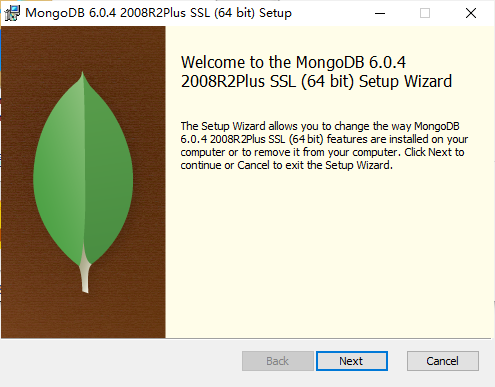
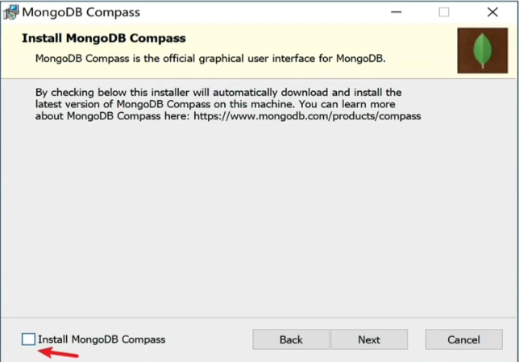
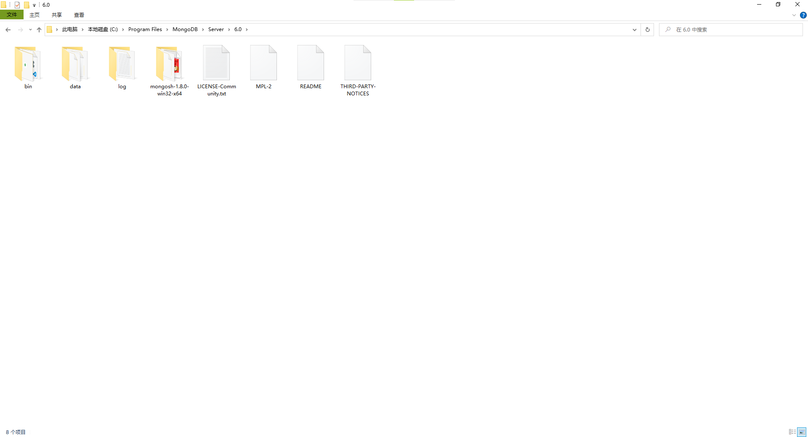
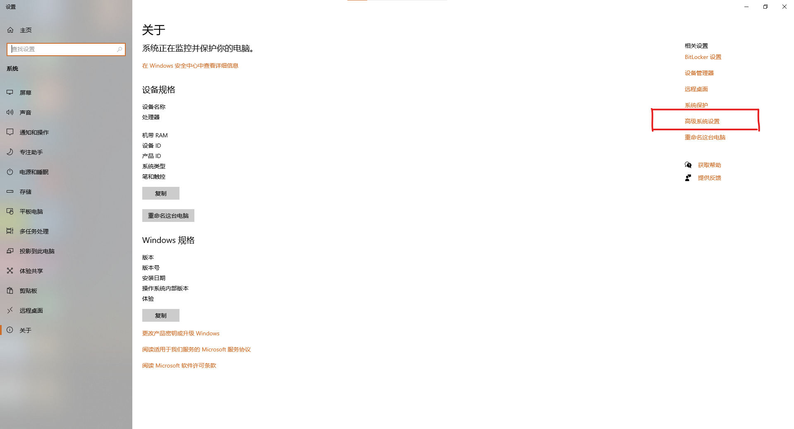
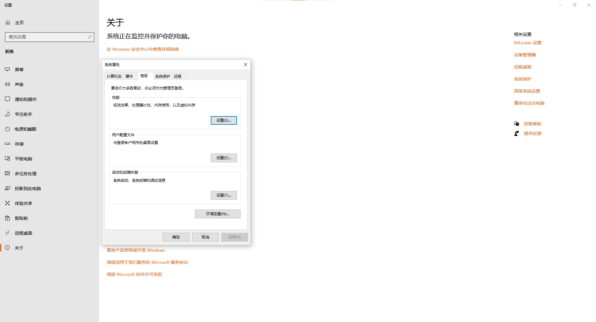
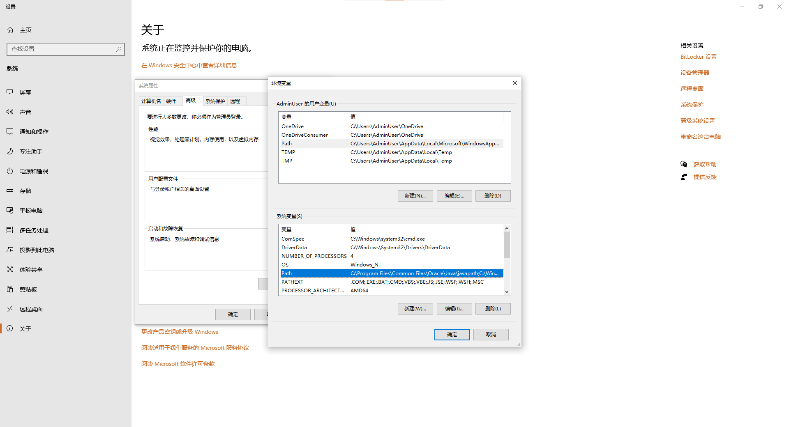

# ReactProject

## 前言

​    <b>本项目为图书馆项目, 提供图书售卖等功能.</b>

## 插件

​    <b>在实际开发中需要配置一下开发软件的插件, 以便于后续的开发工作.</b>

​    <b>1. ESLint 是一款 JavaScript 的语法检查工具.</b> 

​    <b>2. Simple React Snippets 是一个可以快速生成 React 代码片段和命令的插件</b>

​    <b>3. ES7 React/Redux/GraphQL/React-Native snippets  是一款便捷的 React 基础框架生成工具</b> 

​    <b>4. JavaScript Es6 code snippets 是一款专注于 JavaScript 代码片段的生成工具</b> 

​    <b>5. Material Theme 推荐的 VS Code 主题 ( 可选项 )</b> 

​    <b>6. Material Icon Theme 推荐的 VS Code 文件图标 ( 可选项 )</b> 

​    <b>7. FiraCode 推荐的 VS Code 代码字体 ( 可选项; 下载地址: `github.com/tonsky/FiraCode` )</b> 

## 1. 客户端插件

### 1. React

​    <b>本项目为 React 项目需要使用 `create-react-app` 或是直接使用 Vite 进行创建, 创建方式:</b> 

```js
// create-react-app
create-react-app xxx

// Vite
npm create vite@latest

yarn create vite


// "xxx" is replaced by the project name.
// 请将 "xxx" 替换成项目名称.
```

### 2.  React Router Dom

​    <b>react-router-dom 是一款 React 的路由工具, 可以为 React 项目提供路由服务支持.</b> 

​    <b>下载方式:</b> 

```js
npm i --save react-router-dom

yarn add react-router-dom
```

### 3. Antd

​    <b>Antd 是基于 Ant Design 设计体系的 React UI 组件库，主要用于研发企业级中后台产品。本项目将使用 Antd 作为 UI 插件.</b> 

​    <b>下载方式:</b> 

```js
npm i --save antd

yarn add antd
```

​    <b>参考网站:</b>  <b>[Ant Design of React 中文网](https://ant.design/index-cn)</b> 

### 4. Redux

​    <b>redux 是一款全局状态管理插件. 配合异步管理 ( redux-saga ) 对项目数据进行状态更新等...</b> 

​    <b>下载方式:</b> 

```js
npm i --save redux

yarn add redux
```

​    <b>参考网站:</b> <b>[Redux 中文文档](https://www.reduxjs.cn/)</b> 

### 5. Axios

   <b>Axios 是一个基于 `promise` 网络请求库, 作用于 NodeJs 和 Browser, 在服务端使用原生的 NodeJs 中的 `http` 模块, 在 Browser 中则使用 `XMLHttpRequests` 模块.本项目将使用 Axios 进行 Ajax 请求服务.</b> 

​    <b>下载方式:</b>

```js
npm i axios --save

yarn add axios
```

​    <b>参考网站:</b> <b>[Axios 中文文档](https://www.axios-http.cn/)</b> 

### 6. Redux Devtools Extension (Browser)

​    <b>Redux-Devtools-Extension 是一款专注于 Redux 全局状态管理插件的调试工具, 该插件可以在 Edge 浏览器插件商城中进行下载, 属于浏览器插件, 经后期配置完毕后可以对 Redux 所管理的项目进行及时的语法检查, 并报出问题原因等...避免后期不必要的麻烦.</b> 

​    <b>下载方式:</b> 

```js
```

​    <b>参考网站:</b> <b style="color: red;">Is not's defined!</b> 

## 2. 服务端插件

### 1. NodeJs

​    <b>NodeJs 是一个基于Chrome V8引擎的JavaScript运行环境. </b> 

### 2. Mongodb

​    <b>Mongodb 是一个类属 NO SQL 的数据库. 是一个基于分布式文件存储的数据库. 旨在为WEB应用提供可扩展的高性能数据存储解决方案. 本项目种将使用该插件作为后端服务数据库</b> 

### 3. Mongodb Compass

​    <b>Mongodb Compass 是一个 Mongodb 数据库可视化软件.</b> 

## 3. Mongodb 安装

​    <b>下载地址:</b> <b>[MongoDB Server](https://www.mongodb.com/try/download/community)</b> 

​    <b>如果安装版本较高如: </b>

​    <b>安装过程:</b> 

​        <b>1. 启动 MongoDB Install</b> 

​        <b>2. 点击 Next 进行下一步安装</b> 

 

​        <b>3. 同意当前协议, 打勾后点击 Next 继续安装</b> 

​        <b>4. 保持当前选项点击 Next 继续下一步的安装, 此处需要主义的是数据地址和日志地址需要自行记住.</b> 

​       <b>5. 此处需要注意的是要将左下角的 Install MongoDB Compass 选项取消选择! 然后再点击 Next 下一步, 否则会安装一个额外附带的无效插件.</b> 



​        <b>6. 完成以上步骤以后就可以完成最后的安装了, 点击 Install 选项进行安装操作. 安装完成后点击 Finish. ( 以下为高版本配置: 然后找到安装好的 MongoDB 服务目录 `C:\Program Files\MongoDB\Server\6.0` 将下载好的 MongoDB Shell 插件直接放入 )</b> 



​        <b>7. 配置环境变量: 此电脑 ( 我的电脑 ) =\> 右击 =\> 属性 =\> 高级系统设置 =\> 配置 Path 路径, 将 MongoDB 和 MongoDB Shell 的 bin 目录地址都存放其中.</b> 








### 1. 使用语法 ( 基础 )

​    <b>A. 启动 MongoDB:</b> <b style="text-decoration: underline;">net start mongodb</b>

​    <b>B. 关闭 MongoDB:</b> <b style="text-decoration: underline;">net stop mongodb</b>

```mongo
// start
net start mongodb

// end
net stop mongodb
```

# 2. ProjectStart

​    <b>初始化项目:</b> 

```js
// 初始化项目
create-react-app react-library

// 可选: 如使用 cmd 创建, 还需再 VS Code 中打开:
code ./react-library

// 安装所有依赖包
yarn

// 安装依赖项
yarn add antd axios moment redux react-redux react-router-dom redux-saga

// 安装开发项
yarn add --dev redux-devtools-extension

```


