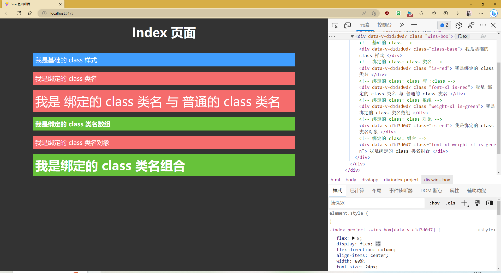

# Vue Project

## 1. 创建方法:

### A. Vue Cli

​    <b>这里可以使用官方给出的 Cli 去进行项目的搭建工作, 使用此方法需要提前使用 npm 进行全局安装, 使用: `npm install --global vue-cli` 进行安装. 完成后使用下方命令进行配置 Vue 工程</b> 

```js
vue create app-name 
// 输入完成后可以使用官方配置的 Vue@3.x 或是 Vue@2.x 当然了, 也可以自己进行配置, 配置完成后还可以选择是否保存自己的设置
```

### B. Vite

​    <b>除了以上方法外, 还可以直接使用 Vite 官方提供的脚手架 API 创建项目, 且免安装! 比 Webpack 更快!</b> 

```js
// npm 使用
npm create vite@latest
// yarn 使用
yarn create vite // 加载完成后输入项目名后需要自行选择创建的脚手架类型, 这里可以直接选择 Vue
```

### C. Unpkg

​    <b>如果实在懒得下载也可以暂时使用 Unpkg 网站提供的链接进行 Vue 的基础使用. ( 不会构建 Vue 项目 <i style="color: red;">!important</i> )</b> 

```js
<script src="https://unpkg.com/vue@2"></script> // Vue@2.x
<script src="https://unpkg.com/vue@3"></script> // Vue@3.x
<script src="https://unpkg.com/next"></script> // Vue@3.x ( 推荐 )
```

## 2. 插件安装

### A. VScode

​    <b>Vs Code ( 全称: Visual Studio Code ), 是一款很不错的编程软件, 其内部提供了更为便捷的插件模块, 及代码提示功能.</b> 

​    <b>下载地址: </b> [点击下载](https://code.visualstudio.com/) <b>&lt;= ctrl + click ( 点击 )</b>

#### 1. VsCode 内置命令

​    <b>为了方便后期更方便的使用 Vs Code 编辑器, 所以官方预留出了一些  API. 如: 制表位的 `$1, $2, $3`... 或 最终光标位置 `$0`</b> 

<b>Visual Studio Code 中的代码片段完整文档:</b> [点击进入](https://code.visualstudio.com/docs/editor/userdefinedsnippets#_snippet-syntax) 

##### A.  变量命令

``` vscode
// 当前选的 顶文本 或 空字符串
TM_SELECTED_TEXT

// 当前行的内容
TM_CURRENT_LINE

// 光标 或 空字符串下的单词内容
TM_CURRENT_WORD

// 基于零索引的行号
TM_LINE_INDEX

// 基于单索引的行号
TM_LINE_NUMBER

// 当前文档的文件名
TM_FILENAME

//当前文档的文件名, 无扩展名
TM_FILENAME_BASE

//当前文档的目录
TM_DIRECTORY

// 从盘符起 => 当前文件的绝对路径
TM_FILEPATH

// 从根目录起 => 当前文件的相对路径
RELATIVE_FILEPATH

// 剪贴板的内容
CLIPBOARD

// 打开的 工作空间 或 文件夹的名称
WORKSPACE_NAME

// 打开的工作空间或文件夹的路径
WORKSPACE_FOLDER

// 基于零索引的游标编号
CURSOR_INDEX

// 基于单索引的游标编号
CURSOR_NUMBER
```

##### B. 时间命令

```vscode
// 本年度
CURRENT_YEAR

// 当年的最后两位数
CURRENT_YEAR_SHORT

// 两位数的月份 (例如 "02")
CURRENT_MONTH

// 月份的全名 (例如 "July)
CURRENT_MONTH_NAME

//月份的简称 (例如 "Jul")
CURRENT_MONTH_NAME_SHORT

// 两位数的月份中的日期 (例如 "08")
CURRENT_DATE

// 星期(例如 "Monday")
CURRENT_DAY_NAME

// 星期简称(例如 "Mon")
CURRENT_DAY_NAME_SHORT

// 24 小时制格式的当前小时
CURRENT_HOUR

// 当前分钟以两位数表示
CURRENT_MINUTE

// 当前秒为两位数
CURRENT_SECOND

// 自 Unix 纪元以来的秒数
CURRENT_SECONDS_UNIX
```

##### C. 随机值

```vscode
// 6 个随机以 10 为基数的数字
RANDOM

// 6 个随机以 16 为基数的数字
RANDOM_HEX

// 版本 4 UUID
UUID
```

##### D. 注释命令

```vscode
// 前注释, 如: "/*" 或 "<!--"
BLOCK_COMMENT_START

// 后注释, 如: "*/" 和 "-->"
BLOCK_COMMENT_END

// 单注释
LINE_COMMENT
```

#### 2. Vue 代码段

```json
{
    "vue2Template": {
		"prefix": "v2t",
		"body": [
			"<template>",
			"    <div class=\"\">${TM_FILENAME_BASE}</div>",
			"</template>\n",
			"<script>",
			"export default {",
			"    name: '${TM_FILENAME_BASE}',",
			"    data() {",
			"        return {$1}",
			"    },",
            "    methods: {},",
            "    computed: {},",
            "    watch: {},",
            "    created() {},",
			"}",
			"</script>\n",
			"<style scoped>$2</style>"
		],
		"description": "Create a new Vue @2.x base template"
	},
    "vue2Props": {
        "prefix": "v2Props",
        "body": [
			"<template>",
			"    <div class=\"\">${TM_FILENAME_BASE}</div>",
			"</template>\n",
			"<script>",
            "import {$1} from 'vue'",
			"export default {",
			"    name: '${TM_FILENAME_BASE}',",
			"    props: {},",
			"    data() {",
			"        return {$2}",
			"    },",
            "    methods: {},",
            "    computed: {},",
            "    watch: {},",
            "    created() {},",
			"}",
			"</script>\n",
			"<style scoped>$4</style>"
		],
        "description": "Create a new Vue @2.x props template"
    },
    "vue2Less": {
        "prefix": "vue2Less",
        "body": [
            "<template>",
            "    <div class=\"\">${TM_FILENAME_BASE}-project$1</div>",
			"</template>\n",
			"<script>",
			"export default {",
			"    name: '${TM_FILENAME_BASE}',",
			"    data() {",
			"        return {$2}",
			"    },",
            "    methods: {},",
            "    computed: {},",
            "    watch: {},",
            "    created() {},",
			"}",
			"</script>\n",
			"<style lang=\"less\" scoped>$3</style>"
        ],
        "description": "Create a new Vue @2.x less template"
    },
    "vue2Scss": {
        "prefix": "v2Scss",
        "body": [
            "<template>",
            "    <div class=\"\">${TM_FILENAME_BASE}-project$1</div>",
			"</template>\n",
			"<script>",
			"export default {",
			"    name: '${TM_FILENAME_BASE}',",
			"    data() {",
			"        return {$2}",
			"    },",
            "    methods: {},",
            "    computed: {},",
            "    watch: {},",
            "    created() {},",
			"}",
			"</script>\n",
			"<style lang=\"scss\" scoped>$3</style>"
        ],
        "description": "Create a new Vue @2.x scss template"
    },
    "vue2Stylus": {
        "prefix": "v2Stylus",
        "body": [
            "<template>",
            "    <div class=\"\">${TM_FILENAME_BASE}-project$1</div>",
			"</template>\n",
			"<script>",
			"export default {",
			"    name: '${TM_FILENAME_BASE}',",
			"    data() {",
			"        return {$2}",
			"    },",
            "    methods: {},",
            "    computed: {},",
            "    watch: {},",
            "    created() {},",
			"}",
			"</script>\n",
			"<style lang=\"stylus\" scoped>$3</style>"
        ],
        "description": "Create a new Vue @2.x stylus template"
    },
    "vue2Ts": {
        "prefix": "v2Ts",
        "body": [
            "<template>",
			"    <div class=\"\">${TM_FILENAME_BASE}</div>",
			"</template>\n",
			"<script lang=\"ts\">",
			"export default {",
			"    name: '${TM_FILENAME_BASE}',",
			"    data() {",
			"        return {$1}",
			"    },",
            "    methods: {},",
            "    computed: {},",
            "    watch: {},",
            "    created() {},",
			"}",
			"</script>\n",
			"<style scoped>$2</style>"
        ]
    },
    "vue3Template": {
        "prefix": "V3Template",
        "body": [
            "<template>",
            "    <div class=\"\">${TM_FILENAME_BASE}</div>",
            "</template>\n",
            "<script setup>",
            "import {$1} from 'vue'",
            "</script>\n",
            "<style scoped>$2</style>"
        ],
        "description": "Create a new Vue @3.x base template"
    },
    "vue3Less": {
        "prefix": "V3Less",
        "body": [
            "<template>",
            "    <div class=\"\">${TM_FILENAME_BASE}-project$1</div>",
            "</template>\n",
            "<script setup>",
            "import {$2} from 'vue'",
            "</script>\n",
            "<style lang=\"less\" scoped>$3</style>"
        ],
        "description": "Create a new Vue @3.x scss template"
    },
    "vue3Scss": {
        "prefix": "V3Scss",
        "body": [
            "<template>",
            "    <div class=\"\">${TM_FILENAME_BASE}-project$1</div>",
            "</template>\n",
            "<script setup>",
            "import {$2} from 'vue'",
            "</script>\n",
            "<style lang=\"scss\" scoped>$3</style>"
        ],
        "description": "Create a new Vue @3.x scss template"
    },
    "vue3Stylus": {
        "prefix": "V3Stylus",
        "body": [
            "<template>",
            "    <div class=\"\">${TM_FILENAME_BASE}-project$1</div>",
            "</template>\n",
            "<script setup>",
            "import {$2} from 'vue'",
            "</script>\n",
            "<style lang=\"stylus\" scoped>$3</style>"
        ],
        "description": "Create a new Vue @3.x stylus template"
    },
    "vue3Ts": {
        "prefix": "V3Ts",
        "body": [
            "<template>",
            "    <div class=\"\">${TM_FILENAME_BASE}-project$1</div>",
            "</template>\n",
            "<script setup lang=\"ts\">",
            "import {$2} from 'vue'",
            "</script>\n",
            "<style scoped>$3</style>"
        ],
        "description": "Create a new Vue @3.x Types template"
    }
}
```

​    <b style="color: #E6A23C">将以上代码复制到 VsCode => 用户代码片段 => 新建代码段 => vue.json => 粘贴 ( Ctrl + V )</b> 

### B. Auto Rename Tag

​    <b>Auto Rename Tag 是一款标签同步插件, 当你需要修改 HTML 标签时, 它会在你修改前标签的同时, 修改后方的闭合标签.</b> 

​    <b>拓展 ID: `formulahendry.auto-rename-tag`</b> 

### C. Vue Language Features (Volar)

   <b>Vue Language Features (Volar) 是一款 Vue 语言的插件, 会对语句的判断方式进行修改, 譬如: `<a :href="baseLink"` 时正常的 HTML 代码检查并不认识带有冒号的 `href` 属性, 就会直接抛出一个书写错误的提示, 当安装完成后就不会再出现以上的误判情况了.</b> 

<b>拓展 ID: `Vue.volar`</b> 

<b style="color: red;">!import: 这里需要注意此插件不能与 Vue@2 的 `Vetur` 一同使用.</b>

### D. Prettier - Code formatter

​    <b>Prettier - Code formatter 插件是用来对代码进行最优风格的格式化插件, 它对基础的 HTML, JavaScript, Css 等都是生效的, 当然你也可以使其对 Vue, React, Sass, Less等语言都可以进行格式化处理.</b> 

<b>拓展 ID: `esbenp.prettier-vscode`</b> 

<b>配置项: `format on save` ( 当文件被保存时自动格式化代买 )</b> 

### E. ESLint

​    <b>ESLint  是一款 JavaScript 代码的检测工具, 可以检查 拼写错误 和 语法错误.</b> 

​    <b>拓展 ID: `dbaeumer.vscode-eslint`</b> 

### F.  Live Server

​    <b>Live Server 是一款非常好用的 HTML 服务器, 可以在 HTML 页面下使用快捷键组合: `Alt + L` 然后再点击 `Alt + O` 就可以在浏览器中启动实时预览的 HTML 页面.</b> 

​    <b>拓展 ID: `ritwickdey.LiveServer`</b> 

### G. TypeScript Vue Plugin (Volar)

​    <b>此插件是 Vue Language Features (Volar) 的 Types 版本, 可以兼容 TypeScript 语法, 以至于不会让默认的语法检查工具因语法不同而报错.</b> 

<b>拓展 ID: `Vue.vscode-typescript-vue-plugin`</b> 

### H. Colorful Comments

​    <b>Colorful Comments 是一个注释提示颜色插件, 通过注释前不同的符号改变颜色从而使注释一目了然更加醒目!</b> 

​    <b>拓展 ID: `ParthR2031.colorful-comments `</b> 

### I. CodeSnap (Optional)

​    <b>此项为可选项 ( Optional ), CodeSnap 是一款代码截图插件, 通过选中指定代码 =&gt;右击鼠标 =&gt; CodeSnpa 进行截图.</b>

​    <b>拓展 ID: `adpyke.codesnap `</b> 

  ### J. Code Translate ( Optional )

​    <b>Code Translate 是一个可以将选中单词翻译成中文的插件, 将鼠标移至单个单词上方时, 会显示单词的含义. 对于单词量较少的, 可以使用该插件进行辅助.</b> 

​    <b>拓展 ID: `w88975.code-translate`</b> 

 ## 3. Vue 基础

### 前言概况

​    <b>在学习之前需要准备一个基础的目录结构以及项目代码, 或是使用上方命令快速生成模板.</b> 


​    <b>完成以上操作后, 配置初始化的 Css 样式文件, 清除默认项:</b> 

```css
/* 配置一些基础样式 */

/* todo: 优先清除默认样式 */
* {
    margin: 0;
    padding: 0;
    -webkit-user-select: none;
    -moz-user-select: none;
    -ms-user-select: none;
    user-select: none;
}

/* ul, ol */
ul, ol {
    list-style: none;
}

/* button, input */
button, input {
    outline: none;
    border: none;
    background: none;
}

/* a */
a {
    text-decoration: none;
}

/* 设置默认 rem = 10px */
html {
    font-size: 62.5%;
}
```

​    <b>清除完成后, 接下来设置 Script 脚本, 找到 `./src/js/index.js` 文件, 打开它并开始进行配置: </b> 

```js
// 新建一个 Vue 实例
const app = Vue.createApp();

// 将 #app 元素作为挂载到 Vue 实例上
// 这里的 app 是一个 Vue 实例, 而 #app 是一个 DOM 中 id 为 app 的元素
app.mount('#app');
```

#### 样式详解

​    <b>Less 样式</b> 

```js
// 下载 less
npm i less -D
npm install --dev less 
yarn add -D less

// 但是单单靠以上样式是无法被直接解析的, 需要解释器来进行解释编译, 编译成 css 文件后才能被浏览器直接阅读
// 下载解释器
npm i less-loader -D
npm install --dev less-loader
yarn add less-loader -D

// 合并下载
npm i less less-loader -D
yarn add less less-loader -D

// 演示样式
#app {
    width: 100%;
    height: 100vh;
    overflow: hidden;
    
    .father-ele {
        // code...
    }
}

// 参考文档: https://less.bootcss.com/
```

​    <b style="color: #E6A23C">后缀名为: `*.less`; 变量符号: `@name: value;`</b> 

<b>Scss 样式</b>

```js
// 下载
npm i sass -D
npm install sass --dev
yarn add sass --dev

// 同理需要下载编译器进行编译, 使用:
npm i sass-loader -D
npm install sass-loader --dev
yarn add sass-loader -D

// 合并下载
npm i sass sass-loader -D
yarn add sass sass-loader -D


// 演示样式
#app {
    width: 100%;
    height: 100vh;
    overflow: hidden;
    
    .father-ele {
        // code...
    }
}

// 参考文档: https://www.sass.hk/docs/
```

​    <b style="color: #E6A23C">后缀名为: `*.scss`; 变量符号: `$name: value;`</b> 

<b>Stylus 样式</b> 

```js
// 下载
npm i stylus -D
npm install stylus --dev
yarn add stylus --dev

// 同理需要下载编译器进行编译, 使用:
npm i stylus-loader -D
npm install stylus-loader --dev
yarn add stylus-loader -D

// 合并下载
npm i stylus stylus-loader -D
yarn add stylus stylus-loader -D

// 演示样式 - 01
#app {
    width: 100%
    height: 100vh
    overflow: hidden
    
    .father-ele {
        // code...
    }
}

// 演示样式 - 02
#app {
    width 100%
    height 100vh
    overflow hidden
    
    .father-ele {
        // code...
    }
}

// 参考文档: https://www.stylus-lang.cn/
```

​    <b style="color: #E6A23C">后缀名为: `*.styl`; 变量符号: `$name = value` 甚至可以更偷懒省事: `name = value`</b> 

### A. data 属性

​    <b>data 属性是一个函数, 用来存储内容的属性, 其内部可以用来存放 Java Script 的所有类型内容, 且可以访问直属属性, 如指数属性下还有其余属性也可以通过对象的访问方式进行访问. ( 例如: obj.name )</b> 

```js
// 新建一个 Vue 实例
const app = Vue.createApp({
    // 设置数据
    data() {
        return {
            // 用于存放用户输入的内容, 存储的内容可以是 JavaScript 中的任何类型
            str: "字符串",
            num: 123,
            bool: true,
            isUndefined: undefined,
            isNull: null,
            arr: [1, 2, 3],
            obj: {
                id: 1,
                name: "对象"
            },
            isFunction: function () {
                console.log("函数");
            },
        }
    }
});

// 将 #app 元素作为挂载到 Vue 实例上
// 这里的 app 是一个 Vue 实例, 而 #app 是一个 DOM 中 id 为 app 的元素
app.mount('#app');
```

​    <b>在 data 中定义的属性可以直接在 Vue 实例的 DOM 中进行使用 ( 这里的 Vue 实例是刚刚创建的 `#app` DOM 元素 )</b> 

​    <b>在实例中使用 `{{ name }}` 的方式对 data 中的数据进行访问</b> 

```html
<!DOCTYPE html>
<html lang="en">
<head>
    <meta charset="UTF-8">
    <meta http-equiv="X-UA-Compatible" content="IE=edge">
    <meta name="viewport" content="width=device-width, initial-scale=1.0">
    <title>Vue 基础项目</title>
    <!-- 导入自己的样式文件 -->
    <link rel="stylesheet" href="./src/css/index.css">
</head>
<body>
    <div id="app">
        <div class="str-box">{{ str }}</div>
        <div class="num-box">{{ num }}</div>
        <div class="bool-box">{{ bool }}</div>
        <div class="arr-box">{{ arr }}</div>
        <div class="obj-box">{{ obj }}</div>
        <div class="null-box">{{ isNull }}</div>
        <div class="undefined-box">{{ isUndefined }}</div>
        <div class="fun-box">{{ isFunction }}</div>
    </div>

    <!-- 导入 Unpkg Vue@3 -->
    <script src="src/utils/vue.global.js"></script>
 
    <!-- 导入自己的 Vue 程序代码 -->
    <script src="./src/js/index.js"></script>
</body>
</html>
```

​    <b>经过以上书写后可以看到 HTML 中, data 的直属属性都被解析出来了:</b> 


​    <b>看到这里突然发现: null 和 undefined 没有任何内容, 是显示失败了吗? 其实并不然...只是因为一个表示 <i style="color: red;">空</i>, 另一个表示 <i style="color: red;">未定义</i> 所以是显示不出任何内容的. 而且在 Vue 处理时, 它默认就是将这两个值视为空白, 不显示! 但它也是有好处的, 譬如: 页面刚加载设置上面两个值, 用于占位也是一个不错的选择.</b> 

​    <b>除了直属的属性, 还有附属的 <i style="color: red;">子属性</i> 或是 <i style="color: red">数组元素</i> 也可以进行单独访问:</b>

```html
<!-- Array -->
<div>{{ arr[0] }}</div>

<!-- Object -->
<div>{{ obj.name }}</div>
```

​    <b>展示效果如下: ( 此处使用的是对象的使用方法 )</b> 


### B. v-bind 指令

​    <b>V-bind 属性用于属性的绑定, 因为在模板中不能直接使用 <i style="color: orange; text-decoration: underline;">\<a href="{{ xxx }}"\>\</a\></i> 的形式去进行属性的设置, 只能通过 `v-bind` 指令对属性值进行双向的绑定.正确的方式则是: <i style="color: #67C23A; text-decoration: underline;">\<a v-bind:href="{{ xxx }}"\>\</a\></i> 或 <i style="color: #67C23A; text-decoration: underline;">\<a :href="{{ xxx }}"\>\</a\></i> 来进行数据绑定.</b> 

​    <b style="font-style: italic;">※ 指令:  <u>是指 Vue 提供的一组可以在 HTML 模板中或是在 Vue 文件中可以直接使用的特殊属性. 如: v-bind、v-for、v-if 等. 用于实现数据绑定、循环数据、条件判断等...</u></b> 

```vue
<template>
    <!-- 此处为 HTML 模板, 为了便利所以直接使用的 Vue 模块, 但是用方法不变! -->
    <div id="app">
        <a :href="link">百度首页</a>
        <a v-bind:href="link">百度首页</a>
    </div>
</template>

<script>
// 此处只展示 Data 属性， 为了便利所以直接使用的 Vue 模块.
export default {
    name: 'App',
    data() {
        return {
            link: 'https://www.baidu.com',
        }
    }
}
</script>

```

### C. v-for 指令

​    <b>`v-for` 指令是将 data() 属性中的数据使用指定的 HTML 模板的方式将需要展示数据展开并遍历数据后放入到 HTML 模板中对应的位置并最终展示出来</b> 


​     <b>一般来说要想将以上数据展示到 HTML 中需要使用以下 2 中最基础的方式:</b>

<b>1. 从 HTML 中直接书写:</b> 

```html
<div id="app">
    <h1>展示数据</h1>
    <div class="show-data">
        <div>数据 - 01</div>
        <div>数据 - 02</div>
        <div>数据 - 03</div>
        <div>数据 - 04</div>
        <div>数据 - 05</div>
    </div>
</div>
```

<b>2. 使用 js 面向 过程 或 对象 对 数组 或 对象 进行解析并导入到 HTML 对应的 DOM 元素中</b>

```html
<div id="app">
    <h1>展示数据</h1>
    <div class="show-data"></div>
</div>

<script>
    // A. 面向过程的方式
    // 1. 获取元素
    const showDataProcess = document.querySelector('.show-data')

    // 2. 设置一个数组，用于存储数据
    const dataProcess = [
        '数据 - 01 ( JS 过程 )',
        '数据 - 02 ( JS 过程 )',
        '数据 - 03 ( JS 过程 )',
        '数据 - 04 ( JS 过程 )',
        '数据 - 05 ( JS 过程 )',
    ]

    // 3. 循环数组，将数组中的数据一一添加到 .show-data 中
    dataProcess.forEach(item => {
        // 3.1 创建一个 div 元素
        const div = document.createElement('div')
        // 3.2 设置 div 元素的内容
        div.innerHTML = item
        // 3.3 将 div 元素添加到 .show-data 中
        showDataProcess.appendChild(div)
    })

    // B. 面向对象的方式
    // 1. 获取元素
    const showDataObj = document.querySelector('.show-data')

    // 2. 设置一个数组，用于存储数据
    const dataObj = [
        '数据 - 01 ( JS 对象 )',
        '数据 - 02 ( JS 对象 )',
        '数据 - 03 ( JS 对象 )',
        '数据 - 04 ( JS 对象 )',
        '数据 - 05 ( JS 对象 )',
    ]

    // 3. 创建一个解析数组并展示数据到 HTML 中的方法
    // arr: 需要展示的数组, ele: 需要展示到哪一个元素中
    function arrToHTML (arr, ele) {
        // 3.0 开始循环
        arr.forEach(item => {
            // 3.1 创建一个 div 元素
            const div = document.createElement('div')
            // 3.2 设置 div 元素的内容
            div.innerHTML = item
            // 3.3 将 div 元素添加到 .show-data 中
            ele.appendChild(div)
        })
    }

    // 4. 调用方法, 将数据展示出来
    arrToHTML(dataObj, showDataObj)

</script>
```


​    <b>虽然经过上方的书写以及图片显示浏览器最终的展示效果, 但以上方式不论哪一个都会产生很多代码. 虽然面向对象会比面向过程好一些, 但也还是逃不出写很多方法和数据的命运...</b> 

​    <b>接下来看看 Vue 中是如何书写的, 以及使用 `v-for` 指令可以带来那些便利.</b> 

```vue
<templante>
    <div id="app">
        <h1>展示数据</h1>
        <div class="show-data">
            <div>数据 - 01 ( HTML )</div>
            <div>数据 - 02 ( HTML )</div>
            <div>数据 - 03 ( HTML )</div>
            <div>数据 - 04 ( HTML )</div>
            <div>数据 - 05 ( HTML )</div>
            <div v-for="item in items">{{ item }}</div>
        </div>
    </div>
</templante>

<script>
export default {
    name: 'App',
    data() {
        return {
            items: [
                "数据 - 01 ( Vue )",
                "数据 - 02 ( Vue )",
                "数据 - 03 ( Vue )",
                "数据 - 04 ( Vue )",
                "数据 - 05 ( Vue )"
            ]
        }
    }
}
</script>
```


​    <b>通过以上观察, Vue 仅仅使用了一份 HTML 代码, 以及一份相同的数据, 它就完成了对数据的展示操作. 大大减少了代码量. Vue 同时也支持 对象 格式的数据展示, 和正常使用数据时一样.</b> 

```html
<!DOCTYPE html>
<html lang="en">
<head>
    <meta charset="UTF-8">
    <meta http-equiv="X-UA-Compatible" content="IE=edge">
    <meta name="viewport" content="width=device-width, initial-scale=1.0">
    <title>Vue 基础项目</title>
    <!-- 导入自己的样式文件 -->
    <link rel="stylesheet" href="./src/css/index.css">
</head>
<body>
    <div id="app">
        <h1>展示数据</h1>
        <div class="show-data">
            
            <div v-for="item in items" :key="item.id">{{ item.content }}</div>
        </div>
    </div>
    
    <script>
    	const info = {
            data() {
                return {
                    lists: [
                        {
                            id: 1,
                            content: "数据 - 01 ( Vue )"
                        },
                        {
                            id: 2,
                            content: "数据 - 02 ( Vue )"
                        },
                        {
                            id: 3,
                            content: "数据 - 03 ( Vue )"
                        },
                        {
                            id: 4,
                            content: "数据 - 04 ( Vue )"
                        },
                        {
                            id: 5,
                            content: "数据 - 05 ( Vue )"
                        },
                    ]
                }
            }
        }
    </script>
</body>
</html>
```

​    <b>以上就是 `v-for` 的全部用法了. 不难发现使用 Vue 和不使用的代码量, 使用 Vue 脚手架可以大幅减少程序员在开发过程中的书写量, 从而也可以更快的开发, 进而提升效率减少代码庸于.</b> 

​    <b>需要注意的是在遍历 对象 或 数组 时需要使用 `:key` 属性, 进行区分. 在遍历对象时, 可以使用的参数有: 1. value 值; 2. key 键值名; 3. index 索引; 以上三个参数是需要按顺序排列的.</b>

### D. v-if 指令

​    <b>`v-if` 是用于控制 HTML 的组件是否呈现出来, 如果值为 "真 ( true )" 则加载, 否则则不加载. (真值: 1, true, 非空字符串; 假值: 0, false, undefined, null, "" )</b> 

```vue
<template>
    <div class="index-project">
        <h2 v-if="foodItems <= 0">{{ title.null }}</h2>
        <div v-else="isShow > 0">
            <h2>{{ title.has }}</h2>
            <ul>
                <li
                    class="food-item"
                    v-for="(item, index) in foodItems"
                    :key="index"
                > {{ index + 1 }}. {{ item }}</li>
            </ul>
        </div>
    </div>
</template>

<script>
export default {
    name: 'Index',
    data() {
        return {
            title: {
                null: '暂时没有选取任何食物',
                has: '当前选取的食物有:'
            },
            foodItems: ["牛香咖啡", "奥良烤鸡", "油炸花生", "清蒸龙虾"]
        }
    }
};
</script>
```

​    <b>当有食物的时候则会显示到 HTML 的 DOM 元素中. 如下所示:</b> 


​    <b>当没有食物时则会按照预先设置的那样, 走到 `v-if` 分支时就会加载第一项 ( `v-if="foodItems <= 0"` ) 也就是说当食物小于 0 或等于 0 时就会显示第一个 HTML 选项, 我们将 Vue 中的 `foodItems` 项清空再来查看浏览器最终的渲染结果. 如图所示: </b> 


​    <b>最终的选然还是取决于是否有食物的数值, `v-if` 会根据最终条件判断是否渲染该部分结构.</b> 

<b>案例: 01</b>

​    <b>使用 `v-if` 配合点击事件使提问框中的答案按照需求决定是否显示.</b> 

```vue
<template>
    <div class="index-project">
        <div class="question-box">
            <h1>拓展提高</h1>
            <p>在日语中 "手紙 [ てがみ ]" 在日语中的含义.</p>
            <p v-if="isShow">"手紙 [ てがみ ]" 在日语中的含义是: 信 Or 信件 的意思.</p>
            <button @click="isShow = !isShow">{{ isShow ? "隐藏" : "显示" }}答案</button>
        </div>
    </div>
</template>

<script>

export default {
    name: 'index',
    data() {
        return {
            isShow: false,
        }
    },
}
</script>

<style lang="scss" scoped>
.index-project {
    display: flex;
    width: 100vw;
    height: 100vh;
    justify-content: center;
    align-items: center;
    font-size: 1.6rem;

    .question-box {
        display: flex;
        flex-direction: column;
        justify-content: space-evenly;
        width: 60rem;
        height: 20rem;
        box-shadow: 0 0 1rem rgba(0, 0, 0, 0.2);
        box-sizing: border-box;
        padding: 2rem;

        button {
            width: 10rem;
            height: 4rem;
            align-self: end;
            font-weight: 700;
            color: #fff;
            background-color: #409EFF;
            outline: none;
            border: none;
            border-radius: .5rem;
            margin-right: 3rem;
            cursor: pointer;

            &:hover {
                background-color: #a0cfff;
            }
        }
    }
}
</style>

```


​    <b>经过以上练习基本上就可以掌握 Vue 中 `v-if` 的基本用法了. 但需要注意的是 `v-if` 和 `v-else-if` 以及 `v-else` 与普通 JavaScript 中的判断语句使用方式一致, 所以也就是说以上所有的判断性 DOM 元素都必须相邻使用, 每一组 `v-if` 都不能在判断时被分隔. 还有一点需要注意的是: `v-if` 是决定该数据在 HTML 中是否被渲染, 也就是说如果是 false 的话就不会创建元素, 而还有一个与其很相似的指令 `v-show` 决定的是该元素是否在 DOM 中显示, 而不是是否渲染, 最终呈现的则是: `<dom style="display: none;">v-show 的效果</dom>` 最终该元素只是在样式中被隐藏了, 而不是没有被渲染.</b> 

### E. 创建事件

​    <b>经过以上的练习也可以大概知道如何创建事件了, 不过那是简写方式 `@事件名称` 而全拼则是: `v-on:事件名称`, 需要注意的是: 这里的所有事件名称都不需要加上 `on` 如: `onclic` 则是 `@click` 或是 `v-on:click` 的形式, 以此类推.</b>

### F. computed 计算属性

​    <b>计算属性: `computed` 则是为了避免在 HTML 模板中书写过多的逻辑属性, 如上方 ( D )练习中使用的`{{ isShow ? "隐藏" : "显示" }}答案`, 如果还有其他地方依旧用到了该属性, 那么就还需要在 HTML 中反复书写... 这非常不符合 Vue 逻辑且处理事件过多也会影响程序的运行速度, 并且程序员需要书写更多的代码大大降低了工作进程. 在这个时候就可以使用 Vue 提供的 `computed` 计算属性. </b> 

```vue
<template>
    <div class="index-project">
        <div class="question-box">
            <h1>拓展提高</h1>
            <p>在日语中 "手紙 [ てがみ ]" 在日语中的含义.</p>
            <p v-if="isShow">"手紙 [ てがみ ]" 在日语中的含义是: 信 Or 信件 的意思.</p>
            <button @click="isShow = !isShow">{{ isShowToStr }}答案</button>
        </div>
    </div>
</template>

<script>

export default {
    name: 'index',
    data() {
        return {
            isShow: false,
        }
    },
    computed: {
        isShowToStr () {
            return this.isShow ? "隐藏" : "显示"
        }
    }
}
</script>

<style lang="scss" scoped>
.index-project {
    display: flex;
    width: 100vw;
    height: 100vh;
    justify-content: center;
    align-items: center;
    font-size: 1.6rem;

    .question-box {
        display: flex;
        flex-direction: column;
        justify-content: space-evenly;
        width: 60rem;
        height: 20rem;
        box-shadow: 0 0 1rem rgba(0, 0, 0, 0.2);
        box-sizing: border-box;
        padding: 2rem;

        button {
            width: 10rem;
            height: 4rem;
            align-self: end;
            font-weight: 700;
            color: #fff;
            background-color: #409EFF;
            outline: none;
            border: none;
            border-radius: .5rem;
            margin-right: 3rem;
            cursor: pointer;

            &:hover {
                background-color: #a0cfff;
            }
        }
    }
}
</style>

```

### G. methods 函数属性

​    <b>Vue 除了提供计算属性也提供了 ( methods ) 函数属性, 多用于: 表单验证、Ajax 数据传递、事件函数等, 且在 Vue 中的 `methods` 内部定义函数的好处是可以直接使用 `this.` 的形式访问到 Vue 中 ` data()` 函数内所定义的数据. 且构思清晰减少 HTML 代码量, 并且还可以进行复用.</b>  

```vue
<template>
    <div class="index-project">
        <div class="question-box">
            <h1>拓展提高</h1>
            <p>在日语中 "手紙 [ てがみ ]" 在日语中的含义.</p>
            <p v-if="isShow">"手紙 [ てがみ ]" 在日语中的含义是: 信 Or 信件 的意思.</p>
            <!-- 此处使用的 @ 是 v-on: 的简写形式 -->
            <button @click="isShowOpposite">{{ isShowToStr }}答案</button>
        </div>
    </div>
</template>

<script>

export default {
    name: 'index',
    data() {
        return {
            isShow: false,
        }
    },
    methods: {
        isShowOpposite () {
            return this.isShow = !this.isShow
        }
    },
    computed: {
        isShowToStr () {
            return this.isShow ? "隐藏" : "显示"
        }
    }
}
</script>

<style lang="scss" scoped>
.index-project {
    display: flex;
    width: 100vw;
    height: 100vh;
    justify-content: center;
    align-items: center;
    font-size: 1.6rem;

    .question-box {
        display: flex;
        flex-direction: column;
        justify-content: space-evenly;
        width: 60rem;
        height: 20rem;
        box-shadow: 0 0 1rem rgba(0, 0, 0, 0.2);
        box-sizing: border-box;
        padding: 2rem;

        button {
            width: 10rem;
            height: 4rem;
            align-self: end;
            font-weight: 700;
            color: #fff;
            background-color: #409EFF;
            outline: none;
            border: none;
            border-radius: .5rem;
            margin-right: 3rem;
            cursor: pointer;

            &:hover {
                background-color: #a0cfff;
            }
        }
    }
}
</style>

```

### H. watch 监听属性

​    <b>`watch` 监听属性, 用来监听属性变化的, 使用 `watch` 时需要使 <u>监听器名字</u> 与 <u>被监听的属性名</u> 一致, 监听器需要接受两个属性: `newVal` ( 新属性值 ) 和 `oldVal` ( 旧属性值 ) 作为参数.</b> 

```vue
<template>
    <div class="index-project">
        <div class="box">
            <h1>简单问答</h1>
            <p class="question">在日语中 "手紙 [ てがみ ]" 在日语中的含义.</p>
            <p class="answer" v-show="isShow">答: 手紙 [ てがみ ] 的意思是 "信件".</p>
            <button @click="isShowEvent">
                {{ isShowCom }}
            </button>
        </div>
    </div>
</template>

<script>
export default {
    name: 'Index',
    data() {
        return {
            // 数据: 用于存储数据, 该数据可以被访问并使用
            isShow: false, // 是否显示答案
            countDown: 5, // 倒计时: 5秒
            timer: null, // 定时器
        }
    },
    computed: {
        // 计算属性: 用于计算数据, 该属性可以直接被访问并使用
        isShowCom() {
            // 返回值: 按照 isShow 数据进行计算并将结果返回, 该数据可以被直接访问并使用
            // 且该数据被多次访问时, 只会计算一次, 之后会将计算结果进行缓存, 直到数据发生变化时才会重新计算
            return this.isShow
                ? '显示答案' + this.countDown + '秒' // 如果为 "真" 则显示 "显示答案"
                : '隐藏答案' // 如果为 "假" 则显示 "隐藏答案"
        }
    },
    methods: {
        // 方法属性: 用于存储方法, 该方法可以直接被访问并使用
        isShowEvent() {
            // 作用: 用于控制答案的显示和隐藏
            // 该属性不会被缓存, 每次访问都会重新计算
            this.isShow = !this.isShow // 将 isShow 数据取反
        }
    },
    watch: {
        // 监听属性: 用于监听数据的变化, 该属性不可以直接被访问, 主要作用用于比较耗时的操作或是异步操作等
        // 在监听过程中会将新值和旧值传入到回调函数中, 最后将新值返回到 data 数据中, 再由 data 数据更新视图
        isShow(newVal, oldVal) {
            // 这里需要注意的是: 监听值 和 需要监听的数据名称保持一致
            if (newVal) {
                this.countDown = 5; // 重置倒计时
                if(this.timer) { // 判断如果定时器已经存在, 则清除定时器, 防止定时器叠加
                    clearInterval(this.timer) // 清除定时器, 作用: 为了防止用户多次点击按钮, 导致定时器叠加
                    this.timer = null; // 使定时器为空, 作用: 为了防止用户多次点击按钮, 导致定时器叠加
                }

                this.timer = setInterval(() => { // 设置定时器
                    this.countDown -= 1; // 倒计时减 1
                    if (this.countDown === 0) { // 如果倒计时为0, 则隐藏答案, 并清除定时器
                        this.isShow = false; // 隐藏答案
                        clearInterval(this.timer); // 清除定时器
                        this.timer = null; // 使定时器为空
                    }
                }, 1000)
            }
        }
    }
}
</script>

<style lang="scss" scoped>
.index-project {
    display: flex;
    align-items: center;
    justify-content: center;
    width: 100%;
    height: 100vh;
    overflow: hidden;
    background-color: #f2f2f2;

    .box {
        display: flex;
        flex-direction: column;
        align-items: center;
        justify-content: space-between;
        width: 50vw;
        height: 50vh;
        background-color: #fff;
        border-radius: 10px;
        padding: 2rem;

        p {
            font-size: 2.4rem;
        }

        button {
            align-self: end;
            width: 8.6rem;
            height: 4rem;
            background-image: linear-gradient(45deg,
                    hsl(218deg, 100%, 50%) 0%,
                    hsl(187deg, 100%, 40%) 100%);
            font-weight: 600;
            color: #fff;
            border-radius: .4rem;
            cursor: pointer;
        }
    }
}
</style>
```

### 附录:

#### 1. computed 计算属性 与 methods 函数属性 的区别

​    <b>为了更好的使用 Vue 脚手架, 本次将对 computed 和 methods 进行区分测试. 测试数据如下:</b>

```js
const dataList = [
    "Vue.js 从入门到精通",
    "Vue 3.x 入门指南",
    "Vue.js 2.x 实战",
    "React 全家桶",
    "React 入门指南",
    "你不知道的 JavaScript 实战技巧"
]
```

​    <b>任务: 将dataList 中的数据进行筛选并输出到 HTML 中进行展示.</b> 

##### illustration 例图


##### computed 测试

​    <b>本次测试目的为辨别 computed 属性和 methods 属性的区别, 为了更好的区分将测试分为两部分进行展示, 该部分将使用 computed 完成筛选 dataList 内容中包含 Vue 的项目并称现在 HTML 无序列表中. 实现方法如下:</b> 

```vue
<template>
    <div class="index-project">
        <ul>
            <li v-for="content in isVue">
                {{ content }}
            </li>
        </ul>
    </div>
</template>

<script>
export default {
    name: 'index',
    data() {
        return {
            dataList: [
                "Vue.js 从入门到精通",
                "Vue 3.x 入门指南",
                "Vue.js 2.x 实战",
                "React 全家桶",
                "React 入门指南",
                "你不知道的 JavaScript 实战技巧"
            ]
        }
    },
    computed: {
        isVue() {
            return this.dataList.filter(item => item.includes('Vue'))
        }
    },
}
</script>

<style lang="scss" scoped>
.index-project {
    display: flex;
    justify-content: center;
    align-items: center;
    width: 100%;
    min-height: 100vh;
    background-color: #333;
    padding: 20px;

    ul {
        color: white;
        font-size: 40px;

        li {
            display: flex;
            justify-content: center;
            align-items: center;
            margin-bottom: 20px;
        }
    }
}
</style>

```

##### methods 测试

​    <b>接下来使用 methods 完成筛选 dataList 内容中包含 Vue 的项目并称现在 HTML 无序列表中.</b> 

```vue
<template>
    <div class="index-project">
        <ul>
            <li v-for="content in getVue()">
                {{ content }}
            </li>
        </ul>
    </div>
</template>

<script>
export default {
    name: 'index',
    data() {
        return {
            dataList: [
                "Vue.js 从入门到精通",
                "Vue 3.x 入门指南",
                "Vue.js 2.x 实战",
                "React 全家桶",
                "React 入门指南",
                "你不知道的 JavaScript 实战技巧"
            ]
        }
    },
    methods: {
        getVue() {
            return this.dataList.filter(item => item.includes('Vue'))
        }
    }
}
</script>

<style lang="scss" scoped>
.index-project {
    display: flex;
    justify-content: center;
    align-items: center;
    width: 100%;
    min-height: 100vh;
    background-color: #333;

    ul {
        color: white;
        font-size: 40px;

        li {
            display: flex;
            justify-content: center;
            align-items: center;
            margin-bottom: 20px;
        }
    }
}
</style>

```

<b style="color: #F56C6C;">※ 注意: 在使用 methods 函数属性时需要在后方加上小括号进行方法的调用</b> 

##### cache 缓存测试

<b>经过以上书写发现两者都可以对 dataList 中的内容进行筛选, 好像并没什么区别.为了更好的观测它们, 接下来对它们进行缓存测试, 给 HTML 中添加一个按钮, 并赋予其点击事件. 为了能够直观感受到是否真的运行了, 在 Vue 的 script 标签中, 或是 Js 文件中的 Vue 数据上给一个count 变量用来记录点击次数.代码如下:</b> 

```vue
<template>
    <div class="index-project">
        <ul>
            <li v-for="content in getVue()">
                {{ content }}
            </li>
        </ul>
        <button @click="count++">被点击了 {{ count }} 次</button>
    </div>
</template>

<script>
export default {
    name: 'index',
    data() {
        return {
            dataList: [
                "Vue.js 从入门到精通",
                "Vue 3.x 入门指南",
                "Vue.js 2.x 实战",
                "React 全家桶",
                "React 入门指南",
                "你不知道的 JavaScript 实战技巧"
            ],
            count: 0
        }
    },
    methods: {
        getVue() {
            console.log('getVue 被调用了')
            return this.dataList.filter(item => item.includes('Vue'))
        }
    },
    computed: {
        isVue() {
            console.log('isVue 被调用了')
            return this.dataList.filter(item => item.includes('Vue'))
        }
    }
}
</script>

<style lang="scss" scoped>
.index-project {
    display: flex;
    flex-direction: column;
    justify-content: center;
    align-items: center;
    width: 100%;
    min-height: 100vh;
    background-color: #333;

    ul {
        color: white;
        font-size: 40px;

        li {
            display: flex;
            justify-content: center;
            align-items: center;
            margin-bottom: 20px;
        }
    }

    button {
        width: 220px;
        height: 60px;
        padding: 10px 20px;
        color: white;
        font-size: 24px;
        background-color: #409EFF;
        border: none;
        outline: none;
        border-radius: 4px;
        cursor: pointer;
    }
}
</style>
```

​    <b>接下来分别使用以上两种方法进行测试, 得到的结果如下:</b> 

<b>methods 结果为:</b> 


<b>computed 结果为:</b>


##### summary 总结

<b style="color: #67C23A">经过以上测试得出:</b>

​    <b style="color: #67C23A;">1. computed 计算属性更适合做一些简单的操作.但 methods 函数属性则适合做一些业务性或逻辑性的复杂操作.</b> 

​    <b style="color: #67C23A;">2.computed 计算属性与 methods 函数属性相比, 计算属性会先比较数值是否发生变化, 如果没有变化则会优先读取缓存中的值.</b> 

​    <b style="color: #67C23A;">3. 计算属性可以直接用于 HTML 模板中, 与 data 数据属性的使用方法一致.</b> 

​    <b style="color: #67C23A;">5. methods 函数属性更适合作用于事件的监听或是公共业务的逻辑等...当然你也可以将其当作普通的 JavaScript 函数来使用或操作.</b> 

#### 2. computed 计算属性 与 watch 监听器 的区别

​    <b>为了更好的使用 Vue 脚手架, 本次将对 computed 和 watch 进行区分测试. 测试数据如下:</b> 

```js
const dataList = [];

dataList.push("JavaScript 悟道")
```

​    <b>任务:  通过一下方式对 dataList 内容条数进行统筹, 并通过后期点击 "添加图书" 对 dataList 数据新增 "JavaScript 悟道" 项, 并实时更新书本的数目以及 HTML 对图书的展示</b> 

##### illustration 例图

<b>base</b>


<b>onClick</b> 


##### computed 测试

​    <b>本次测试目的为辨别 computed 属性和 watch 属性的区别, 为了更好的区分将测试分为两部分进行展示, 该部分将使用 computed 完成对 dataList 内容计数, 并通过后期点击 "添加图书" 对 dataList 数据新增 "JavaScript 悟道" 项, 并实时更新书本的数目以及 HTML 对图书的展示. 实现方法如下:</b>

```vue
<template>
    <div class="index-project">
        <ul>
            <li v-for="content in dataList">
                {{ content }}
            </li>
        </ul>
        <div class="book-sum">
            当前图书共计 {{ bookSum }} 本
        </div>
        <button @click="addBook">
            添加图书
        </button>
    </div>
</template>

<script>
export default {
    name: 'index',
    data() {
        return {
            dataList: [
                "Vue.js 从入门到精通",
                "Vue 3.x 入门指南",
                "Vue.js 2.x 实战",
                "React 全家桶",
                "React 入门指南",
                "你不知道的 JavaScript 实战技巧"
            ],
        }
    },
    methods: {
        addBook() {
            // 判断 datdList 中是否存在 "JavaScript 悟道", 如果存在, 则不添加
            if (this.dataList.indexOf("JavaScript 悟道") === -1) {
                this.dataList.push("JavaScript 悟道")
            }
        }
    },
    computed: {
        bookSum() {
            return this.dataList.length
        }
    }
}
</script>

<style lang="scss" scoped>
.index-project {
    display: flex;
    flex-direction: column;
    justify-content: center;
    align-items: center;
    width: 100%;
    min-height: 100vh;
    background-color: #333;

    ul {
        color: white;
        font-size: 40px;

        li {
            display: flex;
            justify-content: center;
            align-items: center;
            margin-bottom: 20px;
        }
    }

    .book-sum {
        margin: 20px 0;
        color: white;
        font-size: 24px;
    }

    button {
        width: 220px;
        height: 60px;
        padding: 10px 20px;
        color: white;
        font-size: 24px;
        background-color: #409EFF;
        border: none;
        outline: none;
        border-radius: 4px;
        cursor: pointer;
    }
}
</style>

```

##### watch 测试

​    <b>接下来使用 watch 完成以上对新增项的计数功能</b> 

```vue
<template>
  <div class="index-project">
      <ul>
          <li v-for="content in dataList">
              {{ content }}
          </li>
      </ul>
      <div class="book-sum">
          当前图书共计 {{ sum }} 本
      </div>
      <button @click="addBook">
          添加图书
      </button>
  </div>
</template>

<script>
export default {
  name: 'index',
  data() {
      return {
          dataList: [
              "Vue.js 从入门到精通",
              "Vue 3.x 入门指南",
              "Vue.js 2.x 实战",
              "React 全家桶",
              "React 入门指南",
              "你不知道的 JavaScript 实战技巧"
          ],
          // 因为 watch 无法直接监听数组后产生的变换, 所以需要有一个变量来存储数组的长度
          // 再通过后期监听等方式进行改变
          sum: 0
      }
  },
  methods: {
      addBook() {
          // 判断 datdList 中是否存在 "JavaScript 悟道", 如果存在, 则不添加
          if (this.dataList.indexOf("JavaScript 悟道") === -1) {
              this.dataList.push("JavaScript 悟道")
          }
      }
  },
  computed: {
      bookSum() {
          return this.dataList.length
      }
  },
  watch: {
    // watch 在监听数组 或 对象 时发变化时, 需要使用 deep: true
      dataList: {
        deep: true, // deep 为 true 时, 监听数组中的每一项
        // handler 为默认的监听函数, 内部会传入 newVal (新值) 和 oldVal (旧值)
        handler(newVal) {
          // 通过改变 sum 的值, 来触发视图的更新
          this.sum = newVal.length
        }
      }
  },
  created() {
    // created 钩子中, 会在页面加载完毕后触发
    // 此外, 钩子有: ========================
    //     1. beforeCreate 作用: 在实例初始化之后, 数据观测(data observer) 和 event/watcher 事件配置之前被调用
    //     2. created 作用: 在实例创建完成后被立即调用, 在这一步, 实例已完成以下的配置: 数据观测(data observer), 属性和方法的运算, watch/event 事件回调
    //     3. beforeMount 作用: 在挂载开始之前被调用, 相关的 render 函数首次被调用
    //     4. mounted 作用: el 被新创建的 vm.$el 替换, 并挂载到实例上去之后调用该钩子
    //     5. beforeUpdate 作用: 数据更新时调用, 发生在虚拟 DOM 打补丁之前
    //     6. updated 作用: 由于数据更改导致的虚拟 DOM 重新渲染和打补丁, 在这之后会调用该钩子
    //     7. beforeDestroy 作用: 实例销毁之前调用, 在这一步, 实例仍然完全可用
    //     8. destroyed 作用: Vue 实例销毁后调用, 调用后, 所有的事件监听器会被移除, 所有的子实例也会被销毁
    // 因为 watch 无法在浏览器加载完自动触发, 所以需要在 created 钩子中手动修改 sum 的初始值
    // ====================================
    this.sum = this.dataList.length
  }
}
</script>

<style lang="scss" scoped>
.index-project {
  display: flex;
  flex-direction: column;
  justify-content: center;
  align-items: center;
  width: 100%;
  min-height: 100vh;
  background-color: #333;

  ul {
      color: white;
      font-size: 40px;

      li {
          display: flex;
          justify-content: center;
          align-items: center;
          margin-bottom: 20px;
      }
  }

  .book-sum {
      margin: 20px 0;
      color: white;
      font-size: 24px;
  }

  button {
      width: 220px;
      height: 60px;
      padding: 10px 20px;
      color: white;
      font-size: 24px;
      background-color: #409EFF;
      border: none;
      outline: none;
      border-radius: 4px;
      cursor: pointer;
  }
}
</style>

```

##### summary 总结

​    <b>通过以上操作发现与之前的实验结果一样, 还是没有什么具体区别, 但实际上两者需要根据项目的实际情况进行区分使用.如:</b>

​    <b style="color: #67C23A;">1. computed 计算属性更适合简单的业务逻辑计算. 而 watch 监听属性则更偏向于一些耗时操作或是远程 API 的加载操作等...</b> 

​    <b style="color: #67C23A;">2. computed 可以直接出现在 HTML 或是 Vue 项目中的 template 模板中进行使用. 而 watch 则需要在 data 中新建变量 或 依靠原有的变量数据才能进行展示如上方计数需要依靠 sum 变量才能成功在 HTML 中展示 dataList 的长度.</b> 

​    <b style="color: #67C23A;">3. computed 是响应 data 数据变化, watch 则是响应数据变化</b> 

​    <b style="color: #67C23A;">4. computed 有返回值, 而 watch 没有返回值</b> 

​    <b style="color: #67C23A;">5. computed 属性可以设置 getter 和 setters 用于接收或修改 data 中的数据, 而 watch 则是仅可以修改 data 中的数据, 并没有 getter 和 setters 属性</b> 

##### demonstrate 演示

​    <b>演示 computed 计算属性的 getter 和 setters 的使用过程</b> 

```vue
<template>
  <div class="index-project">
      <ul>
          <li v-for="content in dataList">
              {{ content }}
          </li>
      </ul>
      <div class="book-sum">
          当前图书共计 {{ bookSum }} 本
      </div>
      <button @click="newBook = 'JavaScript 悟道'">
          添加图书
      </button>
  </div>
</template>

<script>
export default {
  name: 'index',
  data() {
      return {
          dataList: [
              "Vue.js 从入门到精通",
              "Vue 3.x 入门指南",
              "Vue.js 2.x 实战",
              "React 全家桶",
              "React 入门指南",
              "你不知道的 JavaScript 实战技巧"
          ],
          addNewBook: "", // 用于存储点击事件中的内容
          isLock: false, // 设置节流锁, 防止重复添加, 默认为 false
      }
  },
  computed: {
      bookSum() {
          return this.dataList.length
      },
      newBook: {
        // 通过 get 和 set 方法实现双向绑定
        get() {
          return this.addNewBook // 将 addNewBook 的值赋值给 newBook
        },
        set(val) {
          if (this.isLock === true) return; // 设置节流锁, 防止重复添加
          if (val === "") return; // 如果输入框为空, 则不添加
          if (this.addNewBook === val) return; // 如果输入框内容与添加的内容一致, 则不添加
          if (this.dataList.indexOf(val) !== -1) return; // 如果 datdList 中已存在该内容, 则不添加
          this.isLock = true // 设置节流锁, 防止重复添加, 上锁
          this.addNewBook = val // 将点击事件中的内容赋值给 addNewBook
          // 设置延时器, 2s 后将 addNewBook 添加到 dataList 中, 并解锁
          setTimeout(() => {
            this.dataList.push(val) // 将 addNewBook 添加到 dataList 中
            this.isLock = false // 解锁
          }, 2000) // 2s 后执行
        }
      }
  }
}
</script>

<style lang="scss" scoped>
.index-project {
  display: flex;
  flex-direction: column;
  justify-content: center;
  align-items: center;
  width: 100%;
  min-height: 100vh;
  background-color: #333;

  ul {
      color: white;
      font-size: 40px;

      li {
          display: flex;
          justify-content: center;
          align-items: center;
          margin-bottom: 20px;
      }
  }

  .book-sum {
      margin: 20px 0;
      color: white;
      font-size: 24px;
  }

  button {
      width: 220px;
      height: 60px;
      padding: 10px 20px;
      color: white;
      font-size: 24px;
      background-color: #409EFF;
      border: none;
      outline: none;
      border-radius: 4px;
      cursor: pointer;
  }
}
</style>

```

#### 3. methods 函数属性 与 watch 监听器 的区别

   <b>比较了所有的 computed 计算属性, 只剩下 methods 函数属性 和 watch 监听属性没有比较了, 接下来看一下它们之间具体的区别是什么. </b> 

##### illustration 例图

​    <b>base</b>


​    <b>onClick</b> 


##### test 综合测试

```vue
<template>
  <div class="index-project">
    <ul>
      <li v-for="content in dataList">
        {{ content }}
      </li>
    </ul>
    <div class="book-sum">当前图书共计 {{ bookSum }} 本</div>
    <button @click="handleButton">添加图书</button>
  </div>
</template>

<script>
export default {
  name: "index",
  data() {
    return {
      dataList: [
        "Vue.js 从入门到精通",
        "Vue 3.x 入门指南",
        "Vue.js 2.x 实战",
        "React 全家桶",
        "React 入门指南",
        "你不知道的 JavaScript 实战技巧",
      ],
      addNewBook: "", // 用于存储点击事件中的内容
      isLock: false, // 设置节流锁, 防止重复添加, 默认为 false
    };
  },
  methods: {
    createBook() {
      if (this.isLock === true) return; // 设置节流锁, 防止重复添加
      this.isLock = true; // 设置节流锁, 防止重复添加, 上锁
      // 设置延时器, 2s 后将 addNewBook 添加到 dataList 中, 并解锁
      setTimeout(() => {
        this.dataList.push(this.addNewBook); // 将 addNewBook 添加到 dataList 中
        this.isLock = false; // 解锁
      }, 2000); // 2s 后执行
    },
    handleButton() {
      this.addNewBook = "JavaScript 悟道";
    },
  },
  computed: {
    bookSum() {
      return this.dataList.length;
    },
  },
  watch: {
    addNewBook(newVal) {
      if (newVal === "") return; // 如果输入框为空, 则不添加
      if (this.dataList.indexOf(newVal) !== -1) return; // 如果 datdList 中已存在该内容, 则不添加
      this.createBook();
    },
  },
};
</script>

<style lang="scss" scoped>
.index-project {
  display: flex;
  flex-direction: column;
  justify-content: center;
  align-items: center;
  width: 100%;
  min-height: 100vh;
  background-color: #333;

  ul {
    color: white;
    font-size: 40px;

    li {
      display: flex;
      justify-content: center;
      align-items: center;
      margin-bottom: 20px;
    }
  }

  .book-sum {
    margin: 20px 0;
    color: white;
    font-size: 24px;
  }

  button {
    width: 220px;
    height: 60px;
    padding: 10px 20px;
    color: white;
    font-size: 24px;
    background-color: #409eff;
    border: none;
    outline: none;
    border-radius: 4px;
    cursor: pointer;
  }
}
</style>

```

​    <b style="color: #409EFF;">以上代码通过点击按钮后执行 methods 方法函数中的 handleButton 按钮点击事件函数, 内部执行将 data 中的 addNewBook 变量赋值操作, 为其赋上新值 "JavaScript 悟道", 然后函数结束. 但由于 add New Book 是 watch 监听属性的监听对象, 所以该属性被触发, 内部判断输入内容是否为空或重复数据, 如果不是则运行 methods 函数属性中的 createBook 函数, 在 createBook 函数中先判断是否被锁住, 如没有则开启节流, 并启用延时器, 在 2 秒后执行将 addNewBook 的值添加到 data 属性中的 dataList 中, 并解锁节流锁, 至此 createBook 函数结束, 且 watch 监听器完成监听任务.</b> 

##### summary 总结

​    <b style="color: #67C23A;">1. methods 可以在 watch 中调用且可以直接在 HTML 或 template 模板中使用, 而 watch 则不能被调用, 也不能直接在上述的 HTML 或 template 模板中使用.</b> 

​    <b style="color: #67C23A;">2. methods 函数属性的返回值比较自由, 可有可无. 但 watch 则默认负责处理比较耗时的操作, 且在操作完成后需要将值传递给需要的变量上, 不能将最终获取的值作为返回值进行返回. 但以上两个属性都可以为 data 数据的变化而进行对应的响应.</b> 

#### 4. v-on 和 v-bind 进阶

​    <b>在 vue 中 v-on 和 v-bind 除了以上介绍的方式也可以使用进阶形式的动态参数. 使用时需要在 data 数据属性中设置好对应的参数. 并在 HTML 或 Template 中设置 `<div :[dynamicAttributeName]="dynamicAttributeValue" @[event]="function"` 的形式进行设置. 接下来我们看一下的实际用法. 如下所示:</b> 

```vue
<template>
    <div class="index-project">
        <h1>Index 页面</h1>
        <div class="wins-box">
            <div class="get-user">
                <label for="user-name">用户名:</label>
                <input
                    type="text"
                    id="user-name"
                    :[inputAttrPlaceholder]="placeholderValue"
                    v-model="inputText"
                >
            </div>
            <div class="btn-container">
                <button @[submitEvent]="handleSubmit">提&emsp;交</button>
            </div>
        </div>
    </div>
</template>

<script>
export default {
    name: 'index',
    data() {
        return {
            inputAttrPlaceholder: "placeholder",
            placeholderValue: "请输入姓名",
            submitEvent: "click",
            inputText: ""
        }
    },
    methods: {
        // 提交事件
        handleSubmit() {
            if (this.inputText === "") return;
            console.log(`提交事件被触发!
内容为: ${this.inputText}
`);
        }
    }
}
</script>

<style lang="scss" scoped>
@import './../setColor.scss';

// 项目外框
.index-project {
    display: flex;
    flex-direction: column;
    align-items: center;
    width: 100%;
    height: 100vh;
    overflow: hidden;
    color: white;
    background-color: #333333;

    // 项目标题
    h1 {
        flex: 1;
        font-size: 48px;
        margin: 20px 0;
    }

    // 分屏项目
    .wins-box {
        flex: 9;
        display: flex;
        flex-direction: column;
        align-items: center;
        width: 80%;
        font-size: 24px;

        &>div {
            width: 100%;
            min-height: 48px;
            padding: 10px;
            box-sizing: border-box;

            &:not(:last-child) {
                margin-bottom: 20px;
            }

            // 获取用户名
            &.get-user {
                display: flex;
                align-items: center;
                width: 700px;

                // 标签标题
                label {
                    width: 150px;
                    font-size: 36px;
                    margin-right: 10px;
                }

                // 输入框
                input {
                    width: 540px;
                    height: 48px;
                    font-size: 36px;
                    padding: 10px;
                    border: none;
                    outline: none;
                    background-color: #ccc;
                    color: white;
                    border-radius: 8px;
                }
            }

            // 按钮容器
            &.btn-container {
                display: flex;
                justify-content: center;
                width: 700px;

                // 按钮
                button {
                    width: 200px;
                    height: 48px;
                    font-size: 24px;
                    border: none;
                    outline: none;
                    background-color: $bg-success-base;
                    color: white;
                    border-radius: 8px;
                    cursor: pointer;
                    padding: 10px;
                }
            }
        }

    }
}
</style>
```

​    <b>通过将 `@[event]="function"` 事件名 或 `:[attr]="attrValue"` 动态属性 设置为活的以后可以更好地进行交互, 并便于后期维护, 如想更改 `@click => @dblclick` 由 <span style="color: #f56c6c">单击事件</span> 转换为 <span style="color: #f56c6c">双击事件</span>, 只需要对 data 数据属性中的 submitEvent 变量进行更改, 对于程序员来说更便捷高效. 需要注意的是: 在属性中属性名如果为 null 的话将会不展示该属性, 且如果在拼接属性名的过程中使用了空格则会使之报错, 如: `:['val' + 'ue']` 将会报错, 正确用法则是: `:['val'+'ue']` 在拼接属性名的时候不加空格的方式. 最终上方代码运行后的展示结果:</b> 


#### 5. v-on (@) 与 methods 函数 进阶

​    <b>在使用 触发器 ( v-on || @ ) 和 method 函数属性时, 也可以将原生 Js ( JavaScript ) 属性作为参数, 使用 `$event` 和 `methodsFun(e)` 的方式进行获取.</b> 

```vue
<template>
    <div class="index-project">
        <h1>Index 页面</h1>
        <div
            class="wins-box"
            @click="getMouse($event)"
        >
            请点击本页面，查看控制台输出的鼠标坐标
        </div>
    </div>
</template>

<script>
export default {
    name: 'index',
    data() {
        return {
        }
    },
    methods: {
        getMouse(e) {
            const oMouseX = e.clientX,
                oMouseY = e.clientY;

            console.log(`鼠标坐标：X: '${oMouseX}', Y: '${oMouseY}'`);
        }
    }
}
</script>

<style lang="scss" scoped>
@import './../setColor.scss';

// 项目外框
.index-project {
    display: flex;
    flex-direction: column;
    align-items: center;
    width: 100%;
    height: 100vh;
    overflow: hidden;
    color: white;
    background-color: #333333;

    // 项目标题
    h1 {
        flex: 1;
        font-size: 48px;
        margin: 20px 0;
    }

    // 分屏项目
    .wins-box {
        flex: 9;
        display: flex;
        flex-direction: column;
        align-items: center;
        width: 100%;
        font-size: 24px;
    }
}</style>
```


<b>成功获取到原生 Js 的属性并从中得到了鼠标的坐标位置.</b> 

<b>除了以上用途外, 在标签中还可以在 `v-on:` 或 `@` 中定义多个函数, 使用: `fun01(), fun02()` 的方式进行调用, 中间需要加逗号, 并使用小括号进行调用.在调用时将变量书写在前方, 将 `$event` 书写在最后面.</b>

## 4. Vue 进阶

​    <b>本阶段将学习 表单处理、双向绑定、样式绑定方法等...</b> 

### A. 表单数据

​    <b>本小节将对表单的数据进行获取, 并在控制台输出</b> 

```vue
<template>
    <div class="index-project">
        <h1>Index 页面</h1>
        <section class="input-section">
            <div class="add-input">
                <label for="addInput">新增项：</label>
                <input
                    type="text"
                    id="addInput"
                    @input="handleInput"
                />
            </div>
            <button>提交</button>
        </section>
    </div>
</template>

<script>
export default {
    name: 'index',
    data() {
        return {

        }
    },
    methods: {
        // 事件处理函数
        handleInput(e) {
            console.log(e.target.value)
        },
    },
    computed: {},
    watch: {},
    created() { },
}
</script>

<style lang="scss" scoped>
// 项目外框
.index-project {
    display: flex;
    flex-direction: column;
    align-items: center;
    width: 100%;
    height: 100vh;
    overflow: hidden;
    color: white;
    background-color: #333333;

    // 项目标题
    h1 {
        flex: 1;
        font-size: 48px;
        margin: 20px 0;
    }

    // 项目输入部分
    .input-section {
        flex: 9;
        display: flex;
        flex-direction: column;
        align-items: center;
        justify-content: center;
        width: 100%;
        box-sizing: border-box;

        // 新增项输入框
        .add-input {
            display: flex;
            align-items: center;
            justify-content: center;

            // 输入框标签
            label {
                margin-right: 10px;
                font-size: 36px;
            }

            // 输入框
            input {
                width: 360px;
                height: 36px;
                padding: 0 10px;
                font-size: 24px;
            }
        }

        // 提交按钮
        button {
            width: 120px;
            height: 36px;
            margin-top: 20px;
            font-size: 24px;
            background-color: #409EFF;
            color: white;
            padding: 4px 8px;
            border: none;
            border-radius: 4px;
            cursor: pointer;
            box-sizing: content-box;

            // 鼠标以上样式
            &:hover {
                background-color: #C6E2FF;
            }
        }
    }
}
</style>
```

​    <b>经过以上书写过后并使用命令行启动项目, 就会得到下方的页面.</b> 


​    <b>接下来我们进行输入测试. 先测试数字 ( Number ) 类型</b> 


​    <b>发现可以正常通过 input 元素输入触发 methods 函数属性中的 handleInput 函数, 并成功输出到控制台. 接下来测试 字符串 ( String ) 类型中的 Letter ( 字母 ).</b> 


​    <b>通过以上发现感觉看着运行的还不错, 但很快就能发现一个问题, 那如果我还是输入一个 String ( 字符串 ) 类型的内容, 但我这次不输入字母了, 而是输入拼音会发生什么?</b> 


​    <b>我们发现这样的话就发生只要输入就会触发事件, 由于中文拼音的缘故, 所以不能像英美那样去进行 input 事件. 这时就要设置: <i>compositionstart 事件</i> 和 <i>compositionend 事件</i> 这两个属性是在拼写状态下, 检查是否为组合成字符的属性, start 是开始组合, 直到组合结束会触发 end 结束事件. 那么为了可以使中文也能正常拼写显示, 所以将上方代码进行更改:</b>  

```vue
<template>
    <div class="index-project">
        <h1>Index 页面</h1>
        <section class="input-section">
            <div class="add-input">
                <label for="addInput">新增项：</label>
                <input
                    type="text"
                    id="addInput"
                    @input="handleInput"
                    @compositionstart="isLock = true"
                    @compositionend="isLock = false; handleInput($event)"
                />
            </div>
            <button>提交</button>
        </section>
    </div>
</template>

<script>
export default {
    name: 'index',
    data() {
        return {
            isLock: false, // 判断是否为输入状态的一个锁
        }
    },
    methods: {
        // 事件处理函数
        handleInput(e) {
            if (!this.isLock) console.log(e.target.value)
        },
    },
    computed: {},
    watch: {},
    created() { },
}
</script>

<style lang="scss" scoped>
// 项目外框
.index-project {
    display: flex;
    flex-direction: column;
    align-items: center;
    width: 100%;
    height: 100vh;
    overflow: hidden;
    color: white;
    background-color: #333333;

    // 项目标题
    h1 {
        flex: 1;
        font-size: 48px;
        margin: 20px 0;
    }

    // 项目输入部分
    .input-section {
        flex: 9;
        display: flex;
        flex-direction: column;
        align-items: center;
        justify-content: center;
        width: 100%;
        box-sizing: border-box;

        // 新增项输入框
        .add-input {
            display: flex;
            align-items: center;
            justify-content: center;

            // 输入框标签
            label {
                margin-right: 10px;
                font-size: 36px;
            }

            // 输入框
            input {
                width: 360px;
                height: 36px;
                padding: 0 10px;
                font-size: 24px;
            }
        }

        // 提交按钮
        button {
            width: 120px;
            height: 36px;
            margin-top: 20px;
            font-size: 24px;
            background-color: #409EFF;
            color: white;
            padding: 4px 8px;
            border: none;
            border-radius: 4px;
            cursor: pointer;
            box-sizing: content-box;

            // 鼠标以上样式
            &:hover {
                background-color: #C6E2FF;
            }
        }
    }
}
</style>
```

​    <b>完成以上修改后就可以再次进行拼音输入测试了, 现在我们开始正常输入:</b> 


​    <b>通过对控制台的观察, 我们发现它并没有对未拼写完成状态下的内容进行输出, 而是对最终输入完成的内容进行输出.</b> 

### B. 同步表单

​    <b>此处将对以上代码进行优化, 将输入的内容同步至 HTML 中, 并展示.</b> 

#### 1. 伪同步

​    <b>此处将使用 methods 函数方法对输入的内容进行同步, 虽然这并不是最优的解决方案. 具体做法就是将 input 元素通过 event 捕获当前触发事件元素, 并获取该元素的输入内容, 使用 e.target.value 对内容进行获取后, 并赋值到 data 中的 inputText 存储变量上, 最终在 HTML 中使用 `<textarea>{{ inputText }}</textarea>` 的方式进行展示.</b> 

```vue
<template>
    <div class="index-project">
        <h1>Index 页面</h1>
        <section class="input-section">
            <div class="input-wins">
                <div class="presentation-title">您输入的内容为:</div>
                <textarea
                    class="presentation-content"
                    :readonly="true"
                >{{ inputText }}</textarea>
            </div>
            <div class="add-input">
                <label for="addInput">新增项：</label>
                <input
                    type="text"
                    id="addInput"
                    @input="handleInput"
                    @compositionstart="isLock = true"
                    @compositionend="isLock = false; handleInput($event)"
                />
            </div>
            <button>提交</button>
        </section>
    </div>
</template>

<script>
export default {
    name: 'index',
    data() {
        return {
            isLock: false,
            inputText: '',
        }
    },
    methods: {
        // 事件处理函数
        handleInput(e) {
            if (!this.isLock) this.inputText = e.target.value;
        },
    },
    computed: {},
    watch: {},
    created() { },
}
</script>

<style lang="scss" scoped>
// 项目外框
.index-project {
    display: flex;
    flex-direction: column;
    align-items: center;
    width: 100%;
    height: 100vh;
    overflow: hidden;
    color: white;
    background-color: #333333;

    // 项目标题
    h1 {
        flex: 1;
        font-size: 48px;
        margin: 20px 0;
    }

    // 项目输入部分
    .input-section {
        flex: 9;
        display: flex;
        flex-direction: column;
        align-items: center;
        justify-content: center;
        width: 100%;
        box-sizing: border-box;

        // 用户输入展示
        .input-wins {
            display: flex;
            flex-direction: column;
            align-items: center;
            justify-content: center;
            width: 538px;
            min-height: 47px;
            overflow: hidden;
            margin-bottom: 20px;

            // 展示标题
            .presentation-title {
                width: 100%;
                height: 47px;
                font-size: 36px;
                margin-bottom: 10px;
            }

            // 展示内容
            .presentation-content {
                width: 100%;
                min-height: 360px;
                font-size: 24px;
                box-sizing: border-box;
                padding: 10px;
                outline: none;
                resize: none;
                border-radius: 8px;
            }
        }

        // 新增项输入框
        .add-input {
            display: flex;
            align-items: center;
            justify-content: center;

            // 输入框标签
            label {
                margin-right: 10px;
                font-size: 36px;
            }

            // 输入框
            input {
                width: 360px;
                height: 36px;
                padding: 0 10px;
                font-size: 24px;
                outline: none;
                border-radius: 8px;
            }
        }

        // 提交按钮
        button {
            width: 120px;
            height: 36px;
            margin-top: 20px;
            font-size: 24px;
            background-color: #409EFF;
            color: white;
            padding: 4px 8px;
            border: none;
            border-radius: 4px;
            cursor: pointer;
            box-sizing: content-box;

            // 鼠标以上样式
            &:hover {
                background-color: #C6E2FF;
            }
        }
    }
}
</style>
```

​    <b>展示结果</b> 


#### 2. 问题 (1)

​    <b>虽然现在可以进行同步了, 但很快我们就又发现了一个新的问题, 这里我们添加一个 "重置" 按钮.</b> 

```vue
<template>
    <div class="index-project">
        <h1>Index 页面</h1>
        <section class="input-section">
            <div class="input-wins">
                <div class="presentation-title">您输入的内容为:</div>
                <textarea
                    class="presentation-content"
                    :readonly="true"
                >{{ inputText }}</textarea>
            </div>
            <div class="add-input">
                <label for="addInput">新增项：</label>
                <input
                    type="text"
                    id="addInput"
                    @input="handleInput"
                    @compositionstart="isLock = true"
                    @compositionend="isLock = false; handleInput($event)"
                />
            </div>
            <section class="btn-section">
                <button class="resetting"
                    @click="resetAdd"
                >重置</button>
                <button class="submit">提交</button>
            </section>
        </section>
    </div>
</template>

<script>
export default {
    name: 'index',
    data() {
        return {
            isLock: false,
            inputText: '',
        }
    },
    methods: {
        // 事件处理函数
        handleInput(e) {
            if (!this.isLock) this.inputText = e.target.value;
        },
        resetAdd() {
            this.inputText = '';
        },
    },
    computed: {},
    watch: {},
    created() { },
}
</script>

<style lang="scss" scoped>
@import './../setColor.scss';

// 项目外框
.index-project {
    display: flex;
    flex-direction: column;
    align-items: center;
    width: 100%;
    height: 100vh;
    overflow: hidden;
    color: white;
    background-color: #333333;

    // 项目标题
    h1 {
        flex: 1;
        font-size: 48px;
        margin: 20px 0;
    }

    // 项目输入部分
    .input-section {
        flex: 9;
        display: flex;
        flex-direction: column;
        align-items: center;
        justify-content: center;
        width: 100%;
        box-sizing: border-box;

        // 用户输入展示
        .input-wins {
            display: flex;
            flex-direction: column;
            align-items: center;
            justify-content: center;
            width: 538px;
            min-height: 47px;
            overflow: hidden;
            margin-bottom: 20px;

            // 展示标题
            .presentation-title {
                width: 100%;
                height: 47px;
                font-size: 36px;
                margin-bottom: 10px;
            }

            // 展示内容
            .presentation-content {
                width: 100%;
                min-height: 360px;
                font-size: 24px;
                box-sizing: border-box;
                padding: 10px;
                outline: none;
                resize: none;
                border-radius: 8px;
            }
        }

        // 新增项输入框
        .add-input {
            display: flex;
            align-items: center;
            justify-content: center;

            // 输入框标签
            label {
                margin-right: 10px;
                font-size: 36px;
            }

            // 输入框
            input {
                width: 360px;
                height: 36px;
                padding: 0 10px;
                font-size: 24px;
                outline: none;
                border-radius: 8px;
            }
        }

        .btn-section {


            // 提交按钮
            button {
                width: 120px;
                height: 36px;
                margin-top: 20px;
                font-size: 24px;
                color: white;
                padding: 4px 8px;
                border: none;
                border-radius: 4px;
                cursor: pointer;
                box-sizing: content-box;

                // 除了: 最后一个按钮元素, 其余元素右边距20px
                &:not(:last-child) {
                    margin-right: 20px;
                }

                // 重置按钮样式
                &.resetting {
                    background-color: $bg-danger-base;

                    // 鼠标移上样式
                    &:hover {
                        background-color: $bg-danger-dark;
                    }
                }

                // 提交按钮样式
                &.submit {
                    background-color: $bg-brand-base;

                    // 鼠标移上样式
                    &:hover {
                        background-color: $bg-brand-dark;
                    }
                }

            }
        }
    }
}
</style>
```

​    <b>这时我们点击重置按钮, 就会发现一下问题.</b> 


<b>当我们点击按钮后问题就出来了, 它只重置了展示框的内容, 并没有对 Input 输入框产生效果.</b> 


<b>原因是 Input 输入框触发的是 @input 事件, 该事件只会将输入框中的内容同步到 data 存储数据属性中的 inputText 变量上, 再由 Vue 数据驱动视图的原则, 将 inputText 变量成功展示到带有 `{{ inputText }}` 的元素中. 所以将 inputText 清空后只会对使用该变量进行展示的视图产生影响, 而不会对 Input 输入框产生任何影响.</b> 

#### 3. 解决 (1)

​    <b>针对上方的问题需要将该元素进行绑定, 对 Input 元素使用 `:value="inputText"` 语法糖的方式或 `v-bind:value="inputText"` 全拼的方式进行数据绑定, 将 inputText 的值绑定到该元素上.</b> 

```vue
<template>
    <div class="index-project">
        <h1>Index 页面</h1>
        <section class="input-section">
            <div class="input-wins">
                <div class="presentation-title">您输入的内容为:</div>
                <textarea
                    class="presentation-content"
                    :readonly="true"
                >{{ inputText }}</textarea>
            </div>
            <div class="add-input">
                <label for="addInput">新增项：</label>
                <input
                    type="text"
                    id="addInput"
                    @input="handleInput"
                    @compositionstart="isLock = true"
                    @compositionend="isLock = false; handleInput($event)"
                    :value="inputText"
                />
            </div>
            <section class="btn-section">
                <button
                    class="resetting"
                    @click="resetAdd"
                >重置</button>
                <button class="submit">提交</button>
            </section>
        </section>
    </div>
</template>

<script>
export default {
    name: 'index',
    data() {
        return {
            isLock: false,
            inputText: '',
        }
    },
    methods: {
        // 事件处理函数
        handleInput(e) {
            if (!this.isLock) this.inputText = e.target.value;
        },
        resetAdd() {
            this.inputText = '';
        },
    },
    computed: {},
    watch: {},
    created() { },
}
</script>

<style lang="scss" scoped>
@import './../setColor.scss';

// 项目外框
.index-project {
    display: flex;
    flex-direction: column;
    align-items: center;
    width: 100%;
    height: 100vh;
    overflow: hidden;
    color: white;
    background-color: #333333;

    // 项目标题
    h1 {
        flex: 1;
        font-size: 48px;
        margin: 20px 0;
    }

    // 项目输入部分
    .input-section {
        flex: 9;
        display: flex;
        flex-direction: column;
        align-items: center;
        justify-content: center;
        width: 100%;
        box-sizing: border-box;

        // 用户输入展示
        .input-wins {
            display: flex;
            flex-direction: column;
            align-items: center;
            justify-content: center;
            width: 538px;
            min-height: 47px;
            overflow: hidden;
            margin-bottom: 20px;

            // 展示标题
            .presentation-title {
                width: 100%;
                height: 47px;
                font-size: 36px;
                margin-bottom: 10px;
            }

            // 展示内容
            .presentation-content {
                width: 100%;
                min-height: 360px;
                font-size: 24px;
                box-sizing: border-box;
                padding: 10px;
                outline: none;
                resize: none;
                border-radius: 8px;
            }
        }

        // 新增项输入框
        .add-input {
            display: flex;
            align-items: center;
            justify-content: center;

            // 输入框标签
            label {
                margin-right: 10px;
                font-size: 36px;
            }

            // 输入框
            input {
                width: 360px;
                height: 36px;
                padding: 0 10px;
                font-size: 24px;
                outline: none;
                border-radius: 8px;
            }
        }

        .btn-section {


            // 提交按钮
            button {
                width: 120px;
                height: 36px;
                margin-top: 20px;
                font-size: 24px;
                color: white;
                padding: 4px 8px;
                border: none;
                border-radius: 4px;
                cursor: pointer;
                box-sizing: content-box;

                // 除了: 最后一个按钮元素, 其余元素右边距20px
                &:not(:last-child) {
                    margin-right: 20px;
                }

                // 重置按钮样式
                &.resetting {
                    background-color: $bg-danger-base;

                    // 鼠标移上样式
                    &:hover {
                        background-color: $bg-danger-dark;
                    }
                }

                // 提交按钮样式
                &.submit {
                    background-color: $bg-brand-base;

                    // 鼠标移上样式
                    &:hover {
                        background-color: $bg-brand-dark;
                    }
                }

            }
        }
    }
}
</style>
```

<b>这里再次输入 "Hello World", 并点击 "重置" 按钮</b> 


<b>点击按钮后发现: 全部都被重置.</b> 


<b>原因是: 两项都被以不同形式绑定了 inputText 变量, 所以后期点击重置后两个框内的内容都被清空了. 这也是 Vue 数据驱动视图的好处.</b> 

### C. v-modle 数据绑定

​    <b>在上面我们虽然实现了数据的绑定, 但还是过于繁琐且会出现一些其他问题. 介于以上问题 Vue 官方提供了一个更方便的属性: `v-modle=""` 属性. 可用于实现数据的双向绑定.</b> 

```vue
<template>
    <div class="index-project">
        <h1>Index 页面</h1>
        <section class="input-section">
            <div class="input-wins">
                <div class="presentation-title">您输入的内容为:</div>
                <textarea
                    class="presentation-content"
                    :readonly="true"
                >{{ inputText }}</textarea>
            </div>
            <div class="add-input">
                <label for="addInput">新增项：</label>
                <input
                    type="text"
                    id="addInput"
                    v-model="inputText"
                />
            </div>
            <section class="btn-section">
                <button
                    class="resetting"
                    @click="resetAdd"
                >重置</button>
                <button class="submit">提交</button>
            </section>
        </section>
    </div>
</template>

<script>
export default {
    name: 'index',
    data() {
        return {
            isLock: false,
            inputText: '',
        }
    },
    methods: {
        resetAdd() {
            this.inputText = '';
        },
    },
    computed: {},
    watch: {},
    created() { },
}
</script>

<style lang="scss" scoped>
@import './../setColor.scss';

// 项目外框
.index-project {
    display: flex;
    flex-direction: column;
    align-items: center;
    width: 100%;
    height: 100vh;
    overflow: hidden;
    color: white;
    background-color: #333333;

    // 项目标题
    h1 {
        flex: 1;
        font-size: 48px;
        margin: 20px 0;
    }

    // 项目输入部分
    .input-section {
        flex: 9;
        display: flex;
        flex-direction: column;
        align-items: center;
        justify-content: center;
        width: 100%;
        box-sizing: border-box;

        // 用户输入展示
        .input-wins {
            display: flex;
            flex-direction: column;
            align-items: center;
            justify-content: center;
            width: 538px;
            min-height: 47px;
            overflow: hidden;
            margin-bottom: 20px;

            // 展示标题
            .presentation-title {
                width: 100%;
                height: 47px;
                font-size: 36px;
                margin-bottom: 10px;
            }

            // 展示内容
            .presentation-content {
                width: 100%;
                min-height: 360px;
                font-size: 24px;
                box-sizing: border-box;
                padding: 10px;
                outline: none;
                resize: none;
                border-radius: 8px;
            }
        }

        // 新增项输入框
        .add-input {
            display: flex;
            align-items: center;
            justify-content: center;

            // 输入框标签
            label {
                margin-right: 10px;
                font-size: 36px;
            }

            // 输入框
            input {
                width: 360px;
                height: 36px;
                padding: 0 10px;
                font-size: 24px;
                outline: none;
                border-radius: 8px;
            }
        }

        .btn-section {


            // 提交按钮
            button {
                width: 120px;
                height: 36px;
                margin-top: 20px;
                font-size: 24px;
                color: white;
                padding: 4px 8px;
                border: none;
                border-radius: 4px;
                cursor: pointer;
                box-sizing: content-box;

                // 除了: 最后一个按钮元素, 其余元素右边距20px
                &:not(:last-child) {
                    margin-right: 20px;
                }

                // 重置按钮样式
                &.resetting {
                    background-color: $bg-danger-base;

                    // 鼠标移上样式
                    &:hover {
                        background-color: $bg-danger-dark;
                    }
                }

                // 提交按钮样式
                &.submit {
                    background-color: $bg-brand-base;

                    // 鼠标移上样式
                    &:hover {
                        background-color: $bg-brand-dark;
                    }
                }

            }
        }
    }
}
</style>
```

​    <b>此处使用了 `v-modle` 属性, 并将它绑定的目标设置为: "inputText" 变量, 再将 methods 函数属性中的 handleInput 函数删除. 且功能也并没有出现任何问题, 依旧可以正常运行.</b> 

#### 1. smmary 总结

​    <b>使用 `v-model` 双向绑定可以将: <span style="color: #E6A23C; text-decoration: underline;">输入框</span> 与 <span style="color: #E6A23C; text-decoration: underline;">data 中的数据</span> 进行绑定, 且大大节省了使用 @input 和 `bind:value=""` 的代码量.</b>

### D. 绑定表单控件

​    <b>上方提供了一个新的 `v-modle` 绑定属性, 那么这里来看一下它除了可以对输入框的内容进行绑定外还能做些什么...</b> 

#### 1. 绑定单选框

​    <b>该部分将对单选框进行绑定.</b> 

```vue
<template>
  <div class="index-project">
    <h1>Index</h1>
    <section class="wins-container">
      <!-- 输入容器 -->
      <div class="input-container">
        <!-- 输入框: 用户名 -->
        <div class="user-name">
          <label for="inputText">用户名:</label>
          <input type="text" id="inputText" v-model="inputText" />
        </div>

        <!-- 单选框: 性别 -->
        <div class="user-gender">
          <label for="user-gender">性&emsp;别:</label>
          <div>
            <input
              type="radio"
              name="user-gender"
              id="userGenderMan"
              value="male"
              v-model="activeGender"
              checked
            />
            <label for="userGenderMan">男</label>
          </div>
          <div>
            <input
              type="radio"
              name="user-gender"
              id="userGenderWoman"
              value="female"
              v-model="activeGender"
            />
            <label for="userGenderWoman">女</label>
          </div>
        </div>
      </div>

      <!-- 输出容器 -->
      <div class="out-container">
        <p>你输入的用户名是: {{ inputText }}</p>
        <p>你选择的性别是: {{ genderToStr }}</p>
      </div>
    </section>
  </div>
</template>

<script>
export default {
  name: "index",
  data() {
    return {
      inputText: "",
      activeGender: "",
    };
  },
  methods: {},
  computed: {
    // Gender to String 男性 : 女性
    genderToStr() {
      if (this.activeGender === "") this.activeGender = "male";
      let that = this.activeGender === "male" ? "男性" : "女性";
      return that;
    },
  },
  watch: {},
  created() {},
};
</script>

<style lang="scss" scoped>
@import "./../setColor.scss";

// 根元素 index
.index-project {
  display: flex;
  flex-direction: column;
  align-items: center;
  width: 100%;
  height: 100vh;
  overflow: hidden;
  color: #fff;
  background-color: #333;

  // 标题元素
  h1 {
    flex: 1;
    font-size: 48px;
  }

  // 分屏元素
  .wins-container {
    flex: 9;
    display: flex;
    width: 100%;

    // 设置总样式
    & > div {
      display: flex;
      flex-direction: column;
      align-items: center;
      width: 50%;
      height: 100%;
    }

    // 设置输入容器样式
    .input-container {
      font-size: 24px;

      // 设置用户名样式
      .user-name {
        display: flex;

        // 设置直属 label 元素: 性别标题样式
        & > label {
          width: 80px;
        }

        // 设置输入框的样式
        input {
          width: 240px;
          font-size: 24px;
          margin-left: 10px;
          padding: 6px;
          border-radius: 6px;
          outline: none;
          border: none;
        }
      }

      // 设置性别单选框的样式
      .user-gender {
        display: flex;
        align-items: center;
        justify-content: space-between;
        width: 330px;
        margin-top: 24px;

        & > label {
          width: 80px;
          margin-right: 10px;
        }

        // 设置单选框的样式
        input {
          width: 20px;
          height: 20px;
          outline: none;
          border: none;
        }

        // 设置性别组容器
        div {
          display: flex;
          align-items: center;
          justify-content: center;
          width: 120px;
        }
      }
    }

    // 设置输出容器样式
    .out-container {
      font-size: 24px;

      & > p:not(:last-child) {
        margin-bottom: 24px;
      }
    }
  }
}
</style>

```

​    <b>通过使用 v-modle 属性对 Input 单选框 与 data 数据中的 activeGender 变量 进行绑定, 为了方便用户点击, 将 "男", "女" 两个选项分别打包, 并在 Input 标签上使用 id 属性以便于后方的 Label 标签与其进行捆绑操作 ( , 捆绑后用户可以点击对应的文字也会触发单选框的 checked  选中效果 ), 如图所示.</b> 


#### 2. 绑定多选框

​    <b>本部分将对复选框进行绑定操作</b> 

```vue
<template>
  <div class="index-project">
    <h1>Index</h1>
    <section class="wins-container">
      <!-- 输入容器 -->
      <div class="input-container">
        <!-- 输入框: 用户名 -->
        <div class="user-name">
          <label for="inputText">用户名:</label>
          <input type="text" id="inputText" v-model="inputText" />
        </div>

        <!-- 单选框: 性别 -->
        <div class="user-gender">
          <label for="user-gender">性&emsp;别:</label>
          <div>
            <input
              type="radio"
              name="user-gender"
              id="userGenderMan"
              value="male"
              v-model="activeGender"
              checked
            />
            <label for="userGenderMan">男</label>
          </div>
          <div>
            <input
              type="radio"
              name="user-gender"
              id="userGenderWoman"
              value="female"
              v-model="activeGender"
            />
            <label for="userGenderWoman">女</label>
          </div>
        </div>

        <!-- 多选框: 兴趣 -->
        <div class="user-interest">
          <label for="user-interest">兴&emsp;趣:</label>
          <!-- 兴趣容器 -->
          <div class="interest-container">
            <!-- 足球 -->
            <div class="football">
              <input
                type="checkbox"
                name="user-interest"
                id="userInterestFootball"
                value="football"
                v-model="activeInterest"
              />
              <label for="userInterestFootball">足球</label>
            </div>

            <!-- 台球 -->
            <div class="billiards">
              <input
                type="checkbox"
                name="user-interest"
                id="userInterestBilliards"
                value="billiards"
                v-model="activeInterest"
              />
              <label for="userInterestBilliards">台球</label>
            </div>

            <!-- 篮球 -->
            <div class="basketball">
              <input
                type="checkbox"
                name="user-interest"
                id="userInterestBasketball"
                value="basketball"
                v-model="activeInterest"
              />
              <label for="userInterestBasketball">篮球</label>
            </div>

            <!-- 棒球 -->
            <div class="baseball">
              <input
                type="checkbox"
                name="user-interest"
                id="userInterestBaseball"
                value="baseball"
                v-model="activeInterest"
              />
              <label for="userInterestBaseball">棒球</label>
            </div>
          </div>
        </div>
      </div>

      <!-- 输出容器 -->
      <div class="out-container">
        <p>你输入的用户名是: {{ inputText }}</p>
        <p>你选择的性别是: {{ genderToStr }}</p>
        <p>你选择的兴趣是: {{ interestToStr }}</p>
      </div>
    </section>
  </div>
</template>

<script>
export default {
  name: "index",
  data() {
    return {
      inputText: "",
      activeGender: "",
      activeInterest: [],
    };
  },
  methods: {},
  computed: {
    // Gender to String 男性 : 女性
    genderToStr() {
      if (this.activeGender === "") this.activeGender = "male";
      let that = this.activeGender === "male" ? "男性" : "女性";
      return that;
    },
    // Interest to String
    interestToStr() {
      // 创建一个临时存储变量
      let that = "";
      // 遍历 activeInterest 数组
      this.activeInterest.forEach((item) => {
        // 使用 switch 语句判断 item 的值
        switch(item){
          case "football":
            that += "足球";
            break;
          case "billiards":
            that += "台球";
            break;
          case "basketball":
            that += "篮球";
            break;
          case "baseball":
            that += "棒球";
            break;
          default:
            break;
        }

        // 除了最后一个元素, 其他元素后面都要加 "、"
        if (item !== this.activeInterest[this.activeInterest.length - 1]) {
          that += "、";
        }
      });

      // 返回最终结果
      return that;
    },
  },
  watch: {},
  created() {},
};
</script>

<style lang="scss" scoped>
@import "./../setColor.scss";

// 根元素 index
.index-project {
  display: flex;
  flex-direction: column;
  align-items: center;
  width: 100%;
  height: 100vh;
  overflow: hidden;
  color: #fff;
  background-color: #333;

  // 标题元素
  h1 {
    flex: 1;
    font-size: 48px;
  }

  // 分屏元素
  .wins-container {
    flex: 9;
    display: flex;
    width: 100%;

    // 设置总样式
    & > div {
      display: flex;
      flex-direction: column;
      align-items: center;
      width: 50%;
      height: 100%;
    }

    // 设置输入容器样式
    .input-container {
      font-size: 24px;

      // 设置用户名样式
      .user-name {
        display: flex;

        // 设置直属 label 元素: 性别标题样式
        & > label {
          width: 80px;
        }

        // 设置输入框的样式
        input {
          width: 240px;
          font-size: 24px;
          margin-left: 10px;
          padding: 6px;
          border-radius: 6px;
          outline: none;
          border: none;
        }
      }

      // 设置性别单选框的样式
      .user-gender {
        display: flex;
        align-items: center;
        justify-content: space-between;
        width: 330px;
        margin-top: 24px;

        & > label {
          width: 80px;
          margin-right: 10px;
        }

        // 设置单选框的样式
        input {
          width: 20px;
          height: 20px;
          outline: none;
          border: none;
          margin-right: 10px;
        }

        // 设置性别组容器
        div {
          display: flex;
          align-items: center;
          justify-content: center;
          width: 120px;
        }
      }

      // 设置兴趣多选框的样式
      .user-interest {
        display: flex;
        align-items: center;
        justify-content: space-between;
        width: 330px;
        margin-top: 24px;

        & > label {
          width: 80px;
          margin-right: 10px;
        }

        // 设置兴趣容器样式
        .interest-container {
          display: flex;
          flex-direction: column;
          align-items: center;
          width: 240px;

          // 设置所有的兴趣样式
          & > div {
            display: flex;
            align-items: center;

            // 设置内部的多选框样式
            input {
              width: 20px;
              height: 20px;
              outline: none;
              border: none;
              margin-right: 10px;
            }
          }
        }
      }
    }

    // 设置输出容器样式
    .out-container {
      font-size: 24px;

      & > p:not(:last-child) {
        margin-bottom: 24px;
      }
    }
  }
}
</style>

```

​    <b>通过使用 v-modle 属性对 Input 复选框 与 data 数据中的 activeInterest 变量 进行绑定. 为了方便用户选中依旧采取学习单选框时讲解的方法进行捆绑操作. 完成后如图所示.</b>


#### 3. 绑定下拉菜单

​    <b>接下来将对下拉菜单进行绑定操作</b> 

```vue
<template>
  <div class="index-project">
    <h1>Index</h1>
    <section class="wins-container">
      <!-- 输入容器 -->
      <div class="input-container">
        <!-- 输入框: 用户名 -->
        <div class="user-name">
          <label for="inputText">用户名:</label>
          <input type="text" id="inputText" v-model="inputText" />
        </div>

        <!-- 单选框: 性别 -->
        <div class="user-gender">
          <label for="user-gender">性&emsp;别:</label>
          <div>
            <input
              type="radio"
              name="user-gender"
              id="userGenderMan"
              value="male"
              v-model="activeGender"
              checked
            />
            <label for="userGenderMan">男</label>
          </div>
          <div>
            <input
              type="radio"
              name="user-gender"
              id="userGenderWoman"
              value="female"
              v-model="activeGender"
            />
            <label for="userGenderWoman">女</label>
          </div>
        </div>

        <!-- 多选框: 兴趣 -->
        <div class="user-interest">
          <label for="user-interest">兴&emsp;趣:</label>
          <!-- 兴趣容器 -->
          <div class="interest-container">
            <!-- 足球 -->
            <div class="football">
              <input
                type="checkbox"
                name="user-interest"
                id="userInterestFootball"
                value="football"
                v-model="activeInterest"
              />
              <label for="userInterestFootball">足球</label>
            </div>

            <!-- 台球 -->
            <div class="billiards">
              <input
                type="checkbox"
                name="user-interest"
                id="userInterestBilliards"
                value="billiards"
                v-model="activeInterest"
              />
              <label for="userInterestBilliards">台球</label>
            </div>

            <!-- 篮球 -->
            <div class="basketball">
              <input
                type="checkbox"
                name="user-interest"
                id="userInterestBasketball"
                value="basketball"
                v-model="activeInterest"
              />
              <label for="userInterestBasketball">篮球</label>
            </div>

            <!-- 棒球 -->
            <div class="baseball">
              <input
                type="checkbox"
                name="user-interest"
                id="userInterestBaseball"
                value="baseball"
                v-model="activeInterest"
              />
              <label for="userInterestBaseball">棒球</label>
            </div>
          </div>
        </div>

        <!-- 下拉菜单: 职业 -->
        <div class="user-profession">
          <label for="user-profession">职&emsp;业:</label>
          <select
            name="user-profession"
            id="user-profession"
            v-model="activeProfession"
          >
            <option value="student" label="学生" selected>学生</option>
            <option value="teacher">老师</option>
            <option value="doctor">医生</option>
            <option value="engineer">工程师</option>
            <option value="other">其他</option>
          </select>
        </div>
      </div>

      <!-- 输出容器 -->
      <div class="out-container">
        <p>你输入的用户名是: {{ inputText }}</p>
        <p>你选择的性别是: {{ genderToStr }}</p>
        <p>你选择的兴趣是: {{ interestToStr }}</p>
        <p>你选择的职业是: {{ professionToStr }}</p>
      </div>
    </section>
  </div>
</template>

<script>
export default {
  name: "index",
  data() {
    return {
      inputText: "",
      activeGender: "",
      activeInterest: [],
      activeProfession: "",
    };
  },
  methods: {},
  computed: {
    // Gender to String 男性 : 女性
    genderToStr() {
      if (this.activeGender === "") this.activeGender = "male";
      let that = this.activeGender === "male" ? "男性" : "女性";
      return that;
    },
    // Interest to String
    interestToStr() {
      // 创建一个临时存储变量
      let that = "";
      // 遍历 activeInterest 数组
      this.activeInterest.forEach((item) => {
        // 使用 switch 语句判断 item 的值
        switch (item) {
          case "football":
            that += "足球";
            break;
          case "billiards":
            that += "台球";
            break;
          case "basketball":
            that += "篮球";
            break;
          case "baseball":
            that += "棒球";
            break;
          default:
            break;
        }

        // 除了最后一个元素, 其他元素后面都要加 "、"
        if (item !== this.activeInterest[this.activeInterest.length - 1]) {
          that += "、";
        }
      });

      // 返回最终结果
      return that;
    },
    // Profession to String
    professionToStr() {
      if (this.activeProfession === "") this.activeProfession = "student";
      let that = "";
      switch (this.activeProfession) {
        case "student":
          that = "学生";
          break;
        case "teacher":
          that = "老师";
          break;
        case "doctor":
          that = "医生";
          break;
        case "engineer":
          that = "工程师";
          break;
        case "other":
          that = "其他";
          break;
        default:
          break;
      }
      return that;
    },
  },
  watch: {},
  created() {},
};
</script>

<style lang="scss" scoped>
@import "./../setColor.scss";

// 复用样式
%input {
  width: 20px;
  height: 20px;
  outline: none;
  border: none;
  margin-right: 10px;
}

// 根元素 index
.index-project {
  display: flex;
  flex-direction: column;
  align-items: center;
  width: 100%;
  height: 100vh;
  overflow: hidden;
  color: #fff;
  background-color: #333;

  // 标题元素
  h1 {
    flex: 1;
    font-size: 48px;
  }

  // 分屏元素
  .wins-container {
    flex: 9;
    display: flex;
    width: 100%;

    // 设置总样式
    & > div {
      display: flex;
      flex-direction: column;
      align-items: center;
      width: 50%;
      height: 100%;
    }

    // 设置输入容器样式
    .input-container {
      font-size: 24px;

      // 设置用户名样式
      .user-name {
        display: flex;

        // 设置直属 label 元素: 性别标题样式
        & > label {
          width: 80px;
        }

        // 设置输入框的样式
        input {
          width: 240px;
          font-size: 24px;
          margin-left: 10px;
          padding: 6px;
          border-radius: 6px;
          outline: none;
          border: none;
        }
      }

      // 设置性别单选框的样式
      .user-gender {
        display: flex;
        align-items: center;
        justify-content: space-between;
        width: 330px;
        margin-top: 24px;

        & > label {
          width: 80px;
          margin-right: 10px;
        }

        // 设置单选框的样式
        input {
          // 引用复用样式
          @extend %input;
        }

        // 设置性别组容器
        div {
          display: flex;
          align-items: center;
          justify-content: center;
          width: 120px;
        }
      }

      // 设置兴趣多选框的样式
      .user-interest {
        display: flex;
        align-items: center;
        justify-content: space-between;
        width: 330px;
        margin-top: 24px;

        & > label {
          width: 80px;
          margin-right: 10px;
        }

        // 设置兴趣容器样式
        .interest-container {
          display: flex;
          flex-direction: column;
          align-items: center;
          width: 240px;

          // 设置所有的兴趣样式
          & > div {
            display: flex;
            align-items: center;

            // 设置内部的多选框样式
            input {
              // 引用复用样式
              @extend %input;
            }
          }
        }
      }

      // 设置职业下拉框的样式
      .user-profession {
        display: flex;
        align-items: center;
        justify-content: space-between;
        width: 330px;
        margin-top: 24px;

        & > label {
          width: 80px;
          margin-right: 10px;
        }

        // 设置下拉框的样式
        select {
          width: 240px;
          font-size: 24px;
          padding: 6px;
          outline: none;
          border: none;
          background-color: lighten(#000000, 50%);
          color: #fff;

          // 设置下拉框的选项样式
          option {
            background-color: #333;
            color: #fff;
            border: none;
            outline: none;
          }
        }
      }
    }

    // 设置输出容器样式
    .out-container {
      font-size: 24px;

      & > p:not(:last-child) {
        margin-bottom: 24px;
      }
    }
  }
}
</style>

```

​    <b>做法与上方的单、复选框如出一辙, 只是将 `v-modle` 属性放到了 Select 下拉菜单上.</b> 


#### 4. 绑定文本框

​    <b>本小节将对 text area 元素使用: `v-modle` 进行双向绑定.</b>

```vue
<template>
  <div class="index-project">
    <h1>Index</h1>
    <section class="wins-container">
      <!-- 输入容器 -->
      <div class="input-container">
        <!-- 输入框: 用户名 -->
        <div class="user-name">
          <label for="inputText">用户名:</label>
          <input type="text" id="inputText" v-model="inputText" />
        </div>

        <!-- 单选框: 性别 -->
        <div class="user-gender">
          <label for="user-gender">性&emsp;别:</label>
          <div>
            <input
              type="radio"
              name="user-gender"
              id="userGenderMan"
              value="male"
              v-model="activeGender"
              checked
            />
            <label for="userGenderMan">男</label>
          </div>
          <div>
            <input
              type="radio"
              name="user-gender"
              id="userGenderWoman"
              value="female"
              v-model="activeGender"
            />
            <label for="userGenderWoman">女</label>
          </div>
        </div>

        <!-- 多选框: 兴趣 -->
        <div class="user-interest">
          <label for="user-interest">兴&emsp;趣:</label>
          <!-- 兴趣容器 -->
          <div class="interest-container">
            <!-- 足球 -->
            <div class="football">
              <input
                type="checkbox"
                name="user-interest"
                id="userInterestFootball"
                value="football"
                v-model="activeInterest"
              />
              <label for="userInterestFootball">足球</label>
            </div>

            <!-- 台球 -->
            <div class="billiards">
              <input
                type="checkbox"
                name="user-interest"
                id="userInterestBilliards"
                value="billiards"
                v-model="activeInterest"
              />
              <label for="userInterestBilliards">台球</label>
            </div>

            <!-- 篮球 -->
            <div class="basketball">
              <input
                type="checkbox"
                name="user-interest"
                id="userInterestBasketball"
                value="basketball"
                v-model="activeInterest"
              />
              <label for="userInterestBasketball">篮球</label>
            </div>

            <!-- 棒球 -->
            <div class="baseball">
              <input
                type="checkbox"
                name="user-interest"
                id="userInterestBaseball"
                value="baseball"
                v-model="activeInterest"
              />
              <label for="userInterestBaseball">棒球</label>
            </div>
          </div>
        </div>

        <!-- 下拉菜单: 职业 -->
        <div class="user-profession">
          <label for="user-profession">职&emsp;业:</label>
          <select
            name="user-profession"
            id="user-profession"
            v-model="activeProfession"
          >
            <option value="student" label="学生" selected>学生</option>
            <option value="teacher">老师</option>
            <option value="doctor">医生</option>
            <option value="engineer">工程师</option>
            <option value="other">其他</option>
          </select>
        </div>

        <!-- 文本框: 自我介绍 -->
        <div class="user-introduction">
          <label for="user-introduction">自我介绍:</label>
          <textarea
            name="user-introduction"
            id="user-introduction"
            cols="30"
            rows="10"
            v-model="introductionText"
          ></textarea>
        </div>
      </div>

      <!-- 输出容器 -->
      <div class="out-container">
        <p>你输入的用户名是: {{ inputText }}</p>
        <p>你选择的性别是: {{ genderToStr }}</p>
        <p>你选择的兴趣是: {{ interestToStr }}</p>
        <p>你选择的职业是: {{ professionToStr }}</p>
        <p>你输入的自我介绍是: {{ introductionText }}</p>
      </div>
    </section>
  </div>
</template>

<script>
export default {
  name: "index",
  data() {
    return {
      inputText: "",
      activeGender: "",
      activeInterest: [],
      activeProfession: "",
      introductionText: "",
    };
  },
  methods: {},
  computed: {
    // Gender to String 男性 : 女性
    genderToStr() {
      if (this.activeGender === "") this.activeGender = "male";
      let that = this.activeGender === "male" ? "男性" : "女性";
      return that;
    },
    // Interest to String
    interestToStr() {
      // 创建一个临时存储变量
      let that = "";
      // 遍历 activeInterest 数组
      this.activeInterest.forEach((item) => {
        // 使用 switch 语句判断 item 的值
        switch (item) {
          case "football":
            that += "足球";
            break;
          case "billiards":
            that += "台球";
            break;
          case "basketball":
            that += "篮球";
            break;
          case "baseball":
            that += "棒球";
            break;
          default:
            break;
        }

        // 除了最后一个元素, 其他元素后面都要加 "、"
        if (item !== this.activeInterest[this.activeInterest.length - 1]) {
          that += "、";
        }
      });

      // 返回最终结果
      return that;
    },
    // Profession to String
    professionToStr() {
      if (this.activeProfession === "") this.activeProfession = "student";
      let that = "";
      switch (this.activeProfession) {
        case "student":
          that = "学生";
          break;
        case "teacher":
          that = "老师";
          break;
        case "doctor":
          that = "医生";
          break;
        case "engineer":
          that = "工程师";
          break;
        case "other":
          that = "其他";
          break;
        default:
          break;
      }
      return that;
    },
  },
  watch: {},
  created() {},
};
</script>

<style lang="scss" scoped>
@import "./../setColor.scss";

// 复用样式
%input {
  width: 20px;
  height: 20px;
  outline: none;
  border: none;
  margin-right: 10px;
}

// 根元素 index
.index-project {
  display: flex;
  flex-direction: column;
  align-items: center;
  width: 100%;
  height: 100vh;
  overflow: hidden;
  color: #fff;
  background-color: #333;

  // 标题元素
  h1 {
    flex: 1;
    font-size: 48px;
  }

  // 分屏元素
  .wins-container {
    flex: 9;
    display: flex;
    width: 100%;

    // 设置总样式
    & > div {
      display: flex;
      flex-direction: column;
      align-items: center;
      width: 50%;
      height: 100%;
    }

    // 设置输入容器样式
    .input-container {
      font-size: 24px;

      // 设置用户名样式
      .user-name {
        display: flex;

        // 设置直属 label 元素: 性别标题样式
        & > label {
          width: 80px;
        }

        // 设置输入框的样式
        input {
          width: 240px;
          font-size: 24px;
          margin-left: 10px;
          padding: 6px;
          border-radius: 6px;
          outline: none;
          border: none;
        }
      }

      // 设置性别单选框的样式
      .user-gender {
        display: flex;
        align-items: center;
        justify-content: space-between;
        width: 330px;
        margin-top: 24px;

        & > label {
          width: 80px;
          margin-right: 10px;
        }

        // 设置单选框的样式
        input {
          // 引用复用样式
          @extend %input;
        }

        // 设置性别组容器
        div {
          display: flex;
          align-items: center;
          justify-content: center;
          width: 120px;
        }
      }

      // 设置兴趣多选框的样式
      .user-interest {
        display: flex;
        align-items: center;
        justify-content: space-between;
        width: 330px;
        margin-top: 24px;

        & > label {
          width: 80px;
          margin-right: 10px;
        }

        // 设置兴趣容器样式
        .interest-container {
          display: flex;
          flex-direction: column;
          align-items: center;
          width: 240px;

          // 设置所有的兴趣样式
          & > div {
            display: flex;
            align-items: center;

            // 设置内部的多选框样式
            input {
              // 引用复用样式
              @extend %input;
            }
          }
        }
      }

      // 设置职业下拉框的样式
      .user-profession {
        display: flex;
        align-items: center;
        justify-content: space-between;
        width: 330px;
        margin-top: 24px;

        & > label {
          width: 80px;
          margin-right: 10px;
        }

        // 设置下拉框的样式
        select {
          width: 240px;
          font-size: 24px;
          padding: 6px;
          outline: none;
          border: none;
          background-color: lighten(#000000, 50%);
          color: #fff;

          // 设置下拉框的选项样式
          option {
            background-color: #333;
            color: #fff;
            border: none;
            outline: none;
          }
        }
      }

      // 设置自我介绍的样式
      .user-introduction {
        display: flex;
        align-items: center;
        justify-content: space-between;
        width: 330px;
        margin-top: 24px;

        & > label {
          width: 80px;
          margin-right: 10px;
        }

        // 设置自我介绍的输入框样式
        textarea {
          width: 240px;
          height: 120px;
          font-size: 24px;
          padding: 6px;
          border-radius: 6px;
          outline: none;
          border: none;
          resize: none;

          // 隐藏文本框的滚动条
          &::-webkit-scrollbar {
            display: none;
          }
        }
      }
    }

    // 设置输出容器样式
    .out-container {
      font-size: 24px;

      & > p:not(:last-child) {
        margin-bottom: 24px;
      }
    }
  }
}
</style>

```

​    <b>此处因与 Input 标签使用一致, 所以: 略. 展示效果如图所示.</b>


### E. 内联样式

​    <b>在 Vue 中可以对 style 属性进行绑定操作, 绑定后可以根据后期决定它内部的最终样式.</b>

```vue
<template>
    <div class="index-project">
        <h1>Index</h1>
        <div class="wins-container">
            <!-- 普通样式 -->
            <div style="width: 80vw; height: 45px; background-color: #409eff">
                我是普通样式 style
            </div>
            <!-- 动态样式 -->
            <div :style="dynamicStyle">我是动态样式 :style</div>

            <!-- 单个动态属性 -->
            <div
                :style="{
                    width,
                    height,
                    backgroundColor,
                }"
            >
                我是单个动态属性 :style
            </div>
        </div>
    </div>
</template>

<script>
export default {
    name: "index",
    data() {
        return {
            // 动态样式
            dynamicStyle: {
                width: "80vw",
                height: "45px",
                backgroundColor: "#67C23A",
            },
            // 单个属性
            width: "80vw",
            height: "45px",
            backgroundColor: "#F56C6C",
        };
    },
};
</script>

<style lang="scss" scoped>
.index-project {
    display: flex;
    flex-direction: column;
    align-items: center;
    width: 100%;
    height: 100vh;
    overflow: hidden;
    color: #fff;
    background-color: #333;

    h1 {
        flex: 1;
        font-size: 48px;
    }

    .wins-container {
        flex: 9;
        display: flex;
        flex-direction: column;
        align-items: center;
        width: 100%;

        & > div {
            display: flex;
            align-items: center;
            justify-content: center;
            font-size: 24px;

            &:not(:last-child) {
                margin-bottom: 20px;
            }
        }
    }
}
</style>

```


 <b>以上是基础用法, 还有进阶的用法, 操作如下:</b> 

```vue
<template>
    <div class="index-project">
        <h1>Index</h1>
        <div class="wins-container">
            <!-- 普通样式 -->
            <div style="width: 80vw; height: 45px; background-color: #409eff">
                我是普通样式 style
            </div>
            <!-- 动态样式 -->
            <div :style="dynamicStyle">我是动态样式 :style</div>

            <!-- 单个动态属性 -->
            <div
                :style="{
                    width,
                    height,
                    backgroundColor,
                }"
            >
                我是单个动态属性 :style
            </div>

            <!-- 进阶用法 -->
            <div class="advanced-container">
                <div
                    :style="{
                        fontSize: fontSizeToStr,
                    }"
                    class="advanced-title"
                >我是进阶用法</div>
                <div class="btn-container">
                    <button
                        @click="addSize"
                    >放&emsp;大</button>
                    <button
                        @click="reduceSize"
                    >缩&emsp;小</button>
                </div>
            </div>
        </div>
    </div>
</template>

<script>
export default {
    name: "index",
    data() {
        return {
            // 动态样式
            dynamicStyle: {
                width: "80vw",
                height: "45px",
                backgroundColor: "#67C23A",
            },
            // 单个属性
            width: "80vw",
            height: "45px",
            backgroundColor: "#F56C6C",
            // 进阶用法
            handleFontSize: 24,
        };
    },
    methods: {
      addSize() {
        if (this.handleFontSize < 100) {
          this.handleFontSize += 2
        } else {
          console.log('已经最大了')
        }
      },
      reduceSize() {
        if (this.handleFontSize > 12) {
          this.handleFontSize -= 2
        } else {
          console.log('已经最小了')
        }
      }
    },
    computed: {
      // 将动态的 fontSize 样式转换为字符串 + px
      fontSizeToStr() {
        return this.handleFontSize + 'px'
      }
    }
};
</script>

<style lang="scss" scoped>
@import "./../setColor.scss";
.index-project {
    display: flex;
    flex-direction: column;
    align-items: center;
    width: 100%;
    height: 100vh;
    overflow: hidden;
    color: #fff;
    background-color: #333;

    h1 {
        flex: 1;
        font-size: 48px;
    }

    .wins-container {
        flex: 9;
        display: flex;
        flex-direction: column;
        align-items: center;
        width: 100%;

        & > div {
            display: flex;
            align-items: center;
            justify-content: center;
            font-size: 24px;

            &:not(:last-child) {
                margin-bottom: 20px;
            }

            &.advanced-container {
              display: flex;
              flex-direction: column;

              .advanced-title {
                min-width: 80vw;
                background-color: $bg-warning-base;
                padding: 10px;
                box-sizing: border-box;
              }

              .btn-container {
                display: flex;

                button {
                  width: 180px;
                  height: 45px;
                  font-size: 24px;
                  color: white;
                  border: none;
                  outline: none;
                  margin-top: 20px;
                  border-radius: 8px;
                  cursor: pointer;

                  &:not(:last-child) {
                    margin-right: 20px;
                  }

                  &:first-child {
                    background-color: $bg-success-base;
                  }

                  &:last-child {
                    background-color: $bg-danger-base;
                  }
                }
              }
            }
        }
    }
}
</style>

```


​    <b>经过上述的方式可以通过点击控制 "进阶用法" 处的字体展示大小.</b> 

### F. 类名控制 

​    <b>此处将对元素的类名 ( class ) 属性进行控制.</b> 

```vue
<template>
    <div class="index-project">
        <h1>Index 页面</h1>
        <div class="wins-box">
            <!-- 基础的 class -->
            <div class="class-base">
                我是基础的 class 样式
            </div>

            <!-- 绑定的 class: class 类名 -->
            <div :class="classBind">
                我是绑定的 class 类名
            </div>

            <!-- 绑定的 class: class 与 :class -->
            <div
                class="font-xl"
                :class="classBind"
            >
                我是 绑定的 class 类名 与 普通的 class 类名
            </div>

            <!-- 绑定的 class: class 数组 -->
            <div :class="[weightXL, bgcGreen]">
                我是绑定的 class 类名数组
            </div>

            <!-- 绑定的 class: class 对象 -->
            <div :class="{ 'is-red': isRedShow }">
                我是绑定的 class 类名对象
            </div>

            <!-- 绑定的 class: 组合 -->
            <div
                class="font-xl"
                :class="[weightXL, { 'is-green': isRedShow }]"
            >
                我是绑定的 class 类名组合
            </div>
        </div>
    </div>
</template>

<script>
export default {
    name: 'index',
    data() {
        return {
            classBind: 'is-red',
            bgcGreen: 'is-green',
            weightXL: 'weight-xl',
            isRedShow: true
        }
    }
}
</script>

<style lang="scss" scoped>
@import './../setColor.scss';

// 项目外框
.index-project {
    display: flex;
    flex-direction: column;
    align-items: center;
    width: 100%;
    height: 100vh;
    overflow: hidden;
    color: white;
    background-color: #333333;

    // 项目标题
    h1 {
        flex: 1;
        font-size: 48px;
        margin: 20px 0;
    }

    // 分屏项目
    .wins-box {
        flex: 9;
        display: flex;
        flex-direction: column;
        align-items: center;
        width: 80%;
        font-size: 24px;

        &>div {
            width: 100%;
            min-height: 48px;
            padding: 10px;
            box-sizing: border-box;

            &:not(:last-child) {
                margin-bottom: 20px;
            }
        }
    }
}
</style>

<!-- 此处的 style 样式会对全局样式进行污染 -->
<style lang="scss">
@import './../setColor.scss';
/* // todo: ========== base class START ========== */

.class-base {
    background-color: $bg-brand-base;
}

.font-xl {
    font-size: 48px;
}

.is-red {
    background-color: $bg-danger-base;
}

.is-green {
    background-color: $bg-success-base;
}

.weight-xl {
    font-weight: 600;
}

/* // ! ========== base class END ========== */
</style>
```

​    <b>通过以上方式都可以设置类名, 且在标签中同时有: `:class` 绑定类 和 `class` 普通类 时 Vue 将会对其进行合并处理. 并且绑定的 `class` 类名可以读取 data 属性中的变量, 尤其是变量为对象属性时对最终的渲染进行控制 ( true 则是渲染; false 则是不渲染), 数组中不仅可以书写普通的 class 类名 ( 但需要加英文状态下的引号 ), 还可以使用 对象 形式进行渲染控制 (如: `:class=['class-base', isRed, { fontSize: fontSizeShow }]`).</b> 



## 5. Vue 中级

​    <b>本章节将对 Vue 的一些指定符号进行讲解, 如: `v-html` 和 `v-text` 以及 单次渲染的 `v-once` 指令.</b> 

### A. v-html 属性

​    <b>v-html 属性是 vue 中将 data 数据中的内容以 HTML 的形式展现在该属性标签内部的属性. 也就是说使用 v-html 属性的元素内部不需要写任何内容, v-html 属性会将指定的 data 数据中内容呈现在该元素的内部充当内容.</b> 

```vue
<template>
    <div class="index-project">
        <h1>Index 页面</h1>
        <div class="wins-box">
            <section>{{ eleContent }}</section>
            <section v-html="eleContent"></section>
        </div>
    </div>
</template>

<script>
export default {
    name: 'index',
    data() {
        return {
            eleContent: "<div class=\"danger-container\"><h2>我是小标题</h2><div>我是一段文本内容.</div></div>"
        }
    }
}
</script>

<style lang="scss" scoped>
@import './../setColor.scss';

// 项目外框
.index-project {
    display: flex;
    flex-direction: column;
    align-items: center;
    width: 100%;
    height: 100vh;
    overflow: hidden;
    color: white;
    background-color: #333333;

    // 项目标题
    h1 {
        flex: 1;
        font-size: 48px;
        margin: 20px 0;
    }

    // 分屏项目
    .wins-box {
        flex: 9;
        display: flex;
        flex-direction: column;
        align-items: center;
        width: 80%;
        font-size: 24px;

        &>div {
            width: 100%;
            min-height: 48px;
            padding: 10px;
            box-sizing: border-box;

            &:not(:last-child) {
                margin-bottom: 20px;
            }
        }
    }
}
</style>

<!-- 此处的 style 样式会对全局样式进行污染 -->
<style lang="scss">
@import './../setColor.scss';
/* // todo: ========== base class START ========== */

.danger-container {
    display: flex;
    flex-direction: column;
    align-items: center;
    width: 100vw;
    color: $bg-black;
    background-color: $bg-white;
}

/* // ! ========== base class END ========== */
</style>
```

​    <b>通过书写以上代码, 并启动项目后可以观察到浏览器展示出的效果.</b> 


<b style="font-style: italic;color: #E6A23C">注意: 在某种特定条件下需要使用用户输入的内容并展示时, 需要严格对用户输入的内容进行筛选, 保证无任何的恶意代码攻击! ( 如: \<script\>\</script\> 标签等... )</b> 

### B. v-text 属性

​    <b>v-html 属性是 vue 中将 data 数据中的内容以文本的形式呈现, 与直接在 HTML 或 template 元素中使用 `{{  }}` 转译大括符效果基本一致. 但需要注意的是: 在使用该属性 (`v-text`) 与上方的 `v-html` 属性时不允许再在标签内书写其他内容!</b> 

```vue
<template>
    <div class="index-project">
        <h1>Index 页面</h1>
        <div class="wins-box">
            <section>{{ eleContent }} 123</section>
            <section v-html="eleContent"></section>
            <section v-text="eleContent"></section>
        </div>
    </div>
</template>

<script>
export default {
    name: 'index',
    data() {
        return {
            eleContent: "<div class=\"danger-container\"><h2>我是小标题</h2><div>我是一段文本内容.</div></div>"
        }
    }
}
</script>

<style lang="scss" scoped>
@import './../setColor.scss';

// 项目外框
.index-project {
    display: flex;
    flex-direction: column;
    align-items: center;
    width: 100%;
    height: 100vh;
    overflow: hidden;
    color: white;
    background-color: #333333;

    // 项目标题
    h1 {
        flex: 1;
        font-size: 48px;
        margin: 20px 0;
    }

    // 分屏项目
    .wins-box {
        flex: 9;
        display: flex;
        flex-direction: column;
        align-items: center;
        width: 80%;
        font-size: 24px;

        &>div {
            width: 100%;
            min-height: 48px;
            padding: 10px;
            box-sizing: border-box;

            &:not(:last-child) {
                margin-bottom: 20px;
            }
        }
    }
}
</style>

<!-- 此处的 style 样式会对全局样式进行污染 -->
<style lang="scss">
@import './../setColor.scss';
/* // todo: ========== base class START ========== */

.danger-container {
    display: flex;
    flex-direction: column;
    align-items: center;
    width: 100vw;
    color: $bg-black;
    background-color: $bg-white;
}

/* // ! ========== base class END ========== */
</style>
```


### C. v-once 属性

​    <b>虽然在 Vue 中是数据驱动视图, 视图会根据数据改变而改变. 但也可以使数据只驱动一次视图, 后续不再驱动. 这里需要使用 `v-once` 属性进行设置</b> 

```vue
<template>
    <div class="index-project">
        <h1>Index 页面</h1>
        <div class="wins-box">
            <div>{{ dataBase }} 普通元素</div>
            <div v-once>{{ dataBase }} 使用 v-once 元素</div>
            <button v-on:click="reverseTime">更改内容</button>
        </div>
    </div>
</template>

<script>
export default {
    name: 'index',
    data() {
        return {
            dataBase: 'current time'
        }
    },
    methods: {
        // 将 current time => future time
        reverseTime() {
            this.dataBase = 'future time'
        }
    }
}
</script>

<style lang="scss" scoped>
@import './../setColor.scss';

// 项目外框
.index-project {
    display: flex;
    flex-direction: column;
    align-items: center;
    width: 100%;
    height: 100vh;
    overflow: hidden;
    color: white;
    background-color: #333333;

    // 项目标题
    h1 {
        flex: 1;
        font-size: 48px;
        margin: 20px 0;
    }

    // 分屏项目
    .wins-box {
        flex: 9;
        display: flex;
        flex-direction: column;
        align-items: center;
        width: 80%;
        font-size: 24px;

        &>div {
            width: 100%;
            min-height: 48px;
            padding: 10px;
            box-sizing: border-box;

            &:not(:last-child) {
                margin-bottom: 20px;
            }
        }
    }
}
</style>
```

<b>点击前:</b> 


<b>点击后:</b> 


​    <b>由此可见使用了 `v-once` 属性的元素虽然数据都来源于: dataBase, 但使用该属性的元素确实只会被渲染一次, 而未使用的则会随着数据变化而更新视图.</b> 

 ### D. 硬件事件

​    <b>在 Vue 中事件触发器可以对硬件的点击等作出反应, 如鼠标: ['鼠标移上 ( mouseover )', '鼠标移出 ( mouseout)', '鼠标点击 ( click )', '鼠标双击 ( dblclick )', ...] 以及键盘: []除了以上事件以外还有 输入事件 ( input )等...需要根据开发的实际情况按需使用.</b> 

​    <b>在 Vue 中除了以上的事件处理外, Vue 还自带一套完整的且更利于开发的键盘修饰符:</b>

<table style="text-align: center;">
            <thead>
                <tr>
                    <th>修饰符</th>
                    <th>含义</th>
                </tr>
            </thead>
            <tbody>
                <tr>
                    <td>.enter</td>
                    <td>回车按键 ( Enter )</td>
                </tr>
                <tr>
                    <td>.tab</td>
                    <td>制表键 (Tab)</td>
                </tr>
                <tr>
                    <td>.delete</td>
                    <td>删除键 ( Delete )</td>
                </tr>
                <tr>
                    <td>.esc</td>
                    <td>ESC 键 ( Esc )</td>
                </tr>
                <tr>
                    <td>.space</td>
                    <td>空格键 ( Space )</td>
                </tr>
                <tr>
                    <td>.up</td>
                    <td>上箭头键 ( Up )</td>
                </tr>
                <tr>
                    <td>.down</td>
                    <td>下箭头键 ( Down )</td>
                </tr>
                <tr>
                    <td>.left</td>
                    <td>左箭头键 ( Left )</td>
                </tr>
                <tr>
                    <td>.right</td>
                    <td>右箭头键 ( Right )</td>
                </tr>
            </tbody>
            <tfoot>
                <tr>
                    <td colspan="2">注意：修饰符可以组合使用，如 .enter .ctrl</td>
                </tr>
                <tr>
                    <td colspan="2">
                        <a href="https://developer.mozilla.org/zh-CN/docs/Web/API/KeyboardEvent/key/Key_Values"
                            target="_blank">点击查看更多键盘键值</a>
                    </td>
                </tr>
            </tfoot>
        </table>
​    <b>在使用两个单词组合的按键时需要: `pageDown` => `page-down` 的形式进行展示, 例子: `@keyup.page-down=""`. </b> 

<b>组合按键</b> 

<table style="text-align: center;">
            <article style="text-align: center;font-weight: 700;font-size: 24px;">组合按键</article>
            <thead>
                <tr>
                    <th>修饰符</th>
                    <th>含义</th>
                </tr>
            </thead>
            <tbody>
                <tr>
                    <td>.ctrl</td>
                    <td>ctrl 按键</td>
                </tr>
                <tr>
                    <td>.shift</td>
                    <td>shift 按键</td>
                </tr>
                <tr>
                    <td>.alt</td>
                    <td>alt 按键</td>
                </tr>
                <tr>
                    <td>.meta</td>
                    <td>
                        <p>在 Mac 系统键盘上，对应 command 键 (⌘)；</p>
                        <p>在 Windows 系统键盘上，对应 Windows 徽标键 (⊞)。</p>
                    </td>
                </tr>
            </tbody>
        </table>

​    <b style="color: #f56c6c">※ 注意: `.ctrl` 和 `.shift` 以及 `.alt` 最后还有 `.meta ( Win: window 键; MacOS: Command 键 )`, 以上四种按键为组合键, 不允许单独使用, 且当需要按住 `.ctrl` 和 `.shift` + `x` 按键时, 如果末尾不设置 `.exact` 选项进行精确匹配的话, 则会发生用户只要按下包含的按键就会被触发!</b> 

<b>监听鼠标</b> 

<table style="text-align: center;">
            <article style="text-align: center;font-weight: 700;font-size:24px">鼠标按键</article>
            <thead>
                <tr>
                    <th>修饰符</th>
                    <th>含义</th>
                </tr>
            </thead>
            <tbody>
                <tr>
                    <td>.left</td>
                    <td>鼠标左键</td>
                </tr>
                <tr>
                    <td>.middle</td>
                    <td>鼠标中键</td>
                </tr>
                <tr>
                    <td>.right</td>
                    <td>鼠标右键</td>
                </tr>
            </tbody>
        </table>
<b>使用时需要搭配鼠标事件进行合用.</b> 

### E. 表单修饰符

​    <b>Vue 还提供了一些对表单进行配置的修饰符:</b> 

​        <b>1. `.lazy` 将 Vue 对输入框的 input ( 输入 ) 监听改为 change ( 失去焦点 )</b> 

​        <b>2. `.trim` 将 Vue 表单中输入的内容进行筛选, 去除前后无效空格.</b> 

​        <b>3. `.number` 将输入内容转为数字类型</b> 

### F. 生命周期 ( 钩子 )

​    <b>Vue 框架还提供了一组生命周期函数, 统称为生命周期钩子. 详细如下:</b> 

<table style="text-align:center"><article style="text-align:center;font-weight:700;font-size:24px">生命周期 ( 钩子 )</article><thead><tr><th>序号</th><th>函数名</th><th>描述</th></tr></thead><tbody><tr><td>1.</td><td>beforeCreate</td><td>beforeCreate() 钩子会在调用 <span style="color: #f56c6c; font-weight: 700;">app.mount() 创建 Vue 实例之后, createApp() 中的配置项生效之前</span>被调用.</td></tr><tr><td>2.</td><td>created</td><td>created() 钩子会在 <span style="color: #f56c6c; font-weight: 700;">beforeCreate() 之后, createApp() 中的配置项生效之后</span>调用, 这个时候 computed 计算属性、methods 方法、watch 监听器都已经配置完成.</td></tr><tr><td>3.</td><td>beforeMount</td><td>beforeMount() 钩子会在 created() 钩子生命周期执行完成之后, 此时应用还没有挂载到 app.mount() 指定的 HTML 元素上, <span style="color: #f56c6c; font-weight: 700;">在挂在之前会调用 beforeMount() 生命周期钩子</span>, 这个时候应用还没有在页面中渲染出来.</td></tr><tr><td>4.</td><td>mounted</td><td>mounted() 钩子会<span style="color: #f56c6c; font-weight: 700;">在应用挂载到 app.mount() 指定的 HTML 元素之后执行</span>, 这个时候应用已经在页面中渲染出来了.</td></tr><tr><td>5.</td><td>beforeUpdate</td><td>beforeUpdate() 钩子会在当前应用中 <span style="color: #f56c6c; font-weight: 700;">HTML 模板需要重新渲染时</span>, 例如 data 中的属性发生变化时, 会在<span style="color: #f56c6c; font-weight: 700;">刷新之前</span>执行 beforeUpdate() 生命周期钩子.</td></tr><tr><td>6.</td><td>updated</td><td>update() 钩子会在<span style="color: #f56c6c; font-weight: 700;">数据更新之后, HTML 重新渲染完成之后</span>调用</td></tr><tr><td>7.</td><td>beforeUnmount</td><td>beforeUnmount() 会在<span style="color: #f56c6c; font-weight: 700;">应用卸载前</span>执行, 调用 app.unmount() 会卸载组件, 在正式卸载前会先执行 beforeUnmount() 生命周期钩子, 此时 Vue 应用还是正常显示的, 可以在该钩子中做一些清理收尾的操作.</td></tr><tr><td>8.</td><td>unmounted</td><td>unmounted() 生命周期会在<span style="color: #f56c6c; font-weight: 700;">应用正式卸载之后</span>调用, 此时跟应用有关的事件监听, 或指令绑定都已被卸载完成了.</td></tr></tbody><tfoot><tr><td colspan="3">生命周期会在 app.mount() 之后调用, 直到在调用 unmount() 后结束</td></tr></tfoot></table>

<b>常用的一些参数:</b> 

<table style="text-align:center"><article style="text-align:center;font-weight:700;font-size:24px">常用的生命周期 ( 钩子 )</article><thead><tr><th>函数名</th><th>描述</th></tr></thead><tbody><tr><td>created</td><td>最早可以访问 this 且可以修改 data 属性 或 请求远程数据的函数.</td></tr><tr><td>mounted</td><td>DOM 节点在此时已成功挂载, 此时就可以修改和访问 DOM 元素了.</td></tr></tbody></table>

#### 1. 使用案例

​    <b>本次案例通过 created() 生命周期, 也就是最早可以访问 this 且可以修改 data 属性 或 进行远程数据请求 的函数, 以下案例通过定义异步函数获取数据, 再使用 created() 生命周期进行调用.</b>

```vue
<template>
    <div class="index-project">
        <h1>created() 钩子</h1>
        <div
            class="ajax-container"
            v-for="item in getData"
            :key="item.id"
        >
            <h2>{{ item.title }}</h2>
            <p>{{ item.body }}</p>
        </div>
    </div>
</template>

<script>
export default {
    name: 'index',
    data() {
        return {
            getData: []
        }
    },
    methods: {
        async fetchPosts() {
            const res = await fetch('https://jsonplaceholder.typicode.com/posts')
            const resData = await res.json()
            this.getData = resData
        }
    },
    created() {
        this.fetchPosts()
    },
}
</script>

<style lang="scss" scoped>
.index-project {
    display: flex;
    flex-direction: column;
    justify-content: center;
    align-items: center;
    flex-wrap: wrap;
    width: 100%;
    min-height: 100vh;
    font-size: 1.8rem;
    color: white;
    background-color: #333;

    .ajax-container {
        max-width: 1200px;
        width: 100%;
        margin: 2rem;
        padding: 2rem;
        box-shadow: 0 0 10px 0 rgba(255, 255, 255, 0.5);

        p {
            margin-top: 1rem;
            text-align: justify;
            text-indent: 2em;
        }
    }
}
</style>
```

<b>最终样式 ( 请求后的结果 ):</b> 


## 6. Vue 结构

​    <b>本章将对页面进行拆分, 将其组件化, 可以更好地进行复用及维护, 并且更利于团队协作.</b> 


​    <b>将以上页面中的元素进行模块化就可以得到: 一个搜索框、一个图片展示框、以及三个文本条组成的文字框和下方的两个其他内容容器, 如下所示:</b> 


​    <b>依据上方所展示的组件拆分方式可知, 本章节主要讲解 Vue 组件化 ( 定义 及 使用 )、脚手架的使用方法、父子组件之间的值传递、自定义事件的方法.</b> 

### 前言

​    <b>以下内容基础样式:</b> 

```scss
@import "./setColor.scss";
// Set the default font size to set the "rem" unit
html {
  font-size: 62.5%; // 1rem = 10px
}

@font-face {
  font-family: "PingFang SC";
  src: url('../public/fonts/PingFang.ttf');
}

* {
  // delete default margin and padding
  margin: 0px;
  padding: 0px;
  // prohibit user to select text
  // compatible
  -webkit-user-select: none;
  -moz-user-select: none;
  -ms-user-select: none;
  // standard
  user-select: none;
}

body {
  font-size: 1.8rem;
  font-family: "PingFang SC", sans-serif;
  background-color: #F2F3F5;
}

// ul, ol list style is none
ul, ol {
  list-style: none;
}

// a tag style is none
a {
  // delete underline
  text-decoration: none;
}

button {
  border: none;
  outline: none;
  background: linear-gradient(45deg,
    hsl(218deg, 100%, 50%),
    hsl(187deg, 100%, 50%)
  );
  font-size: 18px;
  font-weight: 700;
  color: white;
  padding: 10px 40px;
  border-radius: 8px;
  cursor: pointer;
  margin: 10px 0;

  &:hover {
    background: linear-gradient(45deg,
    hsl(218deg, 100%, 70%),
    hsl(187deg, 100%, 70%)
    );
  }

  &[data-v-type="brand"] {
    background-image: none;
    background-color: $bg-brand-base;
    &:hover {
      background-color: $bg-brand-dark;
    }
  }
  &[data-v-type="success"] {
    background-image: none;
    background-color: $bg-success-base;
    &:hover {
      background-color: $bg-success-dark;
    }
  }
  &[data-v-type="warning"] {
    background-image: none;
    background-color: $bg-warning-base;
    &:hover {
      background-color: $bg-warning-dark;
    }
  }
  &[data-v-type="danger"] {
    background-image: none;
    background-color: $bg-danger-base;
    &:hover {
      background-color: $bg-danger-dark;
    }
  }
}
```

<b>后续内容将基于该样式进行开发. 所以请务必在默认的 scss 中添加改样式, 并在 main.js 或 index.js 中进行引入. ( 如不引入则可能会导致样式与本案例教程内容样式出现分歧, 不统一的情况. )</b> 

### A. Vue 组件化

​    <b>什么是 Vue 组件化? 如下方的链接, 在后期需要多次的书写我们就可以将其作为一个组件</b> 

```html
<!DOCTYPE html>
<html lang="en">
  <head>
    <meta charset="UTF-8" />
    <meta http-equiv="X-UA-Compatible" content="IE=edge" />
    <meta name="viewport" content="width=device-width, initial-scale=1.0" />
    <title>超链接</title>
    <style>
      * {
        margin: 0;
        padding: 0;
        -webkit-user-select: none;
        -moz-user-select: none;
        -ms-user-select: none;
        user-select: none;
      }

      a {
        color: #000;
        text-decoration: none;
      }

      #app {
        display: flex;
        flex-direction: column;
        align-items: center;
        width: 100%;
        min-height: 100vh;
      }

      #app h1 {
        font-size: 36px;
        font-weight: 700;
        margin: 20px 0;
      }

      #app .link-section {
        max-width: 1200px;
        width: 100%;
      }

      #app .link-section div {
        display: flex;
        flex-direction: column;
        background-color: #dedfe0;
        border-radius: 6px;
        padding: 10px;
        box-sizing: border-box;
      }

      #app .link-section div h2 {
        font-size: 24px;
        font-weight: 700;
        margin-bottom: 10px;
      }
      #app .link-section div p {
        font-size: 18px;
        margin-bottom: 10px;
        text-indent: 2em;
      }
      #app .link-section div a {
        display: block;
        align-self: end;
        font-size: 18px;
        margin: 0 10px 10px 0;
        background-color: #67c23a;
        padding: 10px 20px;
        border-radius: 6px;
        color: white;
        font-weight: 600;
      }

      #app .link-section div a:hover {
        background-color: #b3e19d;
      }
    </style>
  </head>
  <body>
    <div id="app">
      <h1>快捷页面</h1>
      <section class="link-section">
        <div>
          <h2>百度一下</h2>
          <p>
            百度是一个以搜索为核心的互联网公司，是全球最大的中文搜索引擎，同时也是全球最大的中文网站。
          </p>
          <a href="https://www.baidu.com">跳&emsp;转</a>
        </div>
      </section>
    </div>
  </body>
</html>

```

​    <b>运行后就得到了一个 百度 的跳转页面, 如下</b> 


​    <b>那如果我想要更多的快捷跳转则需要在 `<section>` 标签中重复书写:</b>

```html
<div>
    <h2>百度一下</h2>
    <p>百度是一个以搜索为核心的互联网公司，是全球最大的中文搜索引擎，同时也是全球最大的中文网站。</p>
    <a href="https://www.baidu.com">跳&emsp;转</a>
</div>
```

   <b>以上的方法不仅麻烦而且不利于后期维护, 接下来将使用 Vue 组件化的方式去进行书写, 以完成上方页面. 此处开始书写子组件, 在子组件中需要传递 `{ title: 标题; intro: 简介; link: 链接 }`, 具体操作如下:</b> 

```vue
<template>
    <div class="link-list">
        <h2>{{ title }}</h2>
        <p>{{ intro }}</p>
        <a :href="newLink">跳&emsp;转</a>
    </div>
</template>

<script>
export default {
    name: 'LinkList',
    data() {
        return {

        }
    },
    props: {
        title: {
            type: String,
            default: '我是标题'
        },
        intro: {
            type: String,
            default: '我是简介'
        },
        link: {
            type: String,
            default: '我是链接'
        }
    },
    computed: {
        newLink() {
            if (this.link.match(/^(http|https|localhost)/)) {
                return this.link
            } else {
                return 'javascript:void(0)'
            }
        }
    }
}
</script>

<style lang="scss" scoped>
.link-list {
    display: flex;
    flex-direction: column;
    background-color: #dedfe0;
    border-radius: 6px;
    padding: 10px;
    box-sizing: border-box;

    h2 {
        font-size: 24px;
        font-weight: 700;
        margin-bottom: 10px;
    }

    p {
        font-size: 18px;
        margin-bottom: 10px;
        text-indent: 2em;
    }

    a {
        display: block;
        align-self: end;
        font-size: 18px;
        margin: 0 10px 10px 0;
        background-color: #67c23a;
        padding: 10px 20px;
        border-radius: 6px;
        color: white;
        font-weight: 600;

        &:hover {
            background-color: #b3e19d;
        }
    }
}
</style>
```

   <b>完成一上步骤还没有万事大吉, 以为我们只创建了一个组件并未真正的去使用它, 所以接下需要在父级元素中进行调用. 打开父级 Vue 文件将上方的组件引入并在 template 中进行使用, 操作如下:</b> 

```vue
<template>
    <div class="index-project">
        <h1>快捷页面</h1>
        <section class="link-section">
            <LinkList
                title="百度一下"
                intro="百度是一个以搜索为核心的互联网公司，是全球最大的中文搜索引擎，同时也是全球最大的中文网站。"
                link="https://www.baidu.com"
            />
        </section>
    </div>
</template>

<script>
import LinkList from '@/widgets/LinkList.vue'
export default {
    name: 'index',
    data() {
        return {}
    },
    components: {
        LinkList
    },
}
</script>

<style lang="scss" scoped>
.index-project {
    display: flex;
    flex-direction: column;
    align-items: center;
    width: 100%;
    min-height: 100vh;

    h1 {
        font-size: 36px;
        font-weight: 700;
        margin: 20px 0;
    }

    .link-section {
        max-width: 1200px;
        width: 100%;
    }
}
</style>
```

​    <b>接下来我们运行项目后再次查看浏览器就会发现并没有什么改变, 跟上方 HTML 的效果展示一致, 但是呢...如果后期需要重复使用则需要在组件上使用 v-for 即可.</b> 

#### 1. 多组数据

​    <b>如上所述, 我们在父组件的 data 中定义一个 MyLink 数组变量用于存放我们的基本信息 `{ id: 序号;title: 标题; intro: 简介; link: 链接 }`, 完成后我们使用该组件并为其设置 v-for 进行循环 MyLink 中的内容, 将每一次循环的内容保存在 item 中, 接下来将使用 v-bind 绑定的方式进行数据绑定, 下方使用语法糖的方式使用 `:type="item.value"` 冒号加属性等于属性的操作将 item 中的每一项取出来, 但我们发现前方案例中取属性值时使用的是 `item.xx` item 加 点 加 属性值 的方式, 那我们这时候就可以使用 ES6 中解构的方式, 将其一一解构出来, 使用起来就会更加的便捷. 最终我们就得到了以下代码:</b> 

```vue
<template>
    <div class="index-project">
        <h1>快捷页面</h1>
        <section class="link-section">
            <LinkList
                v-for="{ id, title, intro, link } in MyLink"
                :title="title"
                :intro="intro"
                :link="link"
                :key="id"
            />
        </section>
    </div>
</template>

<script>
import LinkList from '@/widgets/LinkList.vue'
export default {
    name: 'index',
    data() {
        return {
            MyLink: [
                {
                    id: 1,
                    title: '百度一下',
                    intro: '百度是一个以搜索为核心的互联网公司, 是全球最大的中文搜索引擎, 同时也是全球最大的中文网站。',
                    link: 'https://www.baidu.com'
                },
                {
                    id: 2,
                    title: '新浪微博',
                    intro: '新浪微博是中国最大的微博社交平台, 是新浪网旗下的产品, 于2009年6月25日正式上线。',
                    link: 'https://weibo.com'
                }
            ]
        }
    },
    components: {
        LinkList
    },
}
</script>

<style lang="scss" scoped>
.index-project {
    display: flex;
    flex-direction: column;
    align-items: center;
    width: 100%;
    min-height: 100vh;

    h1 {
        font-size: 36px;
        font-weight: 700;
        margin: 20px 0;
    }

    .link-section {
        max-width: 1200px;
        width: 100%;
    }
}
</style>
```


#### 2. HTML 组件化

​    <b>在 HTML 中引用 Vue 插件时也可以进行组件化操作, 只是与 Vue 项目中的使用方式有些出入, 在 Vue 中可以直接使用组件闭合如在书写 `<MyComponent></Mycomponent>` 时可以直接书写 `<MyComponent />` 闭合标签, 而在 HTML 模板中并不支持这种操作, 所以需要书写规范, 且在 HTML 中大小写区分能力弱, 所以建议书写小写形式的标签, 如上方的`<MyComponent></Mycomponent>` 在 HTML 中则需要修改为小写形式 `<my-component></my-component>` 的形式, 具体操作如下:</b> 

```html
<!DOCTYPE html>
<html lang="en">

<head>
    <meta charset="UTF-8">
    <meta
        http-equiv="X-UA-Compatible"
        content="IE=edge"
    >
    <meta
        name="viewport"
        content="width=device-width, initial-scale=1.0"
    >
    <title>Document</title>
    <script src="https://unpkg.com/vue@next"></script>
    <style>
        * {
            margin: 0;
            padding: 0;
            -webkit-user-select: none;
            -moz-user-select: none;
            -ms-user-select: none;
            user-select: none;
        }

        #app {
            display: flex;
            flex-direction: column;
            align-items: center;
            width: 100%;
            min-height: 100vh;
        }

        #app .input-container {
            display: flex;
            flex-direction: column;
            align-items: center;
            justify-content: center;
            width: 100%;
            height: 100vh;
            color: white;
            background-color: #333;
            font-size: 18px;
        }

        #app .input-container section {
            display: flex;
            align-items: center;
            font-size: 36px;
        }

        #app .input-container section label {
            margin-right: 10px;
        }

        #app .input-container section input {
            width: 300px;
            height: 40px;
            border: none;
            border-radius: 5px;
            padding: 0 10px;
            font-size: 18px;
            outline: none;
            border: none;
        }

        #app .input-container p {
            margin-top: 20px;
            font-size: 36px;
        }

        #app .input-container p span {
            color: #67C23A
        }
    </style>
</head>

<body>
    <div id="app">
        <my-component-a></my-component-a>
        <my-component-b></my-component-b>
    </div>
    <script>

        // 定义组件 -- 局部组件
        const MyComponentB = {
            template: `
                <div class="input-container">
                    <section>
                        <label for="userInput">输入内容:</label>
                        <input type="text" id="userInput" name="userInput" v-model="content"  />
                    </section>
                    <p>您一共输入了 <span>{{ inputLength }}</span> 个字符</p>
                </div>
            `,
            data() {
                return {
                    content: ''
                };
            },
            computed: {
                inputLength() {
                    return this.content.length;
                }
            }
        };

        // 创建 Vue@3 实例, 由于 const 没有声明提升, 请注意 局部组件 和 全局组件 的声明位置
        const app = Vue.createApp({
            components: {
                MyComponentB
            }
        });

        // 定义组件 -- 全局组件
        app.component("MyComponentA",{
            template: `
                <div class="input-container">
                    <section>
                        <label for="userInput">输入内容:</label>
                        <input type="text" id="userInput" name="userInput" v-model="content"  />
                    </section>
                    <p>您一共输入了 <span>{{ inputLength }}</span> 个字符</p>
                </div>
            `,
            data() {
                return {
                    content: ''
                };
            },
            computed: {
                inputLength() {
                    return this.content.length;
                }
            }
        });

        // 挂载最终的组件
        app.mount("#app");
    </script>
</body>

</html>
```


### B. Props 传递

​    <b>Props 是 Vue 中特有的值传递方式, 它是单向传递由父组件传递值给子组件, 且无法修改父组件传递过来的属性. 在子组件中可以对接收的值类型进行设置, 如果出现父组件传递的值与预期值类型不匹配则会提出警告, 但不会报错.</b> 

<b>父组件 ( .vue )</b> 

```vue
<template>
    <div class="chat-room">
        <h1>临时聊天室</h1>
        <section class="say-section">
            <MSG
                v-for="{ id, name, msg, isShow } in chatData"
                :key="id"
                :name="name"
                :msg="msg"
                :isShow="isShow"
            />
        </section>
        <section class="input-section">
            <textarea
                type="text"
                v-model="msgInput"
            ></textarea>
            <button
                data-v-type="brand"
                @click="sendMsg"
            >发送</button>
            <button
                data-v-type="danger"
                @click="clearMsg"
            >清空</button>
        </section>
    </div>
</template>

<script>
import MSG from '@/widgets/msg.vue'
export default {
    name: 'index',
    data() {
        return {
            msgInput: '',
            chatData: [
                {
                    id: '2023-04-14&12:42:22',
                    name: '张三',
                    msg: 'Hello World!',
                    isShow: true
                }
            ],
        }
    },
    methods: {
        sendMsg() {
            if (this.msgInput) {
                this.chatData.push({
                    id: new Date().toLocaleString(),
                    name: '张三',
                    msg: this.msgInput,
                    isShow: true
                })
                this.msgInput = ''
            }
        },
        clearMsg() {
            this.msg = ''
        }
    },
    components: {
        MSG
    },
    created() {
        document.body.addEventListener('keydown', (e) => {
            if (e.keyCode === 13) {
                this.sendMsg()
            }
        })
    }
}
</script>

<style lang="scss" scoped>
.chat-room {
    display: flex;
    flex-direction: column;
    align-items: center;
    justify-content: space-between;
    width: 100%;
    height: 100vh;
    overflow: hidden;

    h1 {
        display: flex;
        align-items: center;
        justify-content: center;
        font-size: 2.4rem;
        color: #333;
        width: 100%;
        height: 10%;
    }

    .say-section {
        display: flex;
        flex-direction: column;
        align-items: center;
        width: 100%;
        height: 74%;
        overflow: hidden auto;
        background-color: #2c2c2c;
    }

    .input-section {
        display: grid;
        width: 100%;
        height: 16%;
        grid-template-columns: repeat(10, 1fr);
        grid-template-rows: repeat(2, 1fr);
        align-items: center;
        border-top: 2px solid #ccc;
        box-sizing: border-box;

        textarea {
            grid-column: 1 / span 9;
            grid-row: 1 / span 2;
            width: 100%;
            height: 100%;
            outline: none;
            border: none;
            border-right: 2px solid #ccc;
            box-sizing: border-box;
            padding: 1rem;
            font-size: 1.8rem;
            resize: none;
        }

        button {
            display: flex;
            align-items: center;
            justify-content: center;
            width: 14rem;
            height: 4rem;
            margin: 0 auto;
            padding: 0 1rem;

            &:first-child {
                grid-column: 10;
                grid-row: 1 / 1;
            }

            &:last-child {
                grid-column: 10;
                grid-row: 2 / 2;
            }
        }
    }
}
</style>
```

<b>子组件 ( .vue )</b> 

```vue
<template>
    <div
        class="msg-container"
        v-if="isShow"
    >
        <div class="message">{{ msg }}</div>
        <div class="name"> --{{ name }}</div>
    </div>
</template>

<script>
export default {
    name: 'msgIndex',
    props: {
        name: String,
        msg: String,
        isShow: Boolean
    },
    data() {
        return {}
    },
    methods: {},
    computed: {},
    watch: {},
    created() { },
}
</script>

<style lang="scss" scoped>
.msg-container {
    display: flex;
    flex-direction: column;
    align-items: flex-start;
    background-color: white;
    max-width: 98vw;
    min-width: 90vw;
    margin: 1.5rem 5vw;
    border-radius: 0.8rem;

    .message {
        margin: 1rem;
        padding: 1rem;
        font-size: 2.4rem;
    }

    .name {
        align-self: end;
        margin: 1rem;
    }
}
</style>
```

<b>完成后就可以启动服务, 如下所示:</b> 


#### 1. 基础用法

<b>Props 的基本使用方式 ( 此处将展示 name, age, isShow 三个属性, 分别为: 姓名、年龄、是否展示 ):</b> 

```vue
// 第一种方式就是使用数组进行接收, 此方式仅会接收参数, 不做任何处理 ( 参数为只读的,且不可反向传递给父元素 )
props:[name, age, isShow]

// 第二种方式就是适用对象进行接收
// 2.0 基础用法, 直接在对象中进行属性值类型的定义, 注: 即便填写非正确项也不会报错, 但会提出警告.
props: {
    name: String,
    age: Number,
    isShow: Boolean
}

// 2.1 默认值 ( default ), 设置默认值及属性
props: {
    name: {
        type: String,
        default: 'Hello World'
    },
    age: {
        type: Number,
        default: 0
    },
    isShow: {
        type: Boolean,
        default: true
    }
}

// 2.2 验证值 ( validator ), 虽然上方也可以接收到传递的值, 但是在年龄的位置如果用户输入负数或是其他违规年龄无法进行验证, 这时就需要使用 validator 进行值的校验
props: {
    name: {
        type: String,
        default: 'Hello World'
    },
    age: {
        type: Number,
        default: 0,
        validator: value => value > 0
    },
    isShow: {
        type: Boolean,
        default: true
    }
}

// 2.3 必填项 ( required ), 校验完数字后我们再来看一下姓名 ( name ) 的位置, 发送消息的用户不可以没有姓名( Or 用户名 ), 所以该项应为必填项, 这时候就可以使用 required 进行必填项的确认
props: {
    name: {
        type: String,
        required: true
    },
    age: {
        type: Number,
        default: 0,
        validator: value => value > 0
    },
    isShow: {
        type: Boolean,
        default: true
    }
}

```

### C. slot 插槽

​    <b>在 Vue 中如果需要父组件向子组件中传递组件或标签, 可以使用插槽的方式进行传递. </b>

<b>子组件 ( .vue )</b> 

```vue
<template>
    <!-- 注意: 该组件为 Vue@3.x 可以书写多个组件根元素, 如使用 Vue@2.x 则需要在最外曾使用div 元素进行包裹-->
    <div
        class="slot-project"
        v-show="isShow"
    >
        <h2>slot 组件展示</h2>
        <div class="push-box">
            <slot>插槽内容: 当前是插槽的默认内容, 如需修改请传入组件!</slot>
        </div>
        <div class="btn-box">
            <button
                data-v-type="danger"
                @click="handleClick"
            >关闭</button>
        </div>
    </div>
    <div
        class="slot-project is-close"
        v-show="!isShow"
    >
        <h2>关闭提示</h2>
        <div class="push-box">
            <p>当前组件已关闭!</p>
        </div>
        <div class="btn">
            <button @click="handleClick">开启</button>
        </div>
    </div>
</template>

<script>
export default {
    name: 'slotIndex',
    data() {
        return {
            isShow: true
        }
    },
    methods: {
        handleClick(e) {
            this.isShow = !this.isShow
        }
    }
}
</script>

<style lang="scss" scoped>
.slot-project {
    display: flex;
    flex-direction: column;
    justify-content: space-between;
    max-width: 80rem;
    width: 100%;
    min-height: 28rem;
    color: black;
    background-color: #f2f2f2;
    border-radius: 0.5rem;
    overflow: hidden;

    &.slot-project {
        color: white;
        background-color: #f0f6f6;

        .push-box {
            color: #000;
        }

        .btn {
            display: flex;
            justify-content: end;

            button {
                margin: 1rem;
            }
        }
    }

    h2 {
        flex: 1;
        display: flex;
        align-items: center;
        justify-content: center;
        font-size: 3rem;
        width: 100%;
        color: #000;
        background-color: #f2f2f2;
    }

    .push-box {
        flex: 3;
        padding: 0 1.5rem;
        text-indent: 2em;
    }

    div.btn-box {
        flex: 1;
        display: flex;
        align-items: center;
        justify-content: center;
        font-size: 2rem;
        width: 100%;
    }
}
</style>
```

<b>父组件 ( .vue )</b> 

```vue
<template>
    <div class="index-container">
        <h1>Slot 插槽演示</h1>
        <section class="slot-container">
            <slotIndex></slotIndex>
        </section>
    </div>
</template>

<script>
import slotIndex from '@/widgets/slotIndex.vue'
export default {
    name: 'index',
    data() {
        return {}
    },
    components: {
        slotIndex
    }
}
</script>

<style lang="scss" scoped>
.index-container {
    display: flex;
    flex-direction: column;
    align-items: center;
    width: 100%;
    height: 100vh;
    color: white;
    background-color: #333;

    h1 {
        flex: 1;
        display: flex;
        align-items: center;
        justify-content: center;
        font-size: 5rem;
        width: 100%;
        color: #000;
        background-color: #f2f2f2;
    }

    .slot-container {
        flex: 9;
        display: flex;
        align-items: center;
        justify-content: center;
        max-width: 80rem;
        width: 100%;
    }
}
</style>
```


#### 1. 基础用法

​    <b>经过以上操作就完成了 slot 插槽的基本框架了, 在使用插槽的时候需要使用双标签, 因为需要在两个标签之间书写需要插入的模板或内容. 具体操作如下: 父组件 ( .vue )</b> 

```vue
<template>
    <div class="index-container">
        <h1>Slot 插槽演示</h1>
        <section class="slot-container">
            <slotIndex>无可否认，当读者在浏览一个页面的排版时，难免会被可阅读的内容所分散注意力。Lorem
                Ipsum的目的就是为了保持字母多多少少标准及平均的分配，而不是“此处有文本，此处有文本”，从而让内容更像可读的英语。如今，很多桌面排版软件以及网页编辑用Lorem Ipsum作为默认的示范文本，搜一搜“Lorem
                Ipsum”就能找到这些网站的雏形。这些年来Lorem Ipsum演变出了各式各样的版本，有些出于偶然，有些则是故意的（刻意的幽默之类的）</slotIndex>
        </section>
    </div>
</template>

<script>
import slotIndex from '@/widgets/slotIndex.vue'
export default {
    name: 'index',
    data() {
        return {}
    },
    components: {
        slotIndex
    }
}
</script>

<style lang="scss" scoped>
.index-container {
    display: flex;
    flex-direction: column;
    align-items: center;
    width: 100%;
    height: 100vh;
    color: white;
    background-color: #333;

    h1 {
        flex: 1;
        display: flex;
        align-items: center;
        justify-content: center;
        font-size: 5rem;
        width: 100%;
        color: #000;
        background-color: #f2f2f2;
    }

    .slot-container {
        flex: 9;
        display: flex;
        align-items: center;
        justify-content: center;
        max-width: 80rem;
        width: 100%;
    }
}
</style>
```

​    <b>在父容器中的 slotIndex 元素内部书写内容, 改内容将会在子容器中的 slot 插槽部分进行替换. 如下所示:</b> 


#### 2. 进阶用法

​    <b>经过以上可以看出插槽是可以被父元素传入的内容进行替换的, 但有时候需要的布置一个插槽. 如果需要多个的话那么就需要进阶一下了. 在子容器中的 slot 标签中书写 name 进行备注: `<slot name="title">默认内容</slot>`, 再在父容器中 `<slotTemplate></slotTemplate>` 元素上使用 v-slot 属性进行插槽绑定 `<slotTemplate><template v-slot:title></template></slotTemplate>` 通过传递模板及属性绑定就可以实现多个组件插槽展示了. 具体使用方法如下:  ( 咱们先将子容器中 slot 分别给到 title 标题 以及 content 内容 中. )</b>

```vue
<template>
    <!-- 注意: 该组件为 Vue@3.x 可以书写多个组件根元素, 如使用 Vue@2.x 则需要在最外曾使用div 元素进行包裹-->
    <div
        class="slot-project"
        v-show="isShow"
    >
        <h2>
            <slot name="title">slot 组件展示</slot>
        </h2>
        <div class="push-box">
            <slot name="content">插槽内容: 当前是插槽的默认内容, 如需修改请传入组件!</slot>
        </div>
        <div class="btn-box">
            <button
                data-v-type="danger"
                @click="handleClick"
            >关闭</button>
        </div>
    </div>
    <div
        class="slot-project is-close"
        v-show="!isShow"
    >
        <h2>关闭提示</h2>
        <div class="push-box">
            <p>当前组件已关闭!</p>
        </div>
        <div class="btn">
            <button @click="handleClick">开启</button>
        </div>
    </div>
</template>

<script>
export default {
    name: 'slotIndex',
    data() {
        return {
            isShow: true
        }
    },
    methods: {
        handleClick(e) {
            this.isShow = !this.isShow
        }
    }
}
</script>

<style lang="scss" scoped>
.slot-project {
    display: flex;
    flex-direction: column;
    justify-content: space-between;
    max-width: 80rem;
    width: 100%;
    min-height: 28rem;
    color: black;
    background-color: #f2f2f2;
    border-radius: 0.5rem;
    overflow: hidden;

    &.slot-project {
        color: white;
        background-color: #f0f6f6;

        .push-box {
            color: #000;
        }

        .btn {
            display: flex;
            justify-content: end;

            button {
                margin: 1rem;
            }
        }
    }

    h2 {
        flex: 1;
        display: flex;
        align-items: center;
        justify-content: center;
        font-size: 3rem;
        width: 100%;
        color: #000;
        background-color: #f2f2f2;
    }

    .push-box {
        flex: 3;
        padding: 0 1.5rem;
        text-indent: 2em;
    }

    div.btn-box {
        flex: 1;
        display: flex;
        align-items: center;
        justify-content: center;
        font-size: 2rem;
        width: 100%;
    }
}
</style>
```

​    <b>以上为修改后的子容器 ( .vue ), 接下来我们继续修改父容器.</b> 

```vue
<template>
    <div class="index-container">
        <h1>Slot 插槽演示</h1>
        <section class="slot-container">
            <slotIndex>
                <template v-slot:title>
                    文章欣赏
                </template>
                <template v-slot:content>
                    无可否认，当读者在浏览一个页面的排版时，难免会被可阅读的内容所分散注意力。Lorem
                    Ipsum的目的就是为了保持字母多多少少标准及平均的分配，而不是“此处有文本，此处有文本”，从而让内容更像可读的英语。如今，很多桌面排版软件以及网页编辑用Lorem
                    Ipsum作为默认的示范文本，搜一搜“Lorem
                    Ipsum”就能找到这些网站的雏形。这些年来Lorem Ipsum演变出了各式各样的版本，有些出于偶然，有些则是故意的（刻意的幽默之类的）
                </template>
            </slotIndex>
        </section>
    </div>
</template>

<script>
import slotIndex from '@/widgets/slotIndex.vue'
export default {
    name: 'index',
    data() {
        return {}
    },
    components: {
        slotIndex
    }
}
</script>

<style lang="scss" scoped>
.index-container {
    display: flex;
    flex-direction: column;
    align-items: center;
    width: 100%;
    height: 100vh;
    color: white;
    background-color: #333;

    h1 {
        flex: 1;
        display: flex;
        align-items: center;
        justify-content: center;
        font-size: 5rem;
        width: 100%;
        color: #000;
        background-color: #f2f2f2;
    }

    .slot-container {
        flex: 9;
        display: flex;
        align-items: center;
        justify-content: center;
        max-width: 80rem;
        width: 100%;
    }
}
</style>
```

​    <b>修改完成后就得到了新的模板, 这时我们启动服务器, 展示画面如下:</b> 


#### 3. 语法糖

​    <b>以上的方式还是比较麻烦, 所以在后期 Vue 官方在 2.6.14 版本后提供了新的语法糖. 将原先的 v-slot:xx 替换成了 #xx. 使用起来更加的简洁便利. 接下来我们将上方的父组件代码修改成语法糖的形式. 如下所示:</b> 

```vue
<template>
    <div class="index-container">
        <h1>Slot 插槽演示</h1>
        <section class="slot-container">
            <slotIndex>
                <template #title>
                    文章欣赏
                </template>
                <template #content>
                    无可否认，当读者在浏览一个页面的排版时，难免会被可阅读的内容所分散注意力。Lorem
                    Ipsum的目的就是为了保持字母多多少少标准及平均的分配，而不是“此处有文本，此处有文本”，从而让内容更像可读的英语。如今，很多桌面排版软件以及网页编辑用Lorem
                    Ipsum作为默认的示范文本，搜一搜“Lorem
                    Ipsum”就能找到这些网站的雏形。这些年来Lorem Ipsum演变出了各式各样的版本，有些出于偶然，有些则是故意的（刻意的幽默之类的）
                </template>
            </slotIndex>
        </section>
    </div>
</template>

<script>
import slotIndex from '@/widgets/slotIndex.vue'
export default {
    name: 'index',
    data() {
        return {}
    },
    components: {
        slotIndex
    }
}
</script>

<style lang="scss" scoped>
.index-container {
    display: flex;
    flex-direction: column;
    align-items: center;
    width: 100%;
    height: 100vh;
    color: white;
    background-color: #333;

    h1 {
        flex: 1;
        display: flex;
        align-items: center;
        justify-content: center;
        font-size: 5rem;
        width: 100%;
        color: #000;
        background-color: #f2f2f2;
    }

    .slot-container {
        flex: 9;
        display: flex;
        align-items: center;
        justify-content: center;
        max-width: 80rem;
        width: 100%;
    }
}
</style>
```

​    <b>此处因为样式没变所以就不展示最终启动服务器后的图片了.</b> 

### D. 子向父传递数据

​    <b>此处将学习将父组件中的方法传递给子组件, 让子组件进行出发使用. 具体流程如下:</b> 

<b>子组件 ( .vue )</b> 

```vue
<template>
    <div class="children-project">
        <section class="content-section">
            <div>{{ blog }}</div>
            <div>-- {{ name }}</div>
        </section>
        <button
            data-v-type="danger"
            @click="$emit('useDelete', id)"
        >删除</button>
    </div>
</template>

<script>
export default {
    name: 'childrenIndex',
    data() {
        return {}
    },
    props: {
        id: {
            type: Number,
            required: true
        },
        name: {
            type: String,
            default: '张三'
        },
        blog: {
            type: String,
            default: ''
        }
    },
    emits: ["useDelete"]
}
</script>

<style lang="scss" scoped>
.children-project {
    display: grid;
    grid-template-columns: repeat(4, 1fr);
    // 内部元素上下居中
    align-items: center;
    // 内部元素左右居中
    justify-items: center;
    min-width: 45rem;
    height: 10rem;
    color: #000;
    background-color: white;
    margin: 1rem 0;
    border-radius: .8rem;

    .content-section {
        grid-column: 1/ span 3;
        display: flex;
        flex-direction: column;
        align-content: center;
        justify-content: center;
        width: 100%;
        padding: 0 2rem;
        box-sizing: border-box;

        div:last-child {
            align-self: end;
        }
    }

    button {
        grid-column: 4;
        width: 10rem;
        height: 5rem;
        padding: 0;
        font-weight: 500;
        font-size: 1.7rem;
    }
}
</style>

```

<b>父组件 ( .vue )</b> 

​    <b>接下来在父容器中定义一组数据. 在组件中引入 子容器 并在创建的子元素中使用 v-for 对数据进行循环. 将子容器中定义好的事件传递给子组件, 使用 `@子组件内定义方法名="父组件的方法名"`. 代码示例如下:</b> 

```vue
<template>
    <div class="index-container">
        <h1>子 => 父 传递</h1>
        <section class="children-container">
            <childrenIndex
                v-for="{ id, name, blog } in BlogData"
                :id="id"
                :name="name"
                :blog="blog"
                :key="id"
                @useDelete="handleDelete"
            />
        </section>
    </div>
</template>

<script>
import childrenIndex from '@/widgets/Children.vue'
export default {
    name: 'index',
    data() {
        return {
            BlogData: [
                {
                    id: 1,
                    name: '张三',
                    blog: '我是张三'
                },
                {
                    id: 2,
                    name: '李四',
                    blog: '我是李四! 是个程序员'
                },
                {
                    id: 3,
                    name: '王五',
                    blog: '王五: wangwu.com'
                }
            ]
        }
    },
    methods: {
        handleDelete(id) {
            this.BlogData = this.BlogData.filter(item => item.id !== id)
        }
    },
    components: {
        childrenIndex
    }
}
</script>

<style lang="scss" scoped>
.index-container {
    display: flex;
    flex-direction: column;
    align-items: center;
    width: 100%;
    height: 100vh;
    color: white;
    background-color: #333;

    h1 {
        flex: 1;
        display: flex;
        align-items: center;
        justify-content: center;
        font-size: 5rem;
        width: 100%;
        color: #000;
        background-color: #f2f2f2;
    }

    .children-container {
        flex: 9;
        display: flex;
        flex-direction: column;
        align-items: center;
        justify-content: center;
        max-width: 80rem;
        width: 100%;
    }
}
</style>
```


