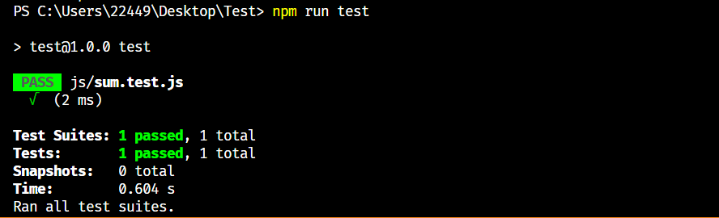
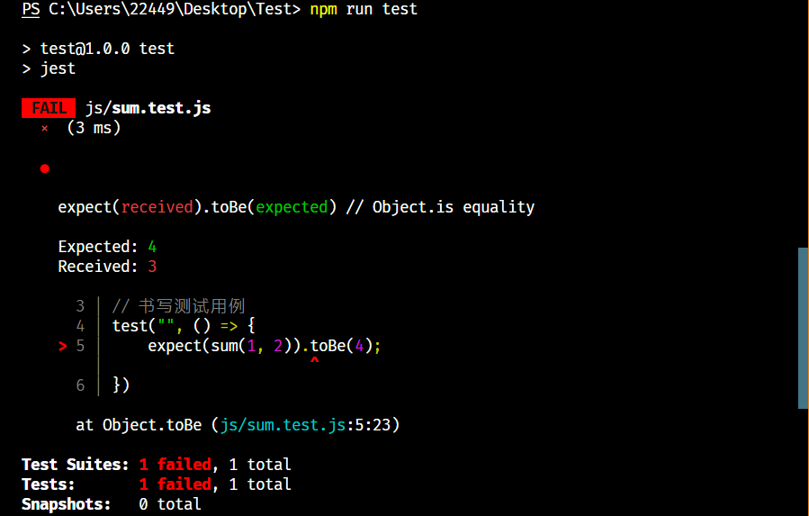

# Jest 测试

​    <b>Jest.js 是专门用于测试  js 的一个框架, 可用于 JavaScript、TypeScript、Vue、React、TypeReact 检测</b>

## 1. 下载方式

```node
// 在使用 npm 时, 可以使用:
npm install jest
// 简写:
npm i jest

// 在使用 Yarn 时, 可以使用:
yarn add jest

// ※ 注意: 以上均属于正常安装状态, 也可以启用开发模式,
// 在后方加入 "--dev"
```

## 2. 使用方法

​    <b>注意: 使用时需要在 packge.json 文件中配置以下内容:</b>

```json
// scripts ? scripts : CreateScripts
// 接下来就可以在 scripts 内部书写:
scripts: {
    "test": "jest"
}
```

### toBe 相等

#### 说明:

<b style="font-style: italic;">&emsp;&emsp;toBe 用于测试精确相等性。</b> 

#### 功能代码:

```javascript
// 此文件地址与名称: "./script/sum.js"
// 此文件为: "功能类代码"
module.exports = function sum(a, b) {
	return a + b;
}
```

#### 测试代码:

```javascript
// 此文件地址与名称: "./script/sum.test.js"
// 此文件为: "测试类代码"

// 导入 sum 模块
const sum = require("./sum");

// 书写测试代码
test('adds 1 + 2 to equal 3', () => {
    expect(sum(1, 2).toBe(3))
})
```

#### <b style="color: #67C23A">正确案例: </b> 



#### <b style="color: #F56C6C">错误案例: </b> 



<b style="color: red;">※ 注意: <u>以上比对的时最终结果是否一致, 且此方法不可以应用于<i style="color:black">数组</i> 或 <i style="color:black">对象</i>, 如需测试 数组 或 对象 请使用 <code style="font-style: italic; color: black">toEqual</code></u></b> 

### toEqual 匹配

#### 使用说明:

<b>&emsp;&emsp;toEqual 方法会递归检查 <i style="color: red">对象</i> 或 <i style="color: red">数组</i> 的每个字段</b> 

#### 功能代码:


## 3. 配置文件

<b style="color: red">※ 声明: <i>创建配置文件需要采用全局安装的方式, 安装完成后使用: <code>jest --init</code> 按需安装配置</i></b> 

### 全局安装

```node
// npm 简写
npm i jest --global

// npm 全拼
npm install jest --global

// yarn
yarn add jest --global
```

### 开始配置

<b>&emsp;&emsp;使用 jest --init 会出现以下问题 (请按需安装):</b>

```node
1. Would you like to use Typescript for the configuration file?
1. 是否要对配置文件使用Typescript？
答: Yes / No

2. Choose the test environment that will be used for testing?
2. 选择将用于测试的测试环境？
答: Node / jsDom (browser-like)浏览器

3. Do you want Jest to add coverage reports?
3. 您希望Jest添加覆盖报告吗？
答: Yes / No

4. Which provider should be used to instrument code for coverage?
4. 应使用哪个提供商为覆盖范围提供代码？
答: V8 / babel

5. Automatically clear mock calls, instances, contexts and results before every test?
5. 在每次测试之前自动清除模拟调用、实例、上下文和结果？
答: Yes / No
```

<b>&emsp;&emsp;安装完成后, 如选择 "Babel" 则需要安装对应的依赖</b> 

```node
// npm 简写
npm i --save-dev babel-jest @babel/core @babel/preset-env

// npm 全拼
npm install --save-dev babel-jest @babel/core @babel/preset-env

// yarn
yarn add --dev babel-jest @babel/core @babel/preset-env
```

<b>&emsp;&emsp;依赖安装完成后需要在根目录中创建 `babel.config.js` 文件对下载完成的依赖进行配置</b> 

```js
// 此处书写为: ./babel.config.js 配置文件
module.exports = api => {
    const isTest = api.env('test');
    presets: [
        [
            '@babel/preset-env',
            {
                targets: {
                    node: 'current',
                },
            },
        ]
    ]
};
```

<b>&emsp;&emsp; 为了更好的兼容程序运行, 且 <code>babel-jest</code> 在安装 Jest 时自动安装, 如果项目中存在 babel 配置，则会自动转换文件。若要避免此行为，可以显式重置配置选项</b> 

```js
// jest.config.js
module.exports = {
    tarnsform: {},
}
```

